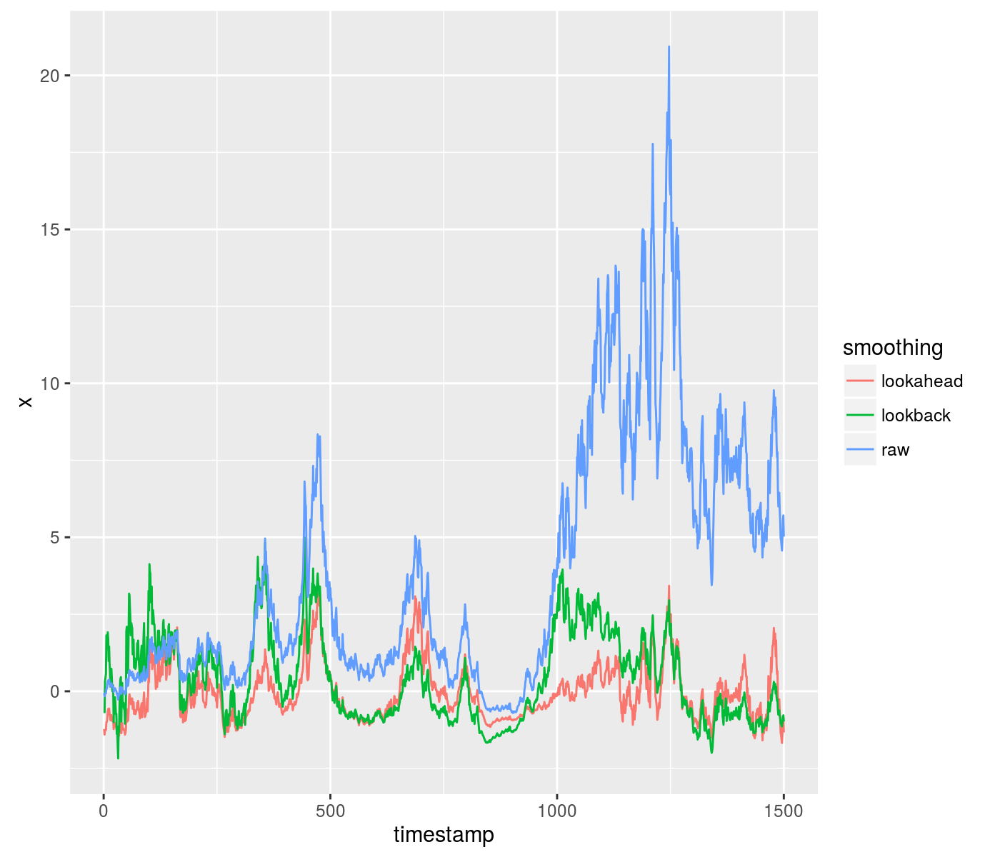

# fromo

[](https://travis-ci.org/shabbychef/fromo)
[](http://codecov.io/github/shabbychef/fromo?branch=master)


  _Fast Robust Moments -- Pick Three!_


Fast, numerically robust, higher order moments in R, computed via Rcpp, mostly as an exercise to learn Rcpp. 
Supports computation on vectors and matrices, and Monoidal append (and unappend) of moments.
Computations are via the Welford-Terriberry algorithm, as described by
[Bennett _et al._](https://www.semanticscholar.org/paper/Numerically-stable-single-pass-parallel-statistics-Bennett-Grout/a83ed72a5ba86622d5eb6395299b46d51c901265)

-- Steven E. Pav, shabbychef@gmail.com

## Installation

This package can be installed 
via [drat](https://github.com/eddelbuettel/drat "drat"), or
from github:


```r
# via drat:
if (require(drat)) {
    drat:::add("shabbychef")
    install.packages("fromo")
}
# get snapshot from github (may be buggy)
if (require(devtools)) {
    install_github("shabbychef/fromo")
}
```

# Basic Usage

## Summary moments

Here is a speed comparison of the basic moment computation:

```r
require(fromo)
require(moments)
require(microbenchmark)

x <- rnorm(1000)

dumbk <- function(x) {
    c(kurtosis(x) - 3, skewness(x), sd(x), mean(x), 
        length(x))
}

microbenchmark(kurt5(x), skew4(x), sd3(x), dumbk(x), 
    dumbk(x), kurtosis(x), skewness(x), sd(x), mean(x))
```

```
## Unit: microseconds
##         expr   min    lq  mean median    uq max neval
##     kurt5(x) 144.9 146.7 150.9  148.2 150.2 183   100
##     skew4(x)  83.9  85.7  88.7   86.9  88.0 158   100
##       sd3(x)  10.6  11.6  12.7   12.1  12.9  28   100
##     dumbk(x) 201.6 211.2 222.4  214.1 222.6 954   200
##  kurtosis(x)  87.0  91.6  94.1   93.0  94.7 129   100
##  skewness(x)  89.5  92.2  94.5   93.6  94.9 115   100
##        sd(x)  15.4  18.6  20.9   19.7  20.7  39   100
##      mean(x)   3.7   4.6   5.2    4.9   5.3  13   100
```

```r
x <- rnorm(1e+07, mean = 1e+12)

microbenchmark(kurt5(x), skew4(x), sd3(x), dumbk(x), 
    kurtosis(x), skewness(x), sd(x), mean(x), times = 10L)
```

```
## Unit: milliseconds
##         expr  min   lq mean median   uq  max neval
##     kurt5(x) 1460 1474 1491   1487 1504 1540    10
##     skew4(x)  832  839  851    850  867  874    10
##       sd3(x)   86   86   88     87   91   93    10
##     dumbk(x) 1736 1745 1777   1764 1815 1839    10
##  kurtosis(x)  852  857  896    899  921  979    10
##  skewness(x)  818  837  858    860  874  901    10
##        sd(x)   51   51   52     51   54   56    10
##      mean(x)   17   17   18     18   18   18    10
```

## Monoid mumbo-jumbo

Store your moments in an object, and you can cat them together. (Eventually there will be
an `unjoin` method.) These should satisfy 'monoidal homomorphism', meaning that concatenation
and taking moments commute with each other. This is a small step of the way towards fast
machine learning methods 
(along the lines of Mike Izbicki's [Hlearn library](https://github.com/mikeizbicki/HLearn).)

Some demo code:


```r
set.seed(12345)
x1 <- runif(100)
x2 <- rnorm(100, mean = 1)
max_ord <- 6L

obj1 <- as.centsums(x1, max_ord)
# display:
show(obj1)
```

```
##           class: centsums 
##     raw moments: 100 0.0051 0.09 -0.00092 0.014 -0.00043 0.0027 
## central moments: 0 0.09 -0.0023 0.014 -0.00079 0.0027 
##     std moments: 0 1 -0.086 1.8 -0.33 3.8
```

```r
# join them together
obj1 <- as.centsums(x1, max_ord)
obj2 <- as.centsums(x2, max_ord)
obj3 <- as.centsums(c(x1, x2), max_ord)
alt3 <- c(obj1, obj2)
# it commutes!
stopifnot(max(abs(sums(obj3) - sums(alt3))) < 1e-07)
# unjoin them, with this one weird operator:
alt2 <- obj3 %-% obj1
alt1 <- obj3 %-% obj2
stopifnot(max(abs(sums(obj2) - sums(alt2))) < 1e-07)
stopifnot(max(abs(sums(obj1) - sums(alt1))) < 1e-07)
```

We also have 'raw' join and unjoin methods, not nicely wrapped:

```r
set.seed(123)
x1 <- rnorm(1000, mean = 1)
x2 <- rnorm(1000, mean = 1)
max_ord <- 6L
rs1 <- cent_sums(x1, max_ord)
rs2 <- cent_sums(x2, max_ord)
rs3 <- cent_sums(c(x1, x2), max_ord)
rs3alt <- join_cent_sums(rs1, rs2)
stopifnot(max(abs(rs3 - rs3alt)) < 1e-07)

rs1alt <- unjoin_cent_sums(rs3, rs2)
rs2alt <- unjoin_cent_sums(rs3, rs1)
stopifnot(max(abs(rs1 - rs1alt)) < 1e-07)
stopifnot(max(abs(rs2 - rs2alt)) < 1e-07)
```

### For multivariate input

There is also code for computing co-sums and co-moments, though as of this writing only up to order 2.
Some demo code for the monoidal stuff here::


```r
set.seed(54321)
x1 <- matrix(rnorm(100 * 4), ncol = 4)
x2 <- matrix(rnorm(100 * 4), ncol = 4)

max_ord <- 2L
obj1 <- as.centcosums(x1, max_ord, na.omit = TRUE)
# display:
show(obj1)
```

```
## An object of class "centcosums"
## Slot "cosums":
##          [,1]    [,2]   [,3]     [,4]    [,5]
## [1,] 100.0000  -0.093  0.045  -0.0046   0.046
## [2,]  -0.0934 111.012  4.941 -16.4822   6.660
## [3,]   0.0450   4.941 71.230   0.8505   5.501
## [4,]  -0.0046 -16.482  0.850 117.3456  13.738
## [5,]   0.0463   6.660  5.501  13.7379 100.781
## 
## Slot "order":
## [1] 2
```

```r
# join them together
obj1 <- as.centcosums(x1, max_ord)
obj2 <- as.centcosums(x2, max_ord)
obj3 <- as.centcosums(rbind(x1, x2), max_ord)
alt3 <- c(obj1, obj2)
# it commutes!
stopifnot(max(abs(cosums(obj3) - cosums(alt3))) < 1e-07)
# unjoin them, with this one weird operator:
alt2 <- obj3 %-% obj1
alt1 <- obj3 %-% obj2
stopifnot(max(abs(cosums(obj2) - cosums(alt2))) < 1e-07)
stopifnot(max(abs(cosums(obj1) - cosums(alt1))) < 1e-07)
```

## Running moments

Since an online algorithm is used, we can compute cumulative running moments. Moreover, we can 
_remove_ observations, and thus compute moments over a fixed length lookback window. The code
checks for negative even moments caused by roundoff, and restarts the computation to correct;
periodic recomputation can be forced by an input parameter.

A demonstration:


```r
require(fromo)
require(moments)
require(microbenchmark)

set.seed(1234)
x <- rnorm(20)

k5 <- running_kurt5(x, window = 10L)
colnames(k5) <- c("excess_kurtosis", "skew", "stdev", 
    "mean", "nobs")
k5
```

```
##       excess_kurtosis  skew stdev   mean nobs
##  [1,]             NaN   NaN   NaN -1.207    1
##  [2,]             NaN   NaN  1.05 -0.465    2
##  [3,]             NaN -0.34  1.16  0.052    3
##  [4,]          -1.520 -0.13  1.53 -0.548    4
##  [5,]          -1.254 -0.50  1.39 -0.352    5
##  [6,]          -0.860 -0.79  1.30 -0.209    6
##  [7,]          -0.714 -0.70  1.19 -0.261    7
##  [8,]          -0.525 -0.64  1.11 -0.297    8
##  [9,]          -0.331 -0.58  1.04 -0.327    9
## [10,]          -0.331 -0.42  1.00 -0.383   10
## [11,]           0.262 -0.65  0.95 -0.310   10
## [12,]           0.017 -0.30  0.95 -0.438   10
## [13,]           0.699 -0.61  0.79 -0.624   10
## [14,]          -0.939  0.69  0.53 -0.383   10
## [15,]          -0.296  0.99  0.64 -0.330   10
## [16,]           1.078  1.33  0.57 -0.391   10
## [17,]           1.069  1.32  0.57 -0.385   10
## [18,]           0.868  1.29  0.60 -0.421   10
## [19,]           0.799  1.31  0.61 -0.449   10
## [20,]           1.193  1.50  1.07 -0.118   10
```

```r
# trust but verify
alt5 <- sapply(seq_along(x), function(iii) {
    rowi <- max(1, iii - 10 + 1)
    kurtosis(x[rowi:iii]) - 3
}, simplify = TRUE)

cbind(alt5, k5[, 1])
```

```
##         alt5       
##  [1,]    NaN    NaN
##  [2,] -2.000    NaN
##  [3,] -1.500    NaN
##  [4,] -1.520 -1.520
##  [5,] -1.254 -1.254
##  [6,] -0.860 -0.860
##  [7,] -0.714 -0.714
##  [8,] -0.525 -0.525
##  [9,] -0.331 -0.331
## [10,] -0.331 -0.331
## [11,]  0.262  0.262
## [12,]  0.017  0.017
## [13,]  0.699  0.699
## [14,] -0.939 -0.939
## [15,] -0.296 -0.296
## [16,]  1.078  1.078
## [17,]  1.069  1.069
## [18,]  0.868  0.868
## [19,]  0.799  0.799
## [20,]  1.193  1.193
```

## Running 'scale' operations

Through template magic, the same code was modified to perform running centering, scaling, z-scoring and so on:


```r
require(fromo)
require(moments)
require(microbenchmark)

set.seed(1234)
x <- rnorm(20)

xz <- running_zscored(x, window = 10L)

# trust but verify
altz <- sapply(seq_along(x), function(iii) {
    rowi <- max(1, iii - 10 + 1)
    (x[iii] - mean(x[rowi:iii]))/sd(x[rowi:iii])
}, simplify = TRUE)

cbind(xz, altz)
```

```
##              altz
##  [1,]   NaN    NA
##  [2,]  0.71  0.71
##  [3,]  0.89  0.89
##  [4,] -1.18 -1.18
##  [5,]  0.56  0.56
##  [6,]  0.55  0.55
##  [7,] -0.26 -0.26
##  [8,] -0.23 -0.23
##  [9,] -0.23 -0.23
## [10,] -0.51 -0.51
## [11,] -0.17 -0.17
## [12,] -0.59 -0.59
## [13,] -0.19 -0.19
## [14,]  0.84  0.84
## [15,]  2.02  2.02
## [16,]  0.49  0.49
## [17,] -0.22 -0.22
## [18,] -0.82 -0.82
## [19,] -0.64 -0.64
## [20,]  2.37  2.37
```

A list of the available functions:

* `running_centered` : from the current value, subtract the mean over the trailing window.
* `running_scaled`: divide the current value by the standard deviation over the trailing window.
* `running_zscored`: from the current value, subtract the mean then divide by the standard deviation over the trailing window.
* `running_sharpe`: divide the mean by the standard deviation over the trailing window. There is a boolean flag to
also compute and return the Mertens' form of the standard error of the Sharpe ratio over the trailing window in the second
column.
* `running_tstat`: compute the t-stat over the trailing window.
* `running_cumulants`: computes cumulants over the trailing window.
* `running_apx_quantiles`: computes approximate quantiles over the trailing window based on the cumulants and the Cornish-Fisher approximation.
* `running_apx_median`: uses `running_apx_quantiles` to give the approximate median over the trailing window.

The functions `running_centered`, `running_scaled` and `running_zscored` take an optional `lookahead` parameter that
allows you to peek ahead (or behind if negative) to the computed moments for comparing against the current value. These
are not supported for `running_sharpe` or `running_tstat` because they do not have an idea of the 'current value'.

Here is an example of using the lookahead to z-score some data, compared to a purely time-safe lookback. Around a timestamp
of 1000, you can see the difference in outcomes from the two methods:


```r
set.seed(1235)
z <- rnorm(1500, mean = 0, sd = 0.09)
x <- exp(cumsum(z)) - 1

xz_look <- running_zscored(x, window = 301, lookahead = 150)
xz_safe <- running_zscored(x, window = 301, lookahead = 0)
df <- data.frame(timestamp = seq_along(x), raw = x, 
    lookahead = xz_look, lookback = xz_safe)

library(tidyr)
gdf <- gather(df, key = "smoothing", value = "x", -timestamp)

library(ggplot2)
ph <- ggplot(gdf, aes(x = timestamp, y = x, group = smoothing, 
    colour = smoothing)) + geom_line()
print(ph)
```



## Efficiency

We make every attempt to balance numerical robustness, computational efficiency and memory usage. As a bit of 
strawman-bashing, here we microbenchmark the running Z-score computation against the naive algorithm:


```r
require(fromo)
require(moments)
require(microbenchmark)

set.seed(4422)
x <- rnorm(10000)

dumb_zscore <- function(x, window) {
    altz <- sapply(seq_along(x), function(iii) {
        rowi <- max(1, iii - window + 1)
        xrang <- x[rowi:iii]
        (x[iii] - mean(xrang))/sd(xrang)
    }, simplify = TRUE)
}

val1 <- running_zscored(x, 250)
val2 <- dumb_zscore(x, 250)
stopifnot(max(abs(val1 - val2), na.rm = TRUE) <= 1e-14)

microbenchmark(running_zscored(x, 250), dumb_zscore(x, 
    250))
```

```
## Unit: microseconds
##                     expr    min     lq   mean median     uq    max neval
##  running_zscored(x, 250)    807    818    861    839    861   1297   100
##      dumb_zscore(x, 250) 228331 243028 257125 253182 257454 371401   100
```
