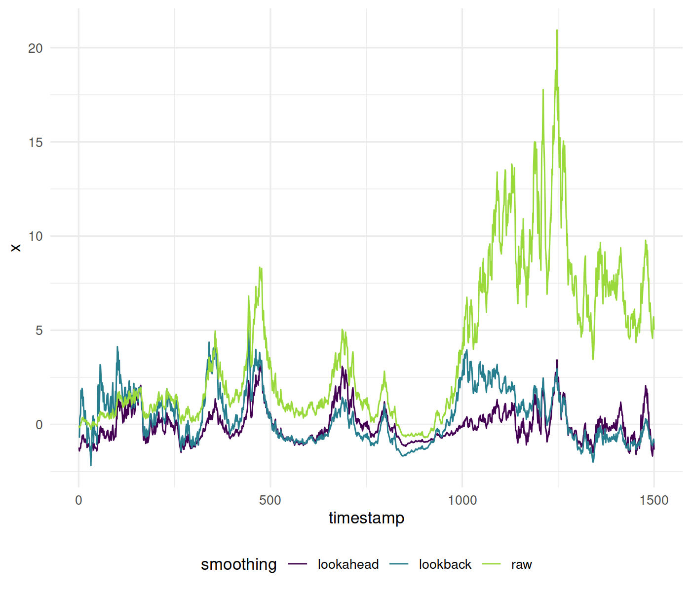
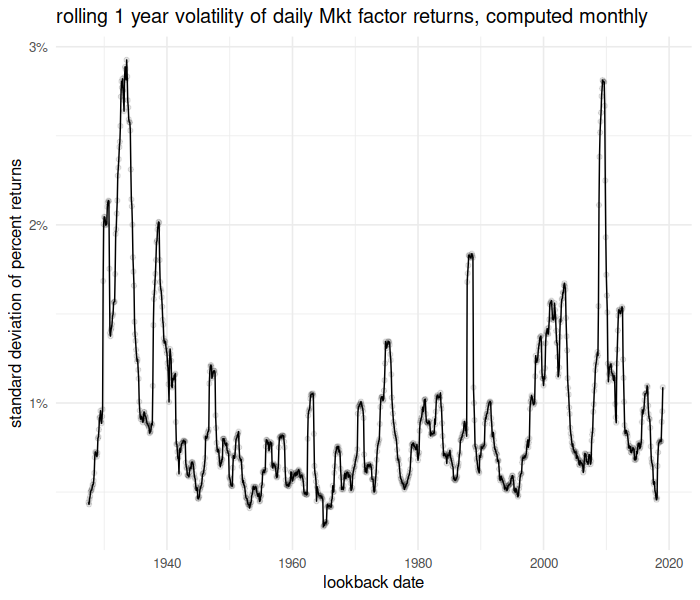

# fromo

[](https://travis-ci.org/shabbychef/fromo)
[](http://codecov.io/github/shabbychef/fromo?branch=master)
[](https://cran.r-project.org/package=fromo)
[](http://www.r-pkg.org/pkg/fromo)
[](http://www.r-pkg.org/pkg/fromo)


  _Fast Robust Moments -- Pick Three!_


Fast, numerically robust, higher order moments in R, computed via Rcpp, mostly as an exercise to learn Rcpp. 
Supports computation on vectors and matrices, and Monoidal append (and unappend) of moments.
Computations are via the Welford-Terriberry algorithm, as described by
[Bennett _et al._](https://www.semanticscholar.org/paper/Numerically-stable-single-pass-parallel-statistics-Bennett-Grout/a83ed72a5ba86622d5eb6395299b46d51c901265)

-- Steven E. Pav, shabbychef@gmail.com

## Installation

This package can be installed 
from CRAN, 
via [drat](https://github.com/eddelbuettel/drat "drat"), or
from github:


```r
# via CRAN:
install.packages("fromo")
# via drat:
if (require(drat)) {
    drat:::add("shabbychef")
    install.packages("fromo")
}
# get snapshot from github (may be buggy)
if (require(devtools)) {
    install_github("shabbychef/fromo")
}
```

# Basic Usage

Currently the package functionality can be divided into the following:
* Functions which reduce a vector to an array of moments.
* Functions which take a vector to a matrix of the running moments.
* Functions which transform a vector to some normalized form, like a centered, rescaled, z-scored sample,
or a summarized form, like the running Sharpe or t-stat.
* Functions for computing the covariance of a vector robustly.
* Object representations of moments with join and unjoin methods.

## Summary moments

A function which computes, say, the kurtosis, typically also computes the mean and standard deviation, and has
performed enough computation to easily return the skew. However, the default functions in R for higher order moments
discard these lower order moments. So, for example, if you wish to compute Merten's form for the standard error
of the Sharpe ratio, you have to call separate functions to compute the kurtosis, skew, standard deviation, and mean.

The summary functions in *fromo* return _all_ the moments up to some order, namely the 
functions `sd3`, `skew4`, and `kurt5`. 
The latter of these, `kurt5` returns an array of length 5 containing 
the _excess_ kurtosis, the skewness, the standard deviation, the mean,
and the observation count. (The number in the function name denotes the length of the output.) 
Along the same lines, there are summarizing functions that compute centered moments, standardized moments, 
and 'raw' cumulants:

* `cent_moments`: return a `k+1`-vector of the `k`th centered moment, the `k-1`th, all the way down to the 2nd (the variance),
then _the mean_ and the observation count.
* `std_moments`: return a `k+1`-vector of the `k`th standardized moment, the `k-1`th, all the way down to the 3rd, then the
_standard deviation_, the mean, and the observation count.
* `cent_cumulants`: computes the centered cumulants (yes, this is redundant, but they are _not_ standardized). 
return a `k+1`-vector of the `k`th raw cumulant, the `k-1`th, all the way down to the second, then the mean, 
and the observation count.
* `std_cumulants`: computes the standardized (and, of course, centered) cumulants. 
return a `k+1`-vector of the `k`th standardized cumulant, all the way down to the third, then the variance, the mean,
and the observation count.


```r
library(fromo)
set.seed(12345)
x <- rnorm(1000, mean = 10, sd = 2)
show(cent_moments(x, max_order = 4, na_rm = TRUE))
```

```
## [1]   47.276   -0.047    3.986   10.092 1000.000
```

```r
show(std_moments(x, max_order = 4, na_rm = TRUE))
```

```
## [1]  3.0e+00 -5.9e-03  2.0e+00  1.0e+01  1.0e+03
```

```r
show(cent_cumulants(x, max_order = 4, na_rm = TRUE))
```

```
## [1]   -0.388   -0.047    3.986   10.092 1000.000
```

```r
show(std_cumulants(x, max_order = 4, na_rm = TRUE))
```

```
## [1] -2.4e-02 -5.9e-03  4.0e+00  1.0e+01  1.0e+03
```

### Speed

In theory these operations should be just as fast as the default functions, but faster than calling multiple
default functions.  Here is a speed comparison of the basic moment computations:


```r
library(fromo)
library(moments)
library(microbenchmark)

set.seed(123)
x <- rnorm(1000)

dumbk <- function(x) {
    c(kurtosis(x) - 3, skewness(x), sd(x), mean(x), 
        length(x))
}

microbenchmark(kurt5(x), skew4(x), sd3(x), dumbk(x), 
    dumbk(x), kurtosis(x), skewness(x), sd(x), mean(x))
```

```
## Error in `levels<-`(`*tmp*`, value = if (nl == nL) as.character(labels) else paste0(labels, : factor level [5] is duplicated
```

```r
x <- rnorm(1e+07, mean = 1e+12)

microbenchmark(kurt5(x), skew4(x), sd3(x), dumbk(x), 
    kurtosis(x), skewness(x), sd(x), mean(x), times = 10L)
```

```
## Unit: milliseconds
##         expr  min   lq mean median   uq  max neval    cld
##     kurt5(x) 1408 1409 1414   1413 1418 1424    10     e 
##     skew4(x)  801  802  813    804  815  871    10    d  
##       sd3(x)   66   66   67     66   67   69    10  b    
##     dumbk(x) 1647 1650 1674   1655 1712 1734    10      f
##  kurtosis(x)  802  804  813    806  811  869    10    d  
##  skewness(x)  777  780  789    781  787  822    10   c   
##        sd(x)   45   45   46     46   46   47    10  b    
##      mean(x)   16   17   17     17   17   18    10 a
```

## Weight! Weight!

Many of the methods now support the computation of _weighted_ moments. There
are a few options around weights: whether to check them for negative values,
whether to normalize them to unit mean. 


```r
library(fromo)
library(moments)
library(microbenchmark)

set.seed(987)
x <- rnorm(1000)
w <- runif(length(x))

# no weights:
show(cent_moments(x, max_order = 4, na_rm = TRUE))
```

```
## [1] 2.9e+00 1.2e-02 1.0e+00 1.0e-02 1.0e+03
```

```r
# with weights:
show(cent_moments(x, max_order = 4, wts = w, na_rm = TRUE))
```

```
## [1] 3.1e+00 4.1e-02 1.0e+00 1.3e-02 1.0e+03
```

```r
# if you turn off weight normalization, the last
# element is sum(wts):
show(cent_moments(x, max_order = 4, wts = w, na_rm = TRUE, 
    normalize_wts = FALSE))
```

```
## [1]   3.072   0.041   1.001   0.013 493.941
```

```r
# let's compare for speed!
x <- rnorm(1e+07)
w <- runif(length(x))

slow_sd <- function(x, w) {
    n0 <- length(x)
    mu <- weighted.mean(x, w = w)
    sg <- sqrt(sum(w * (x - mu)^2)/(n0 - 1))
    c(sg, mu, n0)
}
microbenchmark(sd3(x, wts = w), slow_sd(x, w))
```

```
## Unit: milliseconds
##             expr min  lq mean median  uq max neval cld
##  sd3(x, wts = w)  80  81   83     83  84  87   100  a 
##    slow_sd(x, w) 234 243  253    247 254 382   100   b
```

## Monoid mumbo-jumbo

The `as.centsums` object
performs the summary (centralized) moment computation, and stores the centralized sums.
There is a print method that shows raw, centralized, and standardized moments of the ingested
data.
This object supports concatenation and unconcatenation. 
These should satisfy 'monoidal homomorphism', meaning that concatenation
and taking moments commute with each other. 
So if you have two vectors, `x1` and `x2`, the following should be equal:
`c(as.centsums(x1,4),as.centsums(x2,4))` and `as.centsums(c(x1,x2),4)`. 
Moreover, the following should also be equal:
`as.centsums(c(x1,x2),4) %-% as.centsums(x2,4))` and `as.centsums(x1,4)`. 
This is a small step of the way towards fast machine learning 
methods (along the lines of Mike Izbicki's [Hlearn library](https://github.com/mikeizbicki/HLearn)).

Some demo code:


```r
set.seed(12345)
x1 <- runif(100)
x2 <- rnorm(100, mean = 1)
max_ord <- 6L

obj1 <- as.centsums(x1, max_ord)
# display:
show(obj1)
```

```
##           class: centsums 
##     raw moments: 100 0.0051 0.09 -0.00092 0.014 -0.00043 0.0027 
## central moments: 0 0.09 -0.0023 0.014 -0.00079 0.0027 
##     std moments: 0 1 -0.086 1.8 -0.33 3.8
```

```r
# join them together
obj1 <- as.centsums(x1, max_ord)
obj2 <- as.centsums(x2, max_ord)
obj3 <- as.centsums(c(x1, x2), max_ord)
alt3 <- c(obj1, obj2)
# it commutes!
stopifnot(max(abs(sums(obj3) - sums(alt3))) < 1e-07)
# unjoin them, with this one weird operator:
alt2 <- obj3 %-% obj1
alt1 <- obj3 %-% obj2
stopifnot(max(abs(sums(obj2) - sums(alt2))) < 1e-07)
stopifnot(max(abs(sums(obj1) - sums(alt1))) < 1e-07)
```

We also have 'raw' join and unjoin methods, not nicely wrapped:

```r
set.seed(123)
x1 <- rnorm(1000, mean = 1)
x2 <- rnorm(1000, mean = 1)
max_ord <- 6L
rs1 <- cent_sums(x1, max_ord)
rs2 <- cent_sums(x2, max_ord)
rs3 <- cent_sums(c(x1, x2), max_ord)
rs3alt <- join_cent_sums(rs1, rs2)
stopifnot(max(abs(rs3 - rs3alt)) < 1e-07)

rs1alt <- unjoin_cent_sums(rs3, rs2)
rs2alt <- unjoin_cent_sums(rs3, rs1)
stopifnot(max(abs(rs1 - rs1alt)) < 1e-07)
stopifnot(max(abs(rs2 - rs2alt)) < 1e-07)
```

### For multivariate input

There is also code for computing co-sums and co-moments, though as of this writing only up to order 2.
Some demo code for the monoidal stuff here:


```r
set.seed(54321)
x1 <- matrix(rnorm(100 * 4), ncol = 4)
x2 <- matrix(rnorm(100 * 4), ncol = 4)

max_ord <- 2L
obj1 <- as.centcosums(x1, max_ord, na.omit = TRUE)
# display:
show(obj1)
```

```
## An object of class "centcosums"
## Slot "cosums":
##          [,1]    [,2]   [,3]     [,4]    [,5]
## [1,] 100.0000  -0.093  0.045  -0.0046   0.046
## [2,]  -0.0934 111.012  4.941 -16.4822   6.660
## [3,]   0.0450   4.941 71.230   0.8505   5.501
## [4,]  -0.0046 -16.482  0.850 117.3456  13.738
## [5,]   0.0463   6.660  5.501  13.7379 100.781
## 
## Slot "order":
## [1] 2
```

```r
# join them together
obj1 <- as.centcosums(x1, max_ord)
obj2 <- as.centcosums(x2, max_ord)
obj3 <- as.centcosums(rbind(x1, x2), max_ord)
alt3 <- c(obj1, obj2)
# it commutes!
stopifnot(max(abs(cosums(obj3) - cosums(alt3))) < 1e-07)
# unjoin them, with this one weird operator:
alt2 <- obj3 %-% obj1
alt1 <- obj3 %-% obj2
stopifnot(max(abs(cosums(obj2) - cosums(alt2))) < 1e-07)
stopifnot(max(abs(cosums(obj1) - cosums(alt1))) < 1e-07)
```

## Running moments

Since an online algorithm is used, we can compute cumulative running moments. Moreover, we can 
_remove_ observations, and thus compute moments over a fixed length lookback window. The code
checks for negative even moments caused by roundoff, and restarts the computation to correct;
periodic recomputation can be forced by an input parameter.

A demonstration:


```r
library(fromo)
library(moments)
library(microbenchmark)

set.seed(1234)
x <- rnorm(20)

k5 <- running_kurt5(x, window = 10L)
colnames(k5) <- c("excess_kurtosis", "skew", "stdev", 
    "mean", "nobs")
k5
```

```
##       excess_kurtosis  skew stdev   mean nobs
##  [1,]             NaN   NaN   NaN -1.207    1
##  [2,]             NaN   NaN  1.05 -0.465    2
##  [3,]             NaN -0.34  1.16  0.052    3
##  [4,]          -1.520 -0.13  1.53 -0.548    4
##  [5,]          -1.254 -0.50  1.39 -0.352    5
##  [6,]          -0.860 -0.79  1.30 -0.209    6
##  [7,]          -0.714 -0.70  1.19 -0.261    7
##  [8,]          -0.525 -0.64  1.11 -0.297    8
##  [9,]          -0.331 -0.58  1.04 -0.327    9
## [10,]          -0.331 -0.42  1.00 -0.383   10
## [11,]           0.262 -0.65  0.95 -0.310   10
## [12,]           0.017 -0.30  0.95 -0.438   10
## [13,]           0.699 -0.61  0.79 -0.624   10
## [14,]          -0.939  0.69  0.53 -0.383   10
## [15,]          -0.296  0.99  0.64 -0.330   10
## [16,]           1.078  1.33  0.57 -0.391   10
## [17,]           1.069  1.32  0.57 -0.385   10
## [18,]           0.868  1.29  0.60 -0.421   10
## [19,]           0.799  1.31  0.61 -0.449   10
## [20,]           1.193  1.50  1.07 -0.118   10
```

```r
# trust but verify
alt5 <- sapply(seq_along(x), function(iii) {
    rowi <- max(1, iii - 10 + 1)
    kurtosis(x[rowi:iii]) - 3
}, simplify = TRUE)

cbind(alt5, k5[, 1])
```

```
##         alt5       
##  [1,]    NaN    NaN
##  [2,] -2.000    NaN
##  [3,] -1.500    NaN
##  [4,] -1.520 -1.520
##  [5,] -1.254 -1.254
##  [6,] -0.860 -0.860
##  [7,] -0.714 -0.714
##  [8,] -0.525 -0.525
##  [9,] -0.331 -0.331
## [10,] -0.331 -0.331
## [11,]  0.262  0.262
## [12,]  0.017  0.017
## [13,]  0.699  0.699
## [14,] -0.939 -0.939
## [15,] -0.296 -0.296
## [16,]  1.078  1.078
## [17,]  1.069  1.069
## [18,]  0.868  0.868
## [19,]  0.799  0.799
## [20,]  1.193  1.193
```

### See also

If you like rolling computations, do also check out the following packages (I believe they
are all on CRAN):

  * [RollingWindow](https://github.com/andrewuhl/rollingwindow), available only from github.
  * [RcppRoll](https://github.com/kevinushey/RcppRoll).
  * [roll](https://cran.r-project.org/package=roll).

Of these three, it seems that `RollingWindow` implements the optimal algorithm
of reusing computations, while the other two packages gain efficiency from
parallelization and implementation in C++.

## Running 'scale' operations

Through template magic, the same code was modified to perform running centering, scaling, z-scoring and so on:


```r
library(fromo)
library(moments)
library(microbenchmark)

set.seed(1234)
x <- rnorm(20)

xz <- running_zscored(x, window = 10L)

# trust but verify
altz <- sapply(seq_along(x), function(iii) {
    rowi <- max(1, iii - 10 + 1)
    (x[iii] - mean(x[rowi:iii]))/sd(x[rowi:iii])
}, simplify = TRUE)

cbind(xz, altz)
```

```
##              altz
##  [1,]   NaN    NA
##  [2,]  0.71  0.71
##  [3,]  0.89  0.89
##  [4,] -1.18 -1.18
##  [5,]  0.56  0.56
##  [6,]  0.55  0.55
##  [7,] -0.26 -0.26
##  [8,] -0.23 -0.23
##  [9,] -0.23 -0.23
## [10,] -0.51 -0.51
## [11,] -0.17 -0.17
## [12,] -0.59 -0.59
## [13,] -0.19 -0.19
## [14,]  0.84  0.84
## [15,]  2.02  2.02
## [16,]  0.49  0.49
## [17,] -0.22 -0.22
## [18,] -0.82 -0.82
## [19,] -0.64 -0.64
## [20,]  2.37  2.37
```

A list of the available running functions:

* `running_centered` : from the current value, subtract the mean over the trailing window.
* `running_scaled`: divide the current value by the standard deviation over the trailing window.
* `running_zscored`: from the current value, subtract the mean then divide by the standard deviation over the trailing window.
* `running_sharpe`: divide the mean by the standard deviation over the trailing window. There is a boolean flag to
also compute and return the Mertens' form of the standard error of the Sharpe ratio over the trailing window in the second
column.
* `running_tstat`: compute the t-stat over the trailing window.
* `running_cumulants`: computes cumulants over the trailing window.
* `running_apx_quantiles`: computes approximate quantiles over the trailing window based on the cumulants and the Cornish-Fisher approximation.
* `running_apx_median`: uses `running_apx_quantiles` to give the approximate median over the trailing window.

### Lookahead

The functions `running_centered`, `running_scaled` and `running_zscored` take an optional `lookahead` parameter that
allows you to peek ahead (or behind if negative) to the computed moments for comparing against the current value. These
are not supported for `running_sharpe` or `running_tstat` because they do not have an idea of the 'current value'.

Here is an example of using the lookahead to z-score some data, compared to a purely time-safe lookback. Around a timestamp
of 1000, you can see the difference in outcomes from the two methods:


```r
set.seed(1235)
z <- rnorm(1500, mean = 0, sd = 0.09)
x <- exp(cumsum(z)) - 1

xz_look <- running_zscored(x, window = 301, lookahead = 150)
xz_safe <- running_zscored(x, window = 301, lookahead = 0)
df <- data.frame(timestamp = seq_along(x), raw = x, 
    lookahead = xz_look, lookback = xz_safe)

library(tidyr)
gdf <- gather(df, key = "smoothing", value = "x", -timestamp)

library(ggplot2)
ph <- ggplot(gdf, aes(x = timestamp, y = x, group = smoothing, 
    colour = smoothing)) + geom_line()
print(ph)
```



### Time-Based Running Computations

The standard running moments computations listed above work on a running window 
of a fixed number of observations.  However, sometimes one needs to compute
running moments over a different kind of window. The most common form of this
is over time-based windows. For example, the following computations:

  * Compute the total sales over the past six months, as of every day.
  * Compute the volatility of an asset's daily returns, over a yearly window,
    computed at the end of every trading month.

These are now supported in `fromo` via the `t_running` class of functions,
which are like the `running` functions, but accept also the 'times' at which
the input are marked, and optionally also the times at which one will
'look back' to perform the computations.  The times can be computed implicitly
as the cumulative sum of given (non-negative) time deltas.

Here is an example of computing the volatility of daily 'returns' of the 
Fama French Market factor, based on a one year window, computed at month ends:


```r
# devtools::install_github('shabbychef/aqfb_data')
library(aqfb.data)
library(fromo)
# daily 'returns' of Fama French 4 factors
data(dff4)
# compute month end dates:
library(lubridate)
mo_ends <- unique(lubridate::ceiling_date(index(dff4), 
    "month") %m-% days(1))
res <- t_running_sd3(dff4$Mkt, time = index(dff4), 
    window = 365.25, min_df = 180, lb_time = mo_ends)
df <- cbind(data.frame(mo_ends), data.frame(res))
colnames(df) <- c("date", "sd", "mean", "num_days")
knitr::kable(tail(df), row.names = FALSE)
```


|date       |   sd| mean| num_days|
|:----------|----:|----:|--------:|
|2016-07-31 | 1.09| 0.02|      251|
|2016-08-31 | 0.98| 0.05|      253|
|2016-09-30 | 0.94| 0.06|      253|
|2016-10-31 | 0.91| 0.02|      252|
|2016-11-30 | 0.91| 0.04|      253|
|2016-12-31 | 0.86| 0.05|      252|

And the plot of the time series:


```r
library(ggplot2)
library(scales)
ph <- df %>% ggplot(aes(date, 0.01 * sd)) + geom_line() + 
    geom_point(alpha = 0.1) + scale_y_continuous(labels = scales::percent) + 
    labs(x = "lookback date", y = "standard deviation of percent returns", 
        title = "rolling 1 year volatility of daily Mkt factor returns, computed monthly")
print(ph)
```



---------------


## Efficiency

We make every attempt to balance numerical robustness, computational efficiency and memory usage. As a bit of 
strawman-bashing, here we microbenchmark the running Z-score computation against the naive algorithm:


```r
library(fromo)
library(moments)
library(microbenchmark)

set.seed(4422)
x <- rnorm(10000)

dumb_zscore <- function(x, window) {
    altz <- sapply(seq_along(x), function(iii) {
        rowi <- max(1, iii - window + 1)
        xrang <- x[rowi:iii]
        (x[iii] - mean(xrang))/sd(xrang)
    }, simplify = TRUE)
}

val1 <- running_zscored(x, 250)
val2 <- dumb_zscore(x, 250)
stopifnot(max(abs(val1 - val2), na.rm = TRUE) <= 1e-14)

microbenchmark(running_zscored(x, 250), dumb_zscore(x, 
    250))
```

```
## Unit: microseconds
##                     expr    min     lq   mean median     uq    max neval cld
##  running_zscored(x, 250)    314    330    352    343    362    449   100  a 
##      dumb_zscore(x, 250) 215985 228979 244549 240660 257504 345485   100   b
```


### Timing against the roll package

More seriously, here we compare the `running_sd3` function, which computes
the standard deviation, mean and number of elements with the 
`roll_sd` and `roll_mean` functions from the 
[roll](https://cran.r-project.org/package=roll) package.


```r
# dare I?
library(fromo)
library(microbenchmark)
library(roll)

set.seed(4422)
x <- rnorm(1e+05)
xm <- matrix(x)

v1 <- running_sd3(xm, 250)
rsd <- roll::roll_sd(xm, 250)
rmu <- roll::roll_mean(xm, 250)
# compute error on the 1000th row:
stopifnot(max(abs(v1[1000, ] - c(rsd[1000], rmu[1000], 
    250))) < 1e-14)
# now timings:
microbenchmark(running_sd3(xm, 250), roll::roll_mean(xm, 
    250), roll::roll_sd(xm, 250))
```

```
## Unit: microseconds
##                      expr  min   lq mean median   uq  max neval cld
##      running_sd3(xm, 250) 2990 3007 3246   3322 3408 4335   100  b 
##  roll::roll_mean(xm, 250)  731  739  849    883  911 1382   100 a  
##    roll::roll_sd(xm, 250) 3452 3641 3764   3778 3814 5187   100   c
```


OK, that's not a fair comparison: `roll_mean` is optimized to work columwise on
a matrix. Let's unbash this strawman. I create a function using
`fromo::running_sd3` to compute a running mean or running standard deviation
columnwise on a matrix, then compare _that_ to `roll_mean` and `roll_sd`:


```r
library(fromo)
library(microbenchmark)
library(roll)

set.seed(4422)
xm <- matrix(rnorm(2e+05), ncol = 100)
fromo_sd <- function(x, wins) {
    apply(x, 2, function(xc) {
        running_sd3(xc, wins)[, 1]
    })
}
fromo_mu <- function(x, wins) {
    apply(x, 2, function(xc) {
        running_sd3(xc, wins)[, 2]
    })
}
wins <- 500
v1 <- fromo_sd(xm, wins)
rsd <- roll::roll_sd(xm, wins, min_obs = 3)

v2 <- fromo_mu(xm, wins)
rmu <- roll::roll_mean(xm, wins)
# compute error on the 1000th row:
stopifnot(max(abs(v1[1000, ] - rsd[1000, ])) < 1e-14)
stopifnot(max(abs(v2[1000, ] - rmu[1000, ])) < 1e-14)

# now timings: note fromo_mu and fromo_sd do
# exactly the same work, so only time one of them
microbenchmark(fromo_sd(xm, wins), roll::roll_mean(xm, 
    wins), roll::roll_mean(xm, wins, parallel_for = "cols"), 
    roll::roll_mean(xm, wins, parallel_for = "rows"), 
    roll::roll_sd(xm, wins), times = 50L)
```

```
## Error in roll::roll_mean(xm, wins, parallel_for = "cols"): unused argument (parallel_for = "cols")
```

This was somewhat unexpected. I did not think the `fromo` functions
would be faster than `roll_sd`, much less `roll_mean`. From these benchmarks, I suspected that
my computer was not taking advantage of parallelization, since the different
calls to `roll_mean` had the same timings.  To check, I timed `roll_mean`
for the same data size, but for larger rolling windows. During the following
timing, I confirmed that all eight cores on my laptop were at 100% utilization.
I believe the problem is that `roll_mean` is literally recomputing the moments over the 
entire window for every cell of the output, instead of reusing computations,
which `fromo` mostly does:


```r
library(roll)
library(microbenchmark)
set.seed(91823)
xm <- matrix(rnorm(2e+05), ncol = 10)
fromo_mu <- function(x, wins, ...) {
    apply(x, 2, function(xc) {
        running_sd3(xc, wins, ...)[, 2]
    })
}

microbenchmark(roll::roll_mean(xm, 10, min_obs = 3), 
    roll::roll_mean(xm, 100, min_obs = 3), roll::roll_mean(xm, 
        1000, min_obs = 3), roll::roll_mean(xm, 10000, 
        min_obs = 3), fromo_mu(xm, 10, min_df = 3), 
    fromo_mu(xm, 100, min_df = 3), fromo_mu(xm, 1000, 
        min_df = 3), fromo_mu(xm, 10000, min_df = 3), 
    times = 100L)
```

```
## Unit: microseconds
##                                     expr   min    lq  mean median    uq   max neval   cld
##     roll::roll_mean(xm, 10, min_obs = 3)   630   731   842    786   831  5080   100 a    
##    roll::roll_mean(xm, 100, min_obs = 3)   645   731   809    786   835  2352   100 a    
##   roll::roll_mean(xm, 1000, min_obs = 3)   642   723   791    765   814  2548   100 a    
##  roll::roll_mean(xm, 10000, min_obs = 3)   619   718   810    760   818  2493   100 a    
##             fromo_mu(xm, 10, min_df = 3)  5707  5898  6201   6097  6330  8060   100  b   
##            fromo_mu(xm, 100, min_df = 3)  6888  7063  7485   7395  7648  9460   100   c  
##           fromo_mu(xm, 1000, min_df = 3) 17937 18193 19319  18981 19947 23671   100    d 
##          fromo_mu(xm, 10000, min_df = 3) 70518 71236 73727  72855 74553 92000   100     e
```

The runtime for operations from `roll` grow with the window
size. The equivalent operations from `fromo` appear to also consume more time.
In theory they would be invariant with respect to window size, but I coded them
to 'restart' the computation periodically for improved accuracy. The user has control
over how often this happens, in order to balance speed and accuracy. Here I set
that parameter very large to show that runtimes need not grow with window size:


```r
library(fromo)
library(microbenchmark)
set.seed(91823)
xm <- matrix(rnorm(2e+05), ncol = 10)
fromo_mu <- function(x, wins, ...) {
    apply(x, 2, function(xc) {
        running_sd3(xc, wins, ...)[, 2]
    })
}
rp <- 1L + nrow(xm)

microbenchmark(fromo_mu(xm, 10, min_df = 3, restart_period = rp), 
    fromo_mu(xm, 100, min_df = 3, restart_period = rp), 
    fromo_mu(xm, 1000, min_df = 3, restart_period = rp), 
    fromo_mu(xm, 10000, min_df = 3, restart_period = rp), 
    times = 100L)
```

```
## Unit: milliseconds
##                                                  expr min  lq mean median  uq  max neval cld
##     fromo_mu(xm, 10, min_df = 3, restart_period = rp) 6.1 6.5  6.8    6.5 6.8  9.7   100   a
##    fromo_mu(xm, 100, min_df = 3, restart_period = rp) 6.2 6.5  6.8    6.5 6.7 10.6   100   a
##   fromo_mu(xm, 1000, min_df = 3, restart_period = rp) 6.2 6.5  6.9    6.6 6.8  9.7   100   a
##  fromo_mu(xm, 10000, min_df = 3, restart_period = rp) 6.5 6.6  7.0    6.7 7.0 10.4   100   a
```

Here are some more benchmarks, also against the `rollingWindow` package, for
running sums:


```r
library(microbenchmark)
library(fromo)
library(RollingWindow)
library(roll)

set.seed(12345)
x <- rnorm(10000)
xm <- matrix(x)
wins <- 1000

# run fun on each wins sized window...
silly_fun <- function(x, wins, fun, ...) {
    xout <- rep(NA, length(x))
    for (iii in seq_along(x)) {
        xout[iii] <- fun(x[max(1, iii - wins + 1):iii], 
            ...)
    }
    xout
}
vals <- list(running_sum(x, wins, na_rm = FALSE), RollingWindow::RollingSum(x, 
    wins, na_method = "ignore"), roll::roll_sum(xm, 
    wins), silly_fun(x, wins, sum, na.rm = FALSE))

# check all equal?
stopifnot(max(unlist(lapply(vals[2:length(vals)], function(av) {
    err <- vals[[1]] - av
    max(abs(err[wins:length(err)]), na.rm = TRUE)
}))) < 1e-12)

# benchmark it
microbenchmark(running_sum(x, wins, na_rm = FALSE), 
    RollingWindow::RollingSum(x, wins), running_sum(x, 
        wins, na_rm = TRUE), RollingWindow::RollingSum(x, 
        wins, na_method = "ignore"), roll::roll_sum(xm, 
        wins))
```

```
## Unit: microseconds
##                                                      expr min  lq mean median  uq max neval   cld
##                       running_sum(x, wins, na_rm = FALSE)  67  72   74     73  75  84   100 a    
##                        RollingWindow::RollingSum(x, wins) 104 108  110    110 111 134   100    d 
##                        running_sum(x, wins, na_rm = TRUE)  97 103  106    105 107 174   100   c  
##  RollingWindow::RollingSum(x, wins, na_method = "ignore") 268 278  282    281 286 306   100     e
##                                  roll::roll_sum(xm, wins)  92  95   98     96  99 155   100  b
```

And running means:


```r
library(microbenchmark)
library(fromo)
library(RollingWindow)
library(roll)

set.seed(12345)
x <- rnorm(10000)
xm <- matrix(x)
wins <- 1000

vals <- list(running_mean(x, wins, na_rm = FALSE), 
    RollingWindow::RollingMean(x, wins, na_method = "ignore"), 
    roll::roll_mean(xm, wins), silly_fun(x, wins, mean, 
        na.rm = FALSE))

# check all equal?
stopifnot(max(unlist(lapply(vals[2:length(vals)], function(av) {
    err <- vals[[1]] - av
    max(abs(err[wins:length(err)]), na.rm = TRUE)
}))) < 1e-12)

# benchmark it:
microbenchmark(running_mean(x, wins, na_rm = FALSE, 
    restart_period = 1e+05), RollingWindow::RollingMean(x, 
    wins), running_mean(x, wins, na_rm = TRUE, restart_period = 1e+05), 
    RollingWindow::RollingMean(x, wins, na_method = "ignore"), 
    roll::roll_mean(xm, wins))
```

```
## Unit: microseconds
##                                                          expr min  lq mean median  uq max neval   cld
##  running_mean(x, wins, na_rm = FALSE, restart_period = 1e+05)  66  71   74     74  75 102   100 a    
##                           RollingWindow::RollingMean(x, wins) 129 135  138    138 139 185   100    d 
##   running_mean(x, wins, na_rm = TRUE, restart_period = 1e+05)  95 102  105    105 106 138   100  b   
##     RollingWindow::RollingMean(x, wins, na_method = "ignore") 288 302  308    309 313 348   100     e
##                                     roll::roll_mean(xm, wins) 103 109  112    111 113 165   100   c
```

