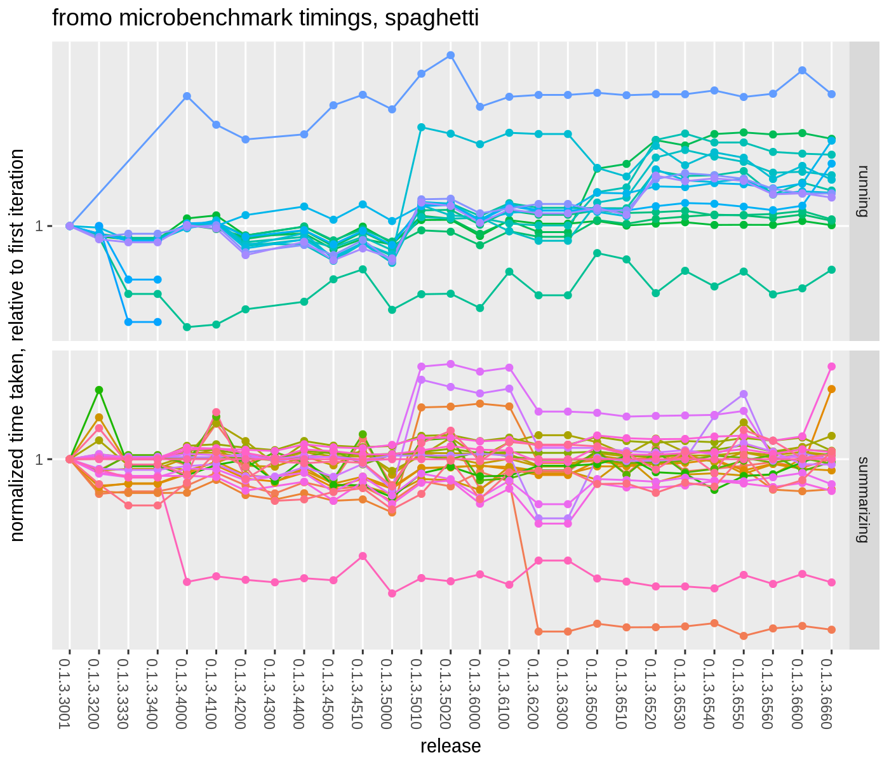
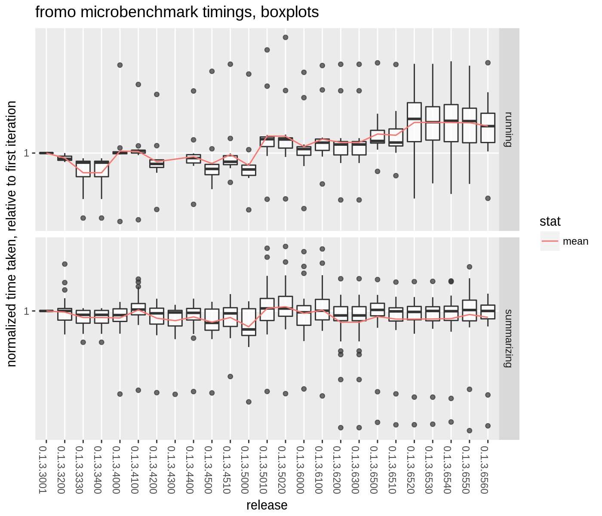

# fromo timings

To prevent performance regressions, compare them here, including benchmarks
against other packages:


```r
library(fromo)
library(RollingWindow)
library(roll)
library(RcppRoll)
library(microbenchmark)
library(moments)
library(RcppParallel)
# keep this constant for comparison
setThreadOptions(numThreads = 2)

print(Sys.info())
```

```
##                                       sysname                                       release                                       version 
##                                       "Linux"                            "4.4.0-77-generic" "#98-Ubuntu SMP Wed Apr 26 08:34:02 UTC 2017" 
##                                      nodename                                       machine                                         login 
##                                "6747492c4a45"                                      "x86_64"                                     "unknown" 
##                                          user                                effective_user 
##                                        "spav"                                        "spav"
```

```r
print(sessionInfo())
```

```
## R version 3.3.0 RC (2016-05-01 r70566)
## Platform: x86_64-pc-linux-gnu (64-bit)
## Running under: Debian GNU/Linux stretch/sid
## 
## locale:
##  [1] LC_CTYPE=en_US.UTF-8       LC_NUMERIC=C               LC_TIME=en_US.UTF-8        LC_COLLATE=en_US.UTF-8     LC_MONETARY=en_US.UTF-8   
##  [6] LC_MESSAGES=en_US.UTF-8    LC_PAPER=en_US.UTF-8       LC_NAME=C                  LC_ADDRESS=C               LC_TELEPHONE=C            
## [11] LC_MEASUREMENT=en_US.UTF-8 LC_IDENTIFICATION=C       
## 
## attached base packages:
## [1] utils   methods base   
## 
## other attached packages:
##  [1] RcppParallel_4.3.20    RcppRoll_0.2.2         roll_1.0.7             RollingWindow_0.2      microbenchmark_1.4-2.1 moments_0.14          
##  [7] dplyr_0.5.0            ggplot2_2.2.1          knitr_1.15.1           fromo_0.1.3.6000      
## 
## loaded via a namespace (and not attached):
##  [1] Rcpp_0.12.11     grDevices_3.3.0  assertthat_0.1   R6_2.1.2         grid_3.3.0       plyr_1.8.4       DBI_0.6-1        gtable_0.2.0     formatR_1.4     
## [10] magrittr_1.5     evaluate_0.10    scales_0.4.1     stringi_1.0-1    lazyeval_0.2.0   graphics_3.3.0   tools_3.3.0      stringr_1.0.0    munsell_0.4.3   
## [19] stats_3.3.0      colorspace_1.3-2 tibble_1.2
```

```r
set.seed(12345)
x <- rnorm(1e+05)
xpos <- runif(length(x)) + 1
xm <- matrix(x, ncol = 1)
xmps <- matrix(xpos, ncol = 1)
w <- runif(length(x))

dumbk <- function(x) {
    c(kurtosis(x) - 3, skewness(x), sd(x), mean(x), 
        length(x))
}

checkit <- microbenchmark(sum(x), mean(x), sd(x), skewness(x), 
    kurtosis(x), sd3(x), skew4(x), kurt5(x), dumbk(x))
print(checkit)
```

```
## Unit: microseconds
##         expr   min    lq  mean median    uq   max neval    cld
##       sum(x)    80    82    95     87    95   241   100 a     
##      mean(x)   162   179   207    191   218   512   100 a     
##        sd(x)   459   503   574    557   634   855   100 a     
##  skewness(x)  8358  9152 10111  10067 10731 14819   100   cd  
##  kurtosis(x)  8128  8993  9726   9804 10333 12696   100   c   
##       sd3(x)  1462  1546  1718   1682  1791  2586   100  b    
##     skew4(x)  8877  9336 10377  10469 10873 13889   100    d  
##     kurt5(x) 16042 16716 18424  18534 19787 22731   100     e 
##     dumbk(x) 17273 18855 20630  20431 22269 27907   100      f
```

```r
resdf <- checkit
```


```r
# weights
slow_sd <- function(x, w) {
    n0 <- length(x)
    mu <- weighted.mean(x, w = w)
    sg <- sqrt(sum(w * (x - mu)^2)/(n0 - 1))
    c(sg, mu, n0)
}
checkit <- microbenchmark(cent_moments(x, max_order = 4, 
    wts = w, na_rm = TRUE, normalize_wts = FALSE), 
    sd3(x, wts = w), slow_sd(x, w))
print(checkit)
```

```
## Unit: milliseconds
##                                                                          expr  min   lq mean median   uq  max neval cld
##  cent_moments(x, max_order = 4, wts = w, na_rm = TRUE, normalize_wts = FALSE) 16.7 16.9 18.6   17.1 20.7 28.3   100   b
##                                                               sd3(x, wts = w)  1.6  1.7  1.9    1.8  2.0  4.2   100  a 
##                                                                 slow_sd(x, w)  1.4  1.5  2.3    1.8  3.1  6.2   100  a
```

```r
resdf <- rbind(resdf, checkit)
```


```r
set.seed(12345)
x1 <- runif(10000)
x2 <- runif(length(x1))

checkit <- microbenchmark(as.centsums(x1, 1), as.centsums(x1, 
    2), as.centsums(x1, 3), as.centsums(x1, 4))
print(checkit)
```

```
## Unit: microseconds
##                expr  min   lq mean median   uq  max neval cld
##  as.centsums(x1, 1)  195  217  249    231  274  467   100 a  
##  as.centsums(x1, 2)  198  222  246    227  249  485   100 a  
##  as.centsums(x1, 3)  900 1007 1081   1060 1147 1589   100  b 
##  as.centsums(x1, 4) 1549 1685 1845   1827 1955 2452   100   c
```

```r
resdf <- rbind(resdf, checkit)

# join them together
max_ord <- 6L
obj1 <- as.centsums(x1, max_ord)
obj2 <- as.centsums(x2, max_ord)
obj3 <- as.centsums(c(x1, x2), max_ord)

checkit <- microbenchmark(c(obj1, obj2), obj3 %-% obj1)
print(checkit)
```

```
## Unit: microseconds
##           expr min lq mean median uq max neval cld
##  c(obj1, obj2)  15 16   19     16 18 191   100   a
##  obj3 %-% obj1  12 13   16     13 14 101   100   a
```

```r
resdf <- rbind(resdf, checkit)

max_ord <- 6L
rs1 <- cent_sums(x1, max_ord)
rs2 <- cent_sums(x2, max_ord)
rs3 <- cent_sums(c(x1, x2), max_ord)

checkit <- microbenchmark(join_cent_sums(rs1, rs2), 
    unjoin_cent_sums(rs3, rs2), unjoin_cent_sums(rs3, 
        rs1))
print(checkit)
```

```
## Unit: microseconds
##                        expr min  lq mean median  uq  max neval cld
##    join_cent_sums(rs1, rs2) 2.4 2.5  3.1    2.7 2.8 28.4   100   a
##  unjoin_cent_sums(rs3, rs2) 2.1 2.3  2.5    2.5 2.6  3.4   100   a
##  unjoin_cent_sums(rs3, rs1) 2.1 2.3  2.8    2.4 2.6 29.8   100   a
```

```r
resdf <- rbind(resdf, checkit)
```


```r
set.seed(54321)
x1 <- matrix(rnorm(100 * 4), ncol = 4)
x2 <- matrix(rnorm(100 * 4), ncol = 4)

max_ord <- 2L

# join them together
mobj1 <- as.centcosums(x1, max_ord)
mobj2 <- as.centcosums(x2, max_ord)
mobj3 <- as.centcosums(rbind(x1, x2), max_ord)
alt3 <- c(mobj1, mobj2)
# unjoin them, with this one weird operator:
alt2 <- mobj3 %-% mobj1
alt1 <- mobj3 %-% mobj2

checkit <- microbenchmark(as.centcosums(x1, max_ord), 
    mobj3 %-% mobj1)
print(checkit)
```

```
## Unit: microseconds
##                        expr min lq mean median uq max neval cld
##  as.centcosums(x1, max_ord)  53 55   60     56 58 153   100   b
##             mobj3 %-% mobj1  17 19   22     20 21  42   100  a
```

```r
resdf <- rbind(resdf, checkit)
```


```r
set.seed(4422)
x <- rnorm(10000)
xpos <- runif(length(x)) + 1
xm <- matrix(x, ncol = 1)
xmps <- matrix(xpos, ncol = 1)
w <- runif(length(x))

dumb_zscore <- function(x, window) {
    altz <- sapply(seq_along(x), function(iii) {
        rowi <- max(1, iii - window + 1)
        xrang <- x[rowi:iii]
        (x[iii] - mean(xrang))/sd(xrang)
    }, simplify = TRUE)
}

# run fun on each wins sized window...
silly_fun <- function(x, wins, fun, ...) {
    xout <- rep(NA, length(x))
    for (iii in seq_along(x)) {
        xout[iii] <- fun(x[max(1, iii - wins + 1):iii], 
            ...)
    }
    xout
}

wins <- 250

checkit <- microbenchmark(silly_fun(x, wins, sum, na.rm = FALSE), 
    silly_fun(x, wins, mean, na.rm = FALSE), running_sum(x, 
        wins), running_mean(x, wins), roll::roll_sum(xm, 
        wins), roll::roll_mean(xm, wins), roll::roll_sd(xm, 
        wins), RollingWindow::RollingSum(x, wins, na_method = "ignore"), 
    RollingWindow::RollingSum(x, wins), RollingWindow::RollingMean(x, 
        wins), RollingWindow::RollingStd(x, wins), 
    RcppRoll::roll_sum(xm, n = wins, align = "right", 
        fill = NA), RcppRoll::roll_mean(xm, n = wins, 
        align = "right", fill = NA), RcppRoll::roll_sd(xm, 
        n = wins, align = "right", fill = NA), running_sd(x, 
        wins, na_rm = FALSE, restart_period = 50000L), 
    running_sd(x, wins, na_rm = TRUE, restart_period = 1000L), 
    running_sd3(x, wins), running_skew(x, wins), running_skew4(x, 
        wins), running_kurt(x, wins), running_kurt5(x, 
        wins), running_tstat(x, wins), running_zscored(x, 
        wins), running_sharpe(x, wins), running_apx_median(x, 
        wins), running_centered(x, wins), running_scaled(x, 
        wins))
print(checkit)
```

```
## Unit: microseconds
##                                                           expr   min    lq  mean median    uq    max neval         cld
##                         silly_fun(x, wins, sum, na.rm = FALSE) 32328 33333 36269  34863 35568 155301   100          j 
##                        silly_fun(x, wins, mean, na.rm = FALSE) 64688 66328 70887  67805 69301 147085   100           k
##                                           running_sum(x, wins)   104   109   120    114   123    217   100 ab         
##                                          running_mean(x, wins)   105   109   120    117   124    194   100 a          
##                                       roll::roll_sum(xm, wins)  1798  1922  2041   1977  2017   4200   100 a  d       
##                                      roll::roll_mean(xm, wins)  1976  2101  2239   2177  2253   4361   100   cd       
##                                        roll::roll_sd(xm, wins)  5435  5805  6187   5946  6184  15342   100      fg    
##       RollingWindow::RollingSum(x, wins, na_method = "ignore")   358   386   556    431   463   4038   100 abc        
##                             RollingWindow::RollingSum(x, wins)   107   124   178    142   192   2207   100 ab         
##                            RollingWindow::RollingMean(x, wins)   139   155   325    202   236   3026   100 abc        
##                             RollingWindow::RollingStd(x, wins)   224   253   389    289   329   2405   100 abc        
##   RcppRoll::roll_sum(xm, n = wins, align = "right", fill = NA)  1741  1826  2042   1975  2063   4349   100 a  d       
##  RcppRoll::roll_mean(xm, n = wins, align = "right", fill = NA)  1723  2006  2118   2047  2183   4538   100  b d       
##    RcppRoll::roll_sd(xm, n = wins, align = "right", fill = NA) 10277 10681 12161  10982 12401  86382   100        h   
##    running_sd(x, wins, na_rm = FALSE, restart_period = 50000L)   427   443   527    459   480   2452   100 abc        
##      running_sd(x, wins, na_rm = TRUE, restart_period = 1000L)   501   589   641    611   637   2407   100 abc        
##                                           running_sd3(x, wins)  1343  1399  1558   1439  1531   3678   100 abc        
##                                          running_skew(x, wins)  3722  3771  3965   3868  4048   5500   100    de      
##                                         running_skew4(x, wins)  4458  4570  4776   4647  4847   7794   100     ef     
##                                          running_kurt(x, wins)  5471  5545  5799   5670  5894   7994   100     e g    
##                                         running_kurt5(x, wins)  6839  6988  7331   7171  7361   9620   100       g    
##                                         running_tstat(x, wins)   893   909   978    933   982   3380   100 abc        
##                                       running_zscored(x, wins)   862   868   926    893   943   1320   100 abc        
##                                        running_sharpe(x, wins)   854   863   918    899   939   1203   100 abc        
##                                    running_apx_median(x, wins) 14746 15026 15805  15244 16227  20865   100         i  
##                                      running_centered(x, wins)   625   634   688    656   686   2573   100 abc        
##                                        running_scaled(x, wins)   859   868   929    893   969   1588   100 abc
```

```r
resdf <- rbind(resdf, checkit)
```


```r
# print(resdf)
library(readr)
readr::write_csv(resdf, "timings.csv")
```

## performance regressions?

Can we see them here? load all the timing data to check.


```r
library(magrittr)
library(dplyr)
library(readr)
library(tidyr)
library(knitr)

mysernum <- as.character(packageVersion("fromo"))
allt <- data.frame(fname = dir(".", "*.csv"), stringsAsFactors = FALSE) %>% 
    dplyr::filter(grepl("^timings_\\d.+\\d+.csv$", 
        fname)) %>% group_by(fname) %>% mutate(tims = list(readr::read_csv(fname))) %>% 
    ungroup() %>% tidyr::unnest() %>% mutate(sernum = gsub("^timings_(.+).csv$", 
    "\\1", fname)) %>% dplyr::select(-fname) %>% rbind(resdf %>% 
    dplyr::mutate(sernum = mysernum)) %>% group_by(sernum, 
    expr) %>% summarize(meantime = mean(time, na.rm = TRUE)) %>% 
    ungroup() %>% group_by(sernum) %>% mutate(sumx_time = median(ifelse(grepl("^sum\\(x\\)$", 
    expr), meantime, NA), na.rm = TRUE)) %>% ungroup() %>% 
    mutate(normalized = meantime/sumx_time) %>% arrange(sernum) %>% 
    group_by(expr) %>% mutate(first_norm = first(normalized), 
    last_norm = last(normalized)) %>% ungroup() %>% 
    mutate(relchange = normalized/first_norm, last_status = last_norm/first_norm)

library(ggplot2)
ph <- allt %>% ggplot(aes(sernum, normalized, group = expr, 
    color = expr)) + geom_line() + geom_point() + scale_y_log10() + 
    guides(colour = FALSE) + labs(x = "release", y = "mean time taken, relative to sum(x)", 
    title = "fromo microbenchmark timings")
print(ph)
```


```r
ph <- allt %>% ggplot(aes(sernum, relchange, group = expr, 
    color = expr)) + geom_line() + geom_point() + scale_y_log10() + 
    guides(colour = FALSE) + labs(x = "release", y = "normalized time taken, relative to first iteration", 
    title = "fromo microbenchmark timings")
print(ph)
```



```r
ph <- allt %>% ggplot(aes(sernum, relchange)) + geom_boxplot(aes(group = sernum), 
    alpha = 0.7) + stat_summary(aes(group = "1", color = "mean"), 
    fun.y = mean, geom = "line") + scale_y_log10() + 
    labs(x = "release", y = "normalized time taken, relative to first iteration", 
        color = "stat", title = "fromo microbenchmark timings")
print(ph)
```



```r
allt %>% select(expr, sernum, relchange, last_status) %>% 
    tidyr::spread(key = "sernum", value = "relchange") %>% 
    arrange(desc(last_status)) %>% select(-last_status) %>% 
    head(n = 40) %>% kable()
```


|expr                                                                         | 0.1.3.3001| 0.1.3.3200| 0.1.3.3330| 0.1.3.3400| 0.1.3.4000| 0.1.3.4100| 0.1.3.4200| 0.1.3.4300| 0.1.3.4400| 0.1.3.4500| 0.1.3.4510| 0.1.3.5000| 0.1.3.5010| 0.1.3.5020| 0.1.3.6000|
|:----------------------------------------------------------------------------|----------:|----------:|----------:|----------:|----------:|----------:|----------:|----------:|----------:|----------:|----------:|----------:|----------:|----------:|----------:|
|running_sum(x, wins)                                                         |          1|         NA|         NA|         NA|       2.72|       2.18|       1.95|         NA|       2.02|       2.53|       2.74|       2.45|       3.23|       3.72|       3.02|
|running_sd3(x, wins)                                                         |         NA|         NA|         NA|         NA|       1.00|       1.04|       0.86|         NA|       0.95|       0.78|       0.88|       0.80|       2.14|       2.03|       1.93|
|sd3(x)                                                                       |          1|       1.03|       1.01|       1.01|       1.03|       1.03|       1.02|       1.00|       1.02|       1.01|       0.99|       1.00|       1.77|       1.80|       1.71|
|sd3(x, wts = w)                                                              |          1|       0.94|       0.94|       0.94|       0.96|       0.97|       0.90|       0.90|       0.95|       0.90|       0.97|       0.83|       1.63|       1.56|       1.51|
|as.centsums(x1, 2)                                                           |          1|       0.82|       0.81|       0.81|       0.81|       0.88|       0.80|       0.78|       0.81|       0.77|       0.78|       0.72|       1.38|       1.38|       1.38|
|running_tstat(x, wins)                                                       |          1|       0.92|       0.94|       0.94|       0.99|       1.01|       0.82|         NA|       0.86|       0.80|       0.90|       0.76|       1.23|       1.23|       1.15|
|skew4(x)                                                                     |          1|       1.01|       1.01|       1.01|       1.07|       1.07|       1.06|       1.05|       1.10|       1.08|       1.07|       1.09|       1.14|       1.14|       1.12|
|running_scaled(x, wins)                                                      |          1|       0.94|       0.91|       0.91|       0.98|       1.03|       0.88|         NA|       0.92|       0.79|       0.88|       0.79|       1.19|       1.19|       1.12|
|kurt5(x)                                                                     |          1|       1.02|       1.00|       1.00|       1.09|       1.10|       1.07|       1.06|       1.12|       1.09|       1.08|       1.08|       1.15|       1.16|       1.11|
|running_sd(x, wins, na_rm = TRUE, restart_period = 1000L)                    |         NA|         NA|         NA|         NA|       1.00|       1.03|       0.87|         NA|       0.87|       0.77|       0.87|       0.75|       1.17|       1.08|       1.10|
|running_skew4(x, wins)                                                       |          1|       0.94|       0.89|       0.89|       1.02|       1.03|       0.92|         NA|       0.97|       0.87|       0.96|       0.86|       1.17|       1.18|       1.10|
|running_skew(x, wins)                                                        |         NA|         NA|         NA|         NA|         NA|       1.00|       1.09|         NA|       1.16|       1.05|       1.18|       1.04|       1.17|       1.18|       1.09|
|running_sharpe(x, wins)                                                      |          1|       0.99|       0.90|       0.90|       0.98|       1.02|       0.84|         NA|       0.90|       0.79|       0.88|       0.77|       1.20|       1.19|       1.09|
|running_zscored(x, wins)                                                     |          1|       0.90|       0.88|       0.88|       1.01|       0.98|       0.80|         NA|       0.89|       0.77|       0.84|       0.78|       1.20|       1.17|       1.08|
|running_sd(x, wins, na_rm = FALSE, restart_period = 50000L)                  |         NA|         NA|         NA|         NA|       1.00|       1.03|       0.86|         NA|       0.90|       0.85|       0.92|       0.83|       1.07|       1.06|       1.05|
|running_kurt5(x, wins)                                                       |          1|       0.94|       0.91|       0.91|       1.01|       1.03|       0.93|         NA|       1.00|       0.90|       0.98|       0.89|       1.13|       1.13|       1.05|
|skewness(x)                                                                  |          1|       1.00|       1.00|       1.00|       1.06|       1.07|       1.04|       1.01|       1.06|       1.05|       1.03|       1.03|       1.06|       1.08|       1.04|
|kurtosis(x)                                                                  |          1|       1.00|       1.00|       1.00|       1.06|       1.06|       1.03|       1.00|       1.05|       1.04|       1.03|       1.03|       1.04|       1.07|       1.02|
|dumbk(x)                                                                     |          1|       1.03|       1.01|       1.01|       1.04|       1.04|       1.01|       0.99|       1.04|       1.02|       1.02|       1.02|       1.04|       1.04|       1.02|
|mean(x)                                                                      |          1|       1.02|       1.00|       1.00|       1.01|       1.01|       1.01|       1.01|       1.01|       1.06|       0.97|       1.03|       1.02|       1.00|       1.02|
|sd(x)                                                                        |          1|       1.02|       1.01|       1.01|       1.01|       1.01|       1.03|       0.99|       1.01|       1.02|       1.00|       1.02|       1.02|       1.02|       1.02|
|join_cent_sums(rs1, rs2)                                                     |          1|       1.12|       0.96|       0.96|       1.02|       1.25|       1.12|       0.97|       1.10|       1.03|       1.05|       0.93|       1.02|       1.14|       1.01|
|unjoin_cent_sums(rs3, rs1)                                                   |          1|       1.21|       0.97|       0.97|       0.91|       1.34|       0.88|       0.99|       0.98|       0.99|       0.98|       0.85|       1.10|       1.19|       1.01|
|sum(x)                                                                       |          1|       1.00|       1.00|       1.00|       1.00|       1.00|       1.00|       1.00|       1.00|       1.00|       1.00|       1.00|       1.00|       1.00|       1.00|
|running_centered(x, wins)                                                    |          1|       0.93|       0.91|       0.91|       1.01|       0.98|       0.92|         NA|       0.94|       0.84|       0.91|       0.87|       1.08|       1.06|       0.98|
|RollingWindow::RollingMean(x, wins)                                          |          1|       1.12|       0.88|       0.88|       0.86|       1.03|       1.22|         NA|       1.23|       0.91|       1.02|       0.88|       0.88|       0.88|       0.97|
|cent_moments(x, max_order = 4, wts = w, na_rm = TRUE, normalize_wts = FALSE) |          1|       0.93|       0.94|       0.94|       1.01|       1.07|       0.96|       0.95|       1.02|       0.96|       1.06|       0.91|       1.04|       1.01|       0.97|
|running_apx_median(x, wins)                                                  |          1|       0.92|       0.90|       0.90|       1.06|       1.09|       0.93|         NA|       1.00|       0.89|       1.00|       0.88|       1.05|       1.05|       0.96|
|as.centsums(x1, 3)                                                           |          1|       0.85|       0.86|       0.86|       0.91|       0.96|       0.89|       0.87|       0.92|       0.84|       0.89|       0.83|       0.95|       0.95|       0.96|
|RcppRoll::roll_sd(xm, n = wins, align = "right", fill = NA)                  |         NA|         NA|         NA|         NA|       1.00|       1.11|       0.95|         NA|       1.00|       0.91|       1.01|       0.88|       1.05|       1.04|       0.95|
|as.centsums(x1, 4)                                                           |          1|       0.84|       0.86|       0.86|       0.92|       0.99|       0.91|       0.89|       0.93|       0.86|       0.90|       0.84|       0.95|       0.95|       0.95|
|running_kurt(x, wins)                                                        |         NA|         NA|         NA|         NA|         NA|       1.00|       0.91|         NA|       0.97|       0.85|       0.95|       0.86|       0.97|       0.96|       0.90|
|unjoin_cent_sums(rs3, rs2)                                                   |          1|       0.86|       0.75|       0.75|       0.87|       1.05|       0.95|       0.77|       0.78|       0.82|       0.84|       0.73|       0.81|       0.99|       0.90|
|as.centsums(x1, 1)                                                           |          1|       0.81|       0.82|       0.82|       0.85|       0.92|       0.85|       0.81|       0.87|       0.83|       0.85|       0.77|       0.87|       0.85|       0.89|
|obj3 %-% obj1                                                                |          1|       1.53|       0.96|       0.96|       0.91|       0.97|       1.00|       0.87|       1.00|       0.85|       0.85|       0.79|       0.92|       0.95|       0.89|
|mobj3 %-% mobj1                                                              |          1|       0.93|       1.03|       1.03|       0.97|       1.30|       0.95|       1.04|       0.98|       0.88|       1.17|       0.83|       1.12|       1.14|       0.89|
|RollingWindow::RollingSum(x, wins, na_method = "ignore")                     |          1|       0.83|       0.93|       0.93|       1.04|       0.95|       0.96|         NA|       0.86|       0.97|       1.08|       0.94|       0.97|       0.93|       0.87|
|c(obj1, obj2)                                                                |          1|       1.29|       0.97|       0.97|       0.93|       0.98|       1.04|       0.87|       0.95|       0.86|       0.85|       0.81|       0.89|       0.88|       0.87|
|roll::roll_sd(xm, wins)                                                      |          1|       0.93|       0.91|       0.91|       0.97|       1.02|       0.85|         NA|       0.90|       0.83|       0.91|       0.83|       0.97|       0.94|       0.86|
|roll::roll_mean(xm, wins)                                                    |          1|       0.95|       0.91|       0.91|       1.01|       1.00|       0.88|         NA|       0.91|       0.81|       0.96|       0.84|       0.93|       0.92|       0.86|

```r
allt %>% select(-sernum, -relchange, -meantime, -sumx_time, 
    -normalized) %>% distinct(expr, .keep_all = TRUE) %>% 
    arrange(desc(last_status)) %>% head(n = 20) %>% 
    kable()
```


|expr                                                        | first_norm| last_norm| last_status|
|:-----------------------------------------------------------|----------:|---------:|-----------:|
|running_sum(x, wins)                                        |       0.51|       1.5|         3.0|
|running_sd3(x, wins)                                        |       8.72|      16.9|         1.9|
|sd3(x)                                                      |      10.52|      18.0|         1.7|
|sd3(x, wts = w)                                             |      13.06|      19.7|         1.5|
|as.centsums(x1, 2)                                          |       1.83|       2.5|         1.4|
|running_tstat(x, wins)                                      |       9.32|      10.7|         1.1|
|skew4(x)                                                    |      97.66|     109.8|         1.1|
|running_scaled(x, wins)                                     |       9.03|      10.2|         1.1|
|kurt5(x)                                                    |     173.12|     192.6|         1.1|
|running_sd(x, wins, na_rm = TRUE, restart_period = 1000L)   |       6.29|       6.9|         1.1|
|running_skew4(x, wins)                                      |      48.07|      52.7|         1.1|
|running_skew(x, wins)                                       |      39.66|      43.4|         1.1|
|running_sharpe(x, wins)                                     |       9.22|      10.1|         1.1|
|running_zscored(x, wins)                                    |       9.49|      10.3|         1.1|
|running_sd(x, wins, na_rm = FALSE, restart_period = 50000L) |       5.19|       5.4|         1.1|
|running_kurt5(x, wins)                                      |      76.25|      79.7|         1.1|
|skewness(x)                                                 |     100.16|     104.5|         1.0|
|kurtosis(x)                                                 |      98.46|     100.9|         1.0|
|dumbk(x)                                                    |     209.85|     214.3|         1.0|
|mean(x)                                                     |       2.07|       2.1|         1.0|


