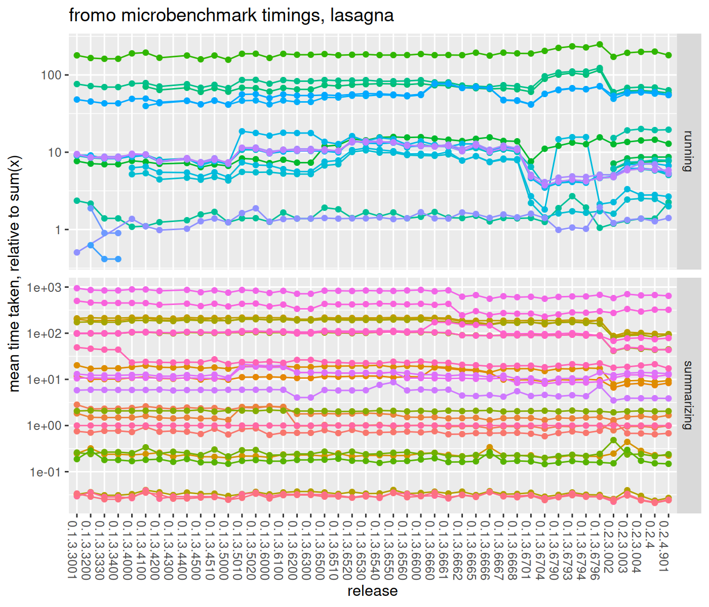
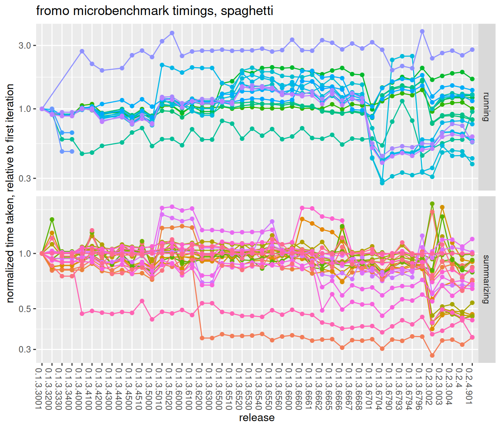
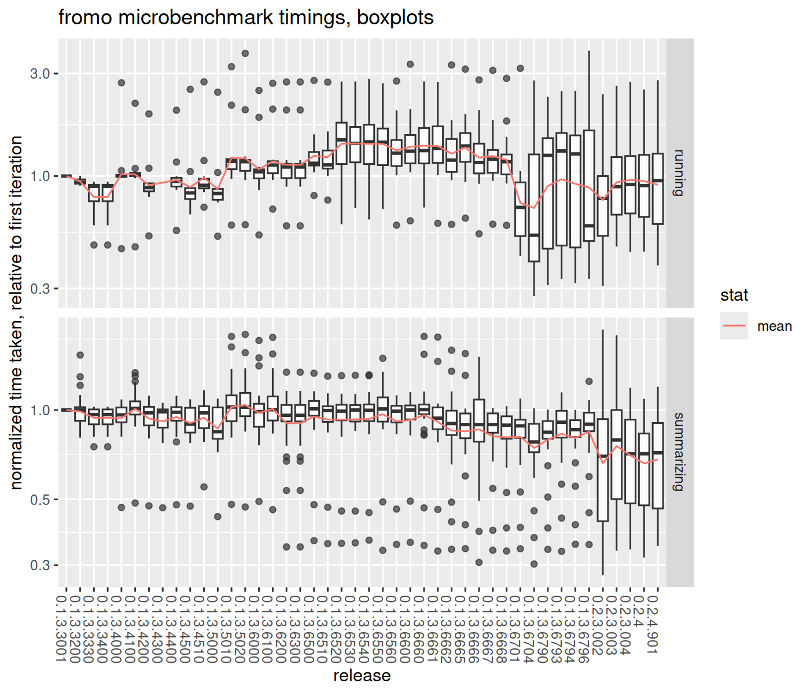

# fromo timings

To prevent performance regressions, compare them here, including benchmarks
against other packages:


``` r
library(fromo)
# will not compile any more
# library(RollingWindow)
library(roll)
library(RcppRoll)
library(microbenchmark)
library(moments)
library(RcppParallel)
# keep this constant for comparison
setThreadOptions(numThreads = 2)

print(Sys.info())
```

```
##                                        sysname                                        release                                        version 
##                                        "Linux"                            "5.4.0-216-generic" "#236-Ubuntu SMP Fri Apr 11 19:53:21 UTC 2025" 
##                                       nodename                                        machine                                          login 
##                                       "nickel"                                       "x86_64"                                         "spav" 
##                                           user                                 effective_user 
##                                         "spav"                                         "spav"
```

``` r
print(sessionInfo())
```

```
## R version 4.5.2 (2025-10-31)
## Platform: x86_64-pc-linux-gnu
## Running under: Ubuntu 20.04.6 LTS
## 
## Matrix products: default
## BLAS:   /usr/lib/x86_64-linux-gnu/openblas-pthread/libblas.so.3 
## LAPACK: /usr/lib/x86_64-linux-gnu/openblas-pthread/liblapack.so.3;  LAPACK version 3.9.0
## 
## locale:
##  [1] LC_CTYPE=en_US.UTF-8       LC_NUMERIC=C               LC_TIME=en_US.UTF-8        LC_COLLATE=en_US.UTF-8     LC_MONETARY=en_US.UTF-8   
##  [6] LC_MESSAGES=en_US.UTF-8    LC_PAPER=en_US.UTF-8       LC_NAME=C                  LC_ADDRESS=C               LC_TELEPHONE=C            
## [11] LC_MEASUREMENT=en_US.UTF-8 LC_IDENTIFICATION=C       
## 
## time zone: America/Los_Angeles
## tzcode source: system (glibc)
## 
## attached base packages:
## [1] utils   methods base   
## 
## other attached packages:
##  [1] RcppParallel_5.1.4   RcppRoll_0.4.0       roll_1.2.1           microbenchmark_1.4-7 moments_0.14         dplyr_1.1.4          ggplot2_3.5.2       
##  [8] knitr_1.50           fromo_0.2.4.901      drat_0.2.1          
## 
## loaded via a namespace (and not attached):
##  [1] vctrs_0.6.5        cli_3.6.5          rlang_1.1.6        xfun_0.52          generics_0.1.4     glue_1.8.0         formatR_1.11       scales_1.4.0      
##  [9] grid_4.5.2         evaluate_1.0.5     tibble_3.3.0       lifecycle_1.0.4    compiler_4.5.2     RColorBrewer_1.1-2 Rcpp_1.1.2         pkgconfig_2.0.3   
## [17] stats_4.5.2        graphics_4.5.2     farver_2.1.0       R6_2.6.1           dichromat_2.0-0    tidyselect_1.2.1   pillar_1.10.2      magrittr_2.0.3    
## [25] tools_4.5.2        grDevices_4.5.2    withr_3.0.2        gtable_0.3.6
```

``` r
set.seed(12345)
x <- rnorm(1e+05)
xpos <- runif(length(x)) + 1
xm <- matrix(x, ncol = 1)
xmps <- matrix(xpos, ncol = 1)
w <- runif(length(x))

dumbk <- function(x) {
    c(kurtosis(x) - 3, skewness(x), sd(x), mean(x),
        length(x))
}

checkit <- microbenchmark(sum(x), mean(x), sd(x), skewness(x),
    kurtosis(x), sd3(x), skew4(x), kurt5(x), dumbk(x))
print(checkit)
```

```
## Unit: microseconds
##         expr  min   lq mean median   uq   max neval   cld
##       sum(x)   76   76   76     76   76    79   100 a    
##      mean(x)  154  155  156    155  155   246   100 a    
##        sd(x)  287  291  295    292  297   313   100 a    
##  skewness(x) 3286 3305 3313   3308 3313  3501   100  b   
##  kurtosis(x) 3289 3304 3413   3307 3311 13801   100  b   
##       sd3(x)  956  958  961    959  962  1020   100   c  
##     skew4(x) 6003 6007 6021   6010 6015  6267   100    d 
##     kurt5(x) 6993 7074 7112   7078 7086  8071   100     e
##     dumbk(x) 7038 7064 7323   7072 7085 17560   100     e
```

``` r
resdf <- checkit
gc()
```

```
##           used (Mb) gc trigger (Mb) max used (Mb)
## Ncells 1947947  104    3.7e+06  197  3.7e+06  197
## Vcells 3946301   30    1.8e+07  134  2.7e+07  210
```


``` r
# weights
slow_sd <- function(x, w) {
    n0 <- length(x)
    mu <- weighted.mean(x, w = w)
    sg <- sqrt(sum(w * (x - mu)^2)/(n0 - 1))
    c(sg, mu, n0)
}
checkit <- microbenchmark(cent_moments(x, max_order = 4,
    wts = w, na_rm = TRUE, normalize_wts = FALSE),
    sd3(x, wts = w), slow_sd(x, w))
print(checkit)
```

```
## Unit: microseconds
##                                                                          expr  min   lq mean median   uq  max neval cld
##  cent_moments(x, max_order = 4, wts = w, na_rm = TRUE, normalize_wts = FALSE) 6870 6930 6967   6935 6946 8185   100 a  
##                                                               sd3(x, wts = w)  931  931  936    933  938 1007   100  b 
##                                                                 slow_sd(x, w)  853  873 1386    879 1746 8213   100   c
```

``` r
resdf <- rbind(resdf, checkit)
gc()
```

```
##           used (Mb) gc trigger (Mb) max used (Mb)
## Ncells 1948542  104    3.7e+06  197  3.7e+06  197
## Vcells 3949203   30    1.8e+07  134  2.7e+07  210
```


``` r
set.seed(12345)
x1 <- runif(10000)
x2 <- runif(length(x1))

checkit <- microbenchmark(as.centsums(x1, 1), as.centsums(x1,
    2), as.centsums(x1, 3), as.centsums(x1, 4))
print(checkit)
```

```
## Unit: microseconds
##                expr min  lq mean median  uq max neval  cld
##  as.centsums(x1, 1)  73  74   76     74  80  85   100 a   
##  as.centsums(x1, 2) 125 126  128    126 130 135   100  b  
##  as.centsums(x1, 3) 630 631  636    632 637 819   100   c 
##  as.centsums(x1, 4) 726 729  734    730 736 765   100    d
```

``` r
resdf <- rbind(resdf, checkit)
gc()
```

```
##           used (Mb) gc trigger (Mb) max used (Mb)
## Ncells 1948985  104    3.7e+06  197  3.7e+06  197
## Vcells 3970828   30    1.8e+07  134  2.7e+07  210
```

``` r
# join them together
max_ord <- 6L
obj1 <- as.centsums(x1, max_ord)
obj2 <- as.centsums(x2, max_ord)
obj3 <- as.centsums(c(x1, x2), max_ord)

checkit <- microbenchmark(c(obj1, obj2), obj3 %-% obj1)
print(checkit)
```

```
## Unit: microseconds
##           expr  min lq mean median uq max neval cld
##  c(obj1, obj2) 13.4 14   17     14 15 253   100  a 
##  obj3 %-% obj1  9.7 10   11     11 11  39   100   b
```

``` r
resdf <- rbind(resdf, checkit)
gc()
```

```
##           used (Mb) gc trigger (Mb) max used (Mb)
## Ncells 1949647  104    3.7e+06  197  3.7e+06  197
## Vcells 3972114   30    1.8e+07  134  2.7e+07  210
```

``` r
max_ord <- 6L
rs1 <- cent_sums(x1, max_ord)
rs2 <- cent_sums(x2, max_ord)
rs3 <- cent_sums(c(x1, x2), max_ord)

checkit <- microbenchmark(join_cent_sums(rs1, rs2),
    unjoin_cent_sums(rs3, rs2), unjoin_cent_sums(rs3,
        rs1))
print(checkit)
```

```
## Unit: microseconds
##                        expr min  lq mean median  uq  max neval cld
##    join_cent_sums(rs1, rs2) 1.7 1.8  2.0    1.8 1.8 18.7   100   a
##  unjoin_cent_sums(rs3, rs2) 1.7 1.7  1.7    1.7 1.7  2.4   100   a
##  unjoin_cent_sums(rs3, rs1) 1.7 1.7  1.8    1.7 1.7  5.4   100   a
```

``` r
resdf <- rbind(resdf, checkit)
gc()
```

```
##           used (Mb) gc trigger (Mb) max used (Mb)
## Ncells 1949706  104    3.7e+06  197  3.7e+06  197
## Vcells 3972867   30    1.8e+07  134  2.7e+07  210
```


``` r
set.seed(54321)
x1 <- matrix(rnorm(100 * 4), ncol = 4)
x2 <- matrix(rnorm(100 * 4), ncol = 4)

max_ord <- 2L

# join them together
mobj1 <- as.centcosums(x1, max_ord)
mobj2 <- as.centcosums(x2, max_ord)
mobj3 <- as.centcosums(rbind(x1, x2), max_ord)
alt3 <- c(mobj1, mobj2)
# unjoin them, with this one weird operator:
alt2 <- mobj3 %-% mobj1
alt1 <- mobj3 %-% mobj2

checkit <- microbenchmark(as.centcosums(x1, max_ord),
    mobj3 %-% mobj1)
print(checkit)
```

```
## Unit: microseconds
##                        expr min lq mean median uq max neval cld
##  as.centcosums(x1, max_ord)  47 48   49     49 49  86   100  a 
##             mobj3 %-% mobj1  15 16   18     17 18  70   100   b
```

``` r
resdf <- rbind(resdf, checkit)
gc()
```

```
##           used (Mb) gc trigger (Mb) max used (Mb)
## Ncells 1949847  104    3.7e+06  197  3.7e+06  197
## Vcells 3954365   30    1.8e+07  134  2.7e+07  210
```


``` r
set.seed(4422)
x <- rnorm(10000)
xpos <- runif(length(x)) + 1
xm <- matrix(x, ncol = 1)
xmps <- matrix(xpos, ncol = 1)
w <- runif(length(x))

dumb_zscore <- function(x, window) {
    altz <- sapply(seq_along(x), function(iii) {
        rowi <- max(1, iii - window + 1)
        xrang <- x[rowi:iii]
        (x[iii] - mean(xrang))/sd(xrang)
    }, simplify = TRUE)
}

# run fun on each wins sized window...
silly_fun <- function(x, wins, fun, ...) {
    xout <- rep(NA, length(x))
    for (iii in seq_along(x)) {
        xout[iii] <- fun(x[max(1, iii - wins + 1):iii],
            ...)
    }
    xout
}

wins <- 250

# RollingWindow::RollingSum(x,wins,na_method='ignore'),
# RollingWindow::RollingSum(x,wins),
# RollingWindow::RollingMean(x,wins),
# RollingWindow::RollingStd(x,wins),
checkit <- microbenchmark(silly_fun(x, wins, sum, na.rm = FALSE),
    silly_fun(x, wins, mean, na.rm = FALSE), running_sum(x,
        wins), running_mean(x, wins), roll::roll_sum(xm,
        wins), roll::roll_mean(xm, wins), roll::roll_sd(xm,
        wins), RcppRoll::roll_sum(xm, n = wins, align = "right",
        fill = NA), RcppRoll::roll_mean(xm, n = wins,
        align = "right", fill = NA), RcppRoll::roll_sd(xm,
        n = wins, align = "right", fill = NA), running_sd(x,
        wins, na_rm = FALSE, restart_period = 50000L),
    running_sd(x, wins, na_rm = TRUE, restart_period = 1000L),
    running_sd3(x, wins), running_skew(x, wins), running_skew4(x,
        wins), running_kurt(x, wins), running_kurt5(x,
        wins), running_tstat(x, wins), running_zscored(x,
        wins), running_sharpe(x, wins), running_apx_median(x,
        wins), running_centered(x, wins), running_scaled(x,
        wins))
print(checkit)
```

```
## Unit: microseconds
##                                                           expr   min    lq  mean median    uq    max neval   cld
##                         silly_fun(x, wins, sum, na.rm = FALSE) 16992 17161 24526  17374 24752 131260   100 a    
##                        silly_fun(x, wins, mean, na.rm = FALSE) 44539 45472 49126  47195 52735  62370   100  b   
##                                           running_sum(x, wins)    99   102   107    104   107    189   100   c  
##                                          running_mean(x, wins)    98   103   171    104   109   6552   100   c  
##                                       roll::roll_sum(xm, wins)    81    97   115    116   131    187   100   c  
##                                      roll::roll_mean(xm, wins)   113   132   213    153   164   6452   100   c  
##                                        roll::roll_sd(xm, wins)   379   390   416    409   423   1193   100   c  
##   RcppRoll::roll_sum(xm, n = wins, align = "right", fill = NA)   145   171   194    192   220    304   100   c  
##  RcppRoll::roll_mean(xm, n = wins, align = "right", fill = NA)   137   160   190    180   223    338   100   c  
##    RcppRoll::roll_sd(xm, n = wins, align = "right", fill = NA)   202   234   255    247   283    304   100   c  
##    running_sd(x, wins, na_rm = FALSE, restart_period = 50000L)   143   146   152    148   154    177   100   c  
##      running_sd(x, wins, na_rm = TRUE, restart_period = 1000L)   192   196   203    199   206    274   100   c  
##                                           running_sd3(x, wins)   425   430   510    433   442   7503   100   c  
##                                          running_skew(x, wins)  4155  4164  4181   4179  4192   4306   100    d 
##                                         running_skew4(x, wins)  4160  4168  4203   4186  4213   4417   100    d 
##                                          running_kurt(x, wins)  4412  4422  4450   4438  4452   4706   100    d 
##                                         running_kurt5(x, wins)  4711  4727  4832   4740  4763  11354   100    d 
##                                         running_tstat(x, wins)   390   395   401    397   403    430   100   c  
##                                       running_zscored(x, wins)   372   377   447    379   386   6730   100   c  
##                                        running_sharpe(x, wins)   392   398   407    400   417    527   100   c  
##                                    running_apx_median(x, wins) 13533 13576 13728  13614 13673  21388   100     e
##                                      running_centered(x, wins)   968   973   982    976   986   1026   100   c  
##                                        running_scaled(x, wins)   374   379   387    381   387    454   100   c
```

``` r
resdf <- rbind(resdf, checkit)
gc()
```

```
##           used (Mb) gc trigger (Mb) max used (Mb)
## Ncells 1951312  104    3.7e+06  197  3.7e+06  197
## Vcells 3514778   27    1.4e+07  107  2.7e+07  210
```

## Covariance and correlation

New functions that support running bivariate regression, correlation, _etc_ on two vectors.
Lets check their timings too.


``` r
set.seed(8931)
x <- rnorm(10000)
y <- 0.33 + 2.5 * x + rnorm(length(x), sd = 7)

wins <- 250

checkit <- microbenchmark(running_covariance(x, y,
    window = wins), running_correlation(x, y, window = wins),
    running_regression_slope(x, y, window = wins),
    running_regression_diagnostics(x, y, window = wins))
print(checkit)
```

```
## Unit: microseconds
##                                                 expr  min   lq mean median   uq  max neval  cld
##              running_covariance(x, y, window = wins)  547  551  554    552  553  631   100 a   
##             running_correlation(x, y, window = wins)  615  618  621    619  621  672   100  b  
##        running_regression_slope(x, y, window = wins)  566  567  571    569  571  612   100   c 
##  running_regression_diagnostics(x, y, window = wins) 1408 1414 1448   1423 1488 1578   100    d
```

``` r
resdf <- rbind(resdf, checkit)
gc()
```

```
##           used (Mb) gc trigger (Mb) max used (Mb)
## Ncells 1951230  104    3.7e+06  197  3.7e+06  197
## Vcells 3522759   27    1.4e+07  107  2.7e+07  210
```


``` r
library(readr)
FAKE_IT <- FALSE
if (FAKE_IT) {
    resdf <- readr::read_csv("timings.csv")
    # print(resdf)
} else {
    readr::write_csv(resdf, "timings.csv")
}
```

## performance regressions?

Can we see them here? load all the timing data to check.


``` r
library(magrittr)
library(dplyr)
library(readr)
library(tidyr)
library(knitr)

mysernum <- as.character(packageVersion("fromo"))
allt <- data.frame(fname = dir(".", "*.csv"), stringsAsFactors = FALSE) %>%
    dplyr::filter(grepl("^timings_\\d.+\\d+.csv$",
        fname)) %>%
    group_by(fname) %>%
    mutate(tims = list(readr::read_csv(fname))) %>%
    ungroup() %>%
    tidyr::unnest() %>%
    mutate(sernum = gsub("^timings_(.+).csv$", "\\1",
        fname)) %>%
    dplyr::select(-fname) %>%
    rbind(resdf %>%
        dplyr::mutate(sernum = mysernum)) %>%
    group_by(sernum, expr) %>%
    summarize(meantime = mean(time, na.rm = TRUE)) %>%
    ungroup() %>%
    group_by(sernum) %>%
    mutate(sumx_time = median(ifelse(grepl("^sum\\(x\\)$",
        expr), meantime, NA), na.rm = TRUE)) %>%
    ungroup() %>%
    mutate(normalized = meantime/sumx_time) %>%
    arrange(sernum) %>%
    group_by(expr) %>%
    mutate(first_norm = first(normalized), last_norm = last(normalized)) %>%
    ungroup() %>%
    mutate(relchange = normalized/first_norm, last_status = last_norm/first_norm) %>%
    mutate(exgrp = ifelse(grepl("^(roll|RollingWindow|RcppRoll)::",
        expr), "brand_x", ifelse(grepl("^running_",
        expr), "running", "summarizing")))

library(ggplot2)
ph <- allt %>%
    dplyr::filter(!grepl("brand_x", exgrp)) %>%
    ggplot(aes(sernum, normalized, group = expr, color = expr)) +
    geom_line() + geom_point() + scale_y_log10() +
    guides(colour = FALSE) + theme(axis.text.x = element_text(angle = -90,
    hjust = 0)) + facet_grid(exgrp ~ ., scales = "free") +
    labs(x = "release", y = "mean time taken, relative to sum(x)",
        title = "fromo microbenchmark timings, lasagna")
print(ph)
```

<div class="figure">

<p class="caption">plot of chunk all_timing_stats</p>
</div>

``` r
ph <- allt %>%
    dplyr::filter(!grepl("brand_x", exgrp)) %>%
    ggplot(aes(sernum, relchange, group = expr, color = expr)) +
    geom_line() + geom_point() + scale_y_log10() +
    guides(colour = FALSE) + theme(axis.text.x = element_text(angle = -90,
    hjust = 0)) + facet_grid(exgrp ~ ., scales = "free") +
    labs(x = "release", y = "normalized time taken, relative to first iteration",
        title = "fromo microbenchmark timings, spaghetti")
print(ph)
```

<div class="figure">

<p class="caption">plot of chunk all_timing_stats</p>
</div>

``` r
ph <- allt %>%
    dplyr::filter(!grepl("brand_x", exgrp)) %>%
    ggplot(aes(sernum, relchange)) + geom_boxplot(aes(group = sernum),
    alpha = 0.7) + stat_summary(aes(group = "1", color = "mean"),
    fun.y = mean, geom = "line") + scale_y_log10() +
    theme(axis.text.x = element_text(angle = -90, hjust = 0)) +
    facet_grid(exgrp ~ ., scales = "free") + labs(x = "release",
    y = "normalized time taken, relative to first iteration",
    color = "stat", title = "fromo microbenchmark timings, boxplots")
print(ph)
```

<div class="figure">

<p class="caption">plot of chunk all_timing_stats</p>
</div>

``` r
allt %>%
    dplyr::filter(!grepl("brand_x", exgrp)) %>%
    select(expr, sernum, relchange, last_status) %>%
    tidyr::spread(key = "sernum", value = "relchange") %>%
    arrange(desc(last_status)) %>%
    select(-last_status) %>%
    head(n = 50) %>%
    kable()
```


|expr                                                                         | 0.1.3.3001| 0.1.3.3200| 0.1.3.3330| 0.1.3.3400| 0.1.3.4000| 0.1.3.4100| 0.1.3.4200| 0.1.3.4300| 0.1.3.4400| 0.1.3.4500| 0.1.3.4510| 0.1.3.5000| 0.1.3.5010| 0.1.3.5020| 0.1.3.6000| 0.1.3.6100| 0.1.3.6200| 0.1.3.6300| 0.1.3.6500| 0.1.3.6510| 0.1.3.6520| 0.1.3.6530| 0.1.3.6540| 0.1.3.6550| 0.1.3.6560| 0.1.3.6600| 0.1.3.6660| 0.1.3.6661| 0.1.3.6662| 0.1.3.6665| 0.1.3.6666| 0.1.3.6667| 0.1.3.6668| 0.1.3.6701| 0.1.3.6704| 0.1.3.6790| 0.1.3.6793| 0.1.3.6794| 0.1.3.6796| 0.2.3.002| 0.2.3.003| 0.2.3.004| 0.2.4| 0.2.4.901|
|:----------------------------------------------------------------------------|----------:|----------:|----------:|----------:|----------:|----------:|----------:|----------:|----------:|----------:|----------:|----------:|----------:|----------:|----------:|----------:|----------:|----------:|----------:|----------:|----------:|----------:|----------:|----------:|----------:|----------:|----------:|----------:|----------:|----------:|----------:|----------:|----------:|----------:|----------:|----------:|----------:|----------:|----------:|---------:|---------:|---------:|-----:|---------:|
|running_sum(x, wins)                                                         |          1|         NA|         NA|         NA|       2.72|       2.18|       1.95|         NA|       2.02|       2.53|       2.74|       2.45|       3.23|       3.72|       2.50|       2.70|       2.74|       2.74|       2.79|       2.74|       2.76|       2.76|       2.84|       2.70|       2.77|       3.31|       2.76|       2.74|       3.29|       3.14|       2.80|       3.10|       2.85|       3.17|       2.78|       1.96|       2.10|       2.02|       3.83|      2.40|      2.63|      2.74|  2.53|      2.79|
|running_centered(x, wins)                                                    |          1|       0.93|       0.91|       0.91|       1.01|       0.98|       0.92|         NA|       0.94|       0.84|       0.91|       0.87|       1.08|       1.06|       0.94|       1.04|       0.95|       0.95|       1.56|       1.61|       1.94|       1.86|       2.03|       2.05|       2.02|       2.04|       1.96|       1.89|       1.82|       1.94|       2.03|       1.83|       1.80|       0.99|       1.45|       1.58|       1.74|       1.66|       2.03|      1.66|      1.77|      1.85|  1.89|      1.68|
|running_skew(x, wins)                                                        |         NA|         NA|         NA|         NA|         NA|       1.00|       1.09|         NA|       1.16|       1.05|       1.18|       1.04|       1.17|       1.18|       1.05|       1.18|       1.13|       1.13|       1.29|       1.29|       1.36|       1.35|       1.39|       1.38|       1.34|       1.39|       1.93|       1.93|       1.72|       1.75|       1.70|       1.19|       1.17|       1.04|       1.43|       1.60|       1.68|       1.65|       1.79|      1.24|      1.45|      1.50|  1.44|      1.38|
|running_regression_diagnostics(x, y, window = wins)                          |         NA|         NA|         NA|         NA|         NA|         NA|         NA|         NA|         NA|         NA|         NA|         NA|         NA|         NA|         NA|         NA|         NA|         NA|         NA|         NA|         NA|         NA|         NA|         NA|         NA|         NA|         NA|         NA|         NA|         NA|         NA|         NA|         NA|         NA|         NA|         NA|         NA|         NA|         NA|      1.00|      1.25|      1.31|  1.26|      1.28|
|running_regression_slope(x, y, window = wins)                                |         NA|         NA|         NA|         NA|         NA|         NA|         NA|         NA|         NA|         NA|         NA|         NA|         NA|         NA|         NA|         NA|         NA|         NA|         NA|         NA|         NA|         NA|         NA|         NA|         NA|         NA|         NA|         NA|         NA|         NA|         NA|         NA|         NA|         NA|         NA|         NA|         NA|         NA|         NA|      1.00|      1.21|      1.23|  1.29|      1.28|
|running_covariance(x, y, window = wins)                                      |         NA|         NA|         NA|         NA|         NA|         NA|         NA|         NA|         NA|         NA|         NA|         NA|         NA|         NA|         NA|         NA|         NA|         NA|         NA|         NA|         NA|         NA|         NA|         NA|         NA|         NA|         NA|         NA|         NA|         NA|         NA|         NA|         NA|         NA|         NA|         NA|         NA|         NA|         NA|      1.00|      1.17|      1.22|  1.24|      1.27|
|running_correlation(x, y, window = wins)                                     |         NA|         NA|         NA|         NA|         NA|         NA|         NA|         NA|         NA|         NA|         NA|         NA|         NA|         NA|         NA|         NA|         NA|         NA|         NA|         NA|         NA|         NA|         NA|         NA|         NA|         NA|         NA|         NA|         NA|         NA|         NA|         NA|         NA|         NA|         NA|         NA|         NA|         NA|         NA|      1.00|      1.16|      1.21|  1.21|      1.21|
|sd3(x)                                                                       |          1|       1.03|       1.01|       1.01|       1.03|       1.03|       1.02|       1.00|       1.02|       1.01|       0.99|       1.00|       1.77|       1.80|       1.71|       1.76|       1.34|       1.34|       1.33|       1.30|       1.31|       1.31|       1.31|       1.35|       1.01|       1.01|       1.00|       0.99|       1.00|       0.98|       0.97|       1.00|       0.80|       0.83|       0.76|       0.82|       0.83|       0.81|       0.85|      1.03|      1.19|      1.19|  1.09|      1.20|
|running_skew4(x, wins)                                                       |          1|       0.94|       0.89|       0.89|       1.02|       1.03|       0.92|         NA|       0.97|       0.87|       0.96|       0.86|       1.17|       1.18|       1.04|       1.17|       1.13|       1.13|       1.15|       1.13|       1.16|       1.19|       1.19|       1.16|       1.13|       1.17|       1.62|       1.61|       1.41|       1.45|       1.40|       0.99|       0.98|       0.87|       1.18|       1.34|       1.40|       1.36|       1.49|      1.12|      1.24|      1.25|  1.25|      1.15|
|sd3(x, wts = w)                                                              |          1|       0.94|       0.94|       0.94|       0.96|       0.97|       0.90|       0.90|       0.95|       0.90|       0.97|       0.83|       1.63|       1.56|       1.50|       1.54|       1.07|       1.07|       1.07|       1.05|       1.04|       1.06|       1.03|       1.10|       1.05|       0.97|       0.97|       0.92|       0.96|       0.94|       0.86|       0.93|       0.78|       0.81|       0.71|       0.79|       0.81|       0.79|       1.08|      0.95|      1.05|      1.08|  1.06|      1.02|
|running_apx_median(x, wins)                                                  |          1|       0.92|       0.90|       0.90|       1.06|       1.09|       0.93|         NA|       1.00|       0.89|       1.00|       0.88|       1.05|       1.05|       0.93|       1.05|       1.02|       1.02|       1.04|       1.00|       1.02|       1.03|       1.01|       1.01|       1.01|       1.04|       1.01|       1.01|       1.01|       1.08|       0.99|       1.08|       1.06|       1.06|       1.14|       1.25|       1.31|       1.27|       1.39|      0.96|      1.08|      1.11|  1.12|      1.00|
|sum(x)                                                                       |          1|       1.00|       1.00|       1.00|       1.00|       1.00|       1.00|       1.00|       1.00|       1.00|       1.00|       1.00|       1.00|       1.00|       1.00|       1.00|       1.00|       1.00|       1.00|       1.00|       1.00|       1.00|       1.00|       1.00|       1.00|       1.00|       1.00|       1.00|       1.00|       1.00|       1.00|       1.00|       1.00|       1.00|       1.00|       1.00|       1.00|       1.00|       1.00|      1.00|      1.00|      1.00|  1.00|      1.00|
|mean(x)                                                                      |          1|       1.02|       1.00|       1.00|       1.01|       1.01|       1.01|       1.01|       1.01|       1.06|       0.97|       1.03|       1.02|       1.00|       1.05|       1.02|       1.00|       1.00|       1.00|       0.98|       0.98|       0.99|       1.02|       1.01|       0.98|       1.01|       0.97|       1.02|       1.00|       1.01|       1.03|       0.97|       0.99|       1.00|       1.01|       0.98|       1.02|       0.98|       0.99|      0.93|      0.98|      1.01|  0.98|      0.99|
|running_mean(x, wins)                                                        |          1|       0.92|       0.59|       0.59|       0.46|       0.47|       0.53|         NA|       0.56|       0.66|       0.72|       0.52|       0.59|       0.59|       0.53|       0.70|       0.59|       0.59|       0.81|       0.77|       0.60|       0.71|       0.63|       0.70|       0.59|       0.62|       0.71|       0.60|       0.60|       0.64|       0.54|       0.60|       0.59|       0.60|       0.53|       0.80|       1.14|       0.82|       0.45|      0.50|      0.55|      0.59|  0.59|      0.95|
|mobj3 %-% mobj1                                                              |          1|       0.93|       1.03|       1.03|       0.97|       1.30|       0.95|       1.04|       0.98|       0.88|       1.17|       0.83|       1.12|       1.14|       0.88|       0.89|       0.93|       0.93|       1.05|       0.91|       1.05|       0.92|       0.94|       0.99|       1.03|       0.93|       0.98|       0.84|       0.82|       0.89|       0.86|       0.86|       0.88|       0.83|       0.77|       0.84|       0.90|       0.85|       0.94|      1.87|      0.91|      0.93|  0.83|      0.92|
|as.centsums(x1, 2)                                                           |          1|       0.82|       0.81|       0.81|       0.81|       0.88|       0.80|       0.78|       0.81|       0.77|       0.78|       0.72|       1.38|       1.38|       1.41|       1.38|       0.98|       0.98|       0.99|       0.98|       0.99|       1.02|       0.99|       0.94|       0.83|       0.82|       0.83|       0.78|       0.79|       0.80|       0.71|       0.79|       0.80|       0.79|       0.72|       0.80|       0.78|       0.81|       0.83|      0.72|      0.84|      0.87|  0.81|      0.91|
|as.centcosums(x1, max_ord)                                                   |          1|       0.93|       1.02|       1.02|       0.96|       1.24|       0.98|       1.02|       0.98|       0.87|       1.13|       0.85|       1.12|       1.16|       0.83|       0.93|       0.92|       0.92|       1.06|       0.91|       1.07|       0.93|       0.94|       0.96|       0.98|       0.95|       1.00|       0.86|       0.87|       0.91|       0.91|       0.92|       0.93|       0.88|       0.78|       0.91|       0.99|       0.92|       1.03|      1.68|      0.90|      0.90|  0.86|      0.90|
|c(obj1, obj2)                                                                |          1|       1.29|       0.97|       0.97|       0.93|       0.98|       1.04|       0.87|       0.95|       0.85|       0.85|       0.81|       0.89|       0.88|       0.83|       0.96|       0.93|       0.93|       0.88|       1.01|       0.87|       0.91|       0.92|       0.90|       0.91|       1.01|       1.03|       0.94|       0.87|       0.89|       1.37|       0.90|       0.90|       0.92|       0.80|       0.84|       0.92|       0.87|       0.87|      1.00|      1.79|      1.14|  0.93|      0.90|
|join_cent_sums(rs1, rs2)                                                     |          1|       1.12|       0.96|       0.96|       1.02|       1.25|       1.12|       0.97|       1.10|       1.03|       1.05|       0.93|       1.02|       1.14|       1.01|       1.11|       1.16|       1.16|       1.11|       1.03|       1.13|       1.04|       1.06|       1.25|       1.05|       1.08|       1.15|       1.05|       1.16|       0.97|       1.18|       1.02|       1.03|       1.09|       0.90|       0.98|       1.11|       0.99|       0.98|      0.80|      1.24|      0.93|  0.74|      0.84|
|unjoin_cent_sums(rs3, rs1)                                                   |          1|       1.21|       0.97|       0.97|       0.91|       1.34|       0.88|       0.99|       0.97|       0.99|       0.98|       0.85|       1.10|       1.19|       0.99|       1.11|       1.09|       1.09|       1.08|       1.04|       0.94|       1.05|       0.92|       1.20|       1.12|       1.00|       1.03|       0.90|       1.08|       0.99|       1.22|       1.00|       1.01|       1.06|       0.91|       0.96|       1.15|       1.00|       0.98|      0.76|      1.12|      0.83|  0.74|      0.84|
|running_kurt5(x, wins)                                                       |          1|       0.94|       0.91|       0.91|       1.01|       1.03|       0.93|         NA|       1.00|       0.90|       0.98|       0.89|       1.13|       1.13|       1.01|       1.13|       1.09|       1.09|       1.13|       1.11|       1.11|       1.12|       1.09|       1.09|       1.10|       1.12|       1.05|       1.05|       0.96|       0.94|       0.92|       0.97|       0.94|       0.88|       1.26|       1.41|       1.45|       1.45|       1.61|      0.79|      0.89|      0.91|  0.90|      0.83|
|running_kurt(x, wins)                                                        |         NA|         NA|         NA|         NA|         NA|       1.00|       0.91|         NA|       0.97|       0.85|       0.95|       0.86|       0.97|       0.96|       0.86|       0.96|       0.92|       0.92|       1.05|       1.02|       1.06|       1.08|       1.09|       1.08|       1.06|       1.09|       1.04|       1.03|       0.97|       0.95|       0.93|       0.95|       0.92|       0.86|       1.26|       1.43|       1.50|       1.43|       1.65|      0.77|      0.88|      0.89|  0.87|      0.83|
|skew4(x)                                                                     |          1|       1.01|       1.01|       1.01|       1.07|       1.07|       1.06|       1.05|       1.10|       1.08|       1.07|       1.09|       1.14|       1.14|       1.12|       1.13|       1.09|       1.09|       1.16|       1.14|       1.13|       1.13|       1.15|       1.16|       1.12|       1.15|       1.77|       1.76|       1.59|       1.55|       1.51|       1.01|       1.00|       1.01|       0.98|       1.00|       1.03|       0.99|       0.90|      0.70|      0.79|      0.81|  0.76|      0.81|
|obj3 %-% obj1                                                                |          1|       1.53|       0.96|       0.96|       0.91|       0.97|       1.00|       0.87|       1.00|       0.85|       0.85|       0.79|       0.92|       0.95|       0.90|       0.90|       0.96|       0.96|       0.97|       1.02|       0.92|       0.91|       0.83|       0.90|       0.91|       0.98|       1.04|       0.86|       0.87|       0.89|       1.41|       0.88|       0.92|       0.89|       0.78|       0.84|       0.91|       0.86|       0.85|      0.81|      1.59|      0.92|  0.81|      0.79|
|running_sd3(x, wins)                                                         |         NA|         NA|         NA|         NA|       1.00|       1.04|       0.86|         NA|       0.95|       0.78|       0.88|       0.80|       2.14|       2.03|       1.88|       2.05|       2.03|       2.03|       1.56|       1.46|       1.85|       1.60|       1.76|       1.69|       1.44|       1.59|       1.43|       1.35|       1.47|       1.47|       1.22|       1.33|       1.23|       0.53|       0.40|       0.46|       0.47|       0.46|       0.59|      0.58|      0.79|      0.81|  0.81|      0.77|
|unjoin_cent_sums(rs3, rs2)                                                   |          1|       0.86|       0.75|       0.75|       0.87|       1.05|       0.95|       0.77|       0.78|       0.82|       0.84|       0.73|       0.81|       0.99|       0.78|       0.92|       0.93|       0.93|       0.86|       0.86|       0.81|       0.87|       0.84|       1.03|       0.83|       0.88|       1.05|       0.82|       0.92|       0.84|       1.08|       0.87|       0.83|       0.91|       0.72|       0.83|       0.92|       0.85|       0.85|      0.74|      0.91|      0.71|  0.63|      0.72|
|as.centsums(x1, 3)                                                           |          1|       0.85|       0.86|       0.86|       0.91|       0.96|       0.89|       0.87|       0.92|       0.84|       0.89|       0.83|       0.95|       0.95|       0.96|       0.94|       0.91|       0.91|       0.99|       0.97|       0.99|       1.00|       1.00|       0.93|       0.97|       0.96|       1.54|       1.46|       1.35|       1.31|       1.17|       0.84|       0.83|       0.83|       0.75|       0.84|       0.82|       0.85|       0.82|      0.56|      0.67|      0.70|  0.64|      0.71|
|silly_fun(x, wins, mean, na.rm = FALSE)                                      |          1|       0.91|       0.89|       0.89|       0.94|       0.94|       0.88|         NA|       0.92|       0.82|       0.90|       0.80|       0.92|       0.88|       0.79|       0.88|       0.76|       0.76|       0.88|       0.88|       0.87|       0.89|       0.88|       0.87|       0.89|       0.92|       0.86|       0.90|       0.66|       0.71|       0.59|       0.67|       0.64|       0.65|       0.59|       0.65|       0.66|       0.66|       0.72|      0.61|      0.74|      0.70|  0.71|      0.68|
|sd(x)                                                                        |          1|       1.02|       1.01|       1.01|       1.01|       1.01|       1.03|       0.99|       1.01|       1.02|       1.00|       1.02|       1.02|       1.02|       1.04|       1.02|       0.69|       0.69|       1.01|       0.99|       0.99|       1.00|       1.30|       1.49|       0.99|       1.04|       1.00|       1.03|       0.77|       0.75|       0.78|       0.73|       0.95|       0.75|       0.79|       0.74|       0.78|       0.74|       1.25|      0.60|      0.67|      0.67|  0.67|      0.66|
|running_sum(x, wins, robust = FALSE)                                         |         NA|       1.00|       0.66|       0.66|         NA|         NA|         NA|         NA|         NA|         NA|         NA|         NA|         NA|         NA|         NA|         NA|         NA|         NA|         NA|         NA|         NA|         NA|         NA|         NA|         NA|         NA|         NA|         NA|         NA|         NA|         NA|         NA|         NA|         NA|         NA|         NA|         NA|         NA|         NA|        NA|        NA|        NA|    NA|        NA|
|silly_fun(x, wins, sum, na.rm = FALSE)                                       |          1|       0.92|       0.90|       0.90|       0.90|       0.90|       0.82|         NA|       0.87|       0.77|       0.87|       0.76|       0.86|       0.88|       0.76|       0.83|       0.67|       0.67|       0.86|       0.84|       0.84|       0.85|       0.87|       0.86|       0.84|       0.86|       0.82|       0.86|       0.49|       0.60|       0.49|       0.54|       0.53|       0.53|       0.46|       0.51|       0.56|       0.55|       0.60|      0.55|      0.67|      0.59|  0.65|      0.64|
|running_zscored(x, wins)                                                     |          1|       0.90|       0.88|       0.88|       1.01|       0.98|       0.80|         NA|       0.89|       0.77|       0.84|       0.78|       1.20|       1.17|       1.02|       1.14|       1.10|       1.10|       1.15|       1.09|       1.47|       1.41|       1.44|       1.42|       1.28|       1.29|       1.25|       1.26|       1.09|       1.29|       1.07|       1.20|       1.12|       0.51|       0.39|       0.44|       0.47|       0.44|       0.49|      0.50|      0.62|      0.64|  0.62|      0.62|
|running_sharpe(x, wins)                                                      |          1|       0.99|       0.90|       0.90|       0.98|       1.02|       0.84|         NA|       0.90|       0.79|       0.88|       0.77|       1.20|       1.19|       1.05|       1.11|       1.13|       1.13|       1.11|       1.08|       1.55|       1.42|       1.40|       1.44|       1.28|       1.31|       1.29|       1.34|       1.12|       1.29|       1.11|       1.26|       1.19|       0.52|       0.40|       0.45|       0.47|       0.46|       0.51|      0.53|      0.67|      0.67|  0.65|      0.58|
|running_tstat(x, wins)                                                       |          1|       0.92|       0.94|       0.94|       0.99|       1.01|       0.82|         NA|       0.86|       0.80|       0.90|       0.76|       1.23|       1.23|       1.10|       1.14|       1.18|       1.18|       1.13|       1.13|       1.43|       1.50|       1.48|       1.44|       1.33|       1.28|       1.28|       1.35|       1.19|       1.38|       1.16|       1.31|       1.21|       0.55|       0.44|       0.50|       0.52|       0.51|       0.55|      0.54|      0.66|      0.77|  0.75|      0.56|
|running_scaled(x, wins)                                                      |          1|       0.94|       0.91|       0.91|       0.98|       1.03|       0.88|         NA|       0.92|       0.79|       0.88|       0.79|       1.19|       1.19|       1.08|       1.19|       1.15|       1.15|       1.15|       1.15|       1.53|       1.47|       1.48|       1.53|       1.27|       1.40|       1.31|       1.31|       1.14|       1.25|       1.09|       1.20|       1.12|       0.72|       0.41|       0.46|       0.48|       0.47|       0.51|      0.53|      0.66|      0.67|  0.64|      0.56|
|kurt5(x)                                                                     |          1|       1.02|       1.00|       1.00|       1.09|       1.10|       1.07|       1.06|       1.12|       1.09|       1.08|       1.08|       1.15|       1.16|       1.12|       1.14|       1.09|       1.09|       1.15|       1.12|       1.11|       1.12|       1.11|       1.14|       1.12|       1.14|       1.05|       1.04|       0.95|       0.92|       0.88|       0.98|       0.97|       0.99|       0.95|       0.98|       1.00|       0.96|       0.93|      0.46|      0.51|      0.53|  0.48|      0.54|
|running_sum(x, wins, robust = TRUE)                                          |         NA|       1.00|       0.48|       0.48|         NA|         NA|         NA|         NA|         NA|         NA|         NA|         NA|         NA|         NA|         NA|         NA|         NA|         NA|         NA|         NA|         NA|         NA|         NA|         NA|         NA|         NA|         NA|         NA|         NA|         NA|         NA|         NA|         NA|         NA|         NA|         NA|         NA|         NA|         NA|        NA|        NA|        NA|    NA|        NA|
|as.centsums(x1, 4)                                                           |          1|       0.84|       0.86|       0.86|       0.92|       0.99|       0.91|       0.89|       0.93|       0.86|       0.90|       0.84|       0.95|       0.95|       0.96|       0.95|       0.92|       0.92|       0.96|       0.96|       0.97|       0.98|       1.00|       0.91|       0.97|       0.94|       0.93|       0.90|       0.82|       0.80|       0.70|       0.84|       0.84|       0.85|       0.75|       0.84|       0.83|       0.87|       0.85|      0.39|      0.46|      0.47|  0.44|      0.47|
|cent_moments(x, max_order = 4, wts = w, na_rm = TRUE, normalize_wts = FALSE) |          1|       0.93|       0.94|       0.94|       1.01|       1.07|       0.96|       0.95|       1.02|       0.96|       1.06|       0.91|       1.04|       1.01|       0.97|       1.00|       0.96|       0.96|       1.02|       1.00|       1.01|       1.03|       0.98|       1.04|       1.01|       1.03|       1.03|       1.00|       0.90|       0.86|       0.79|       0.86|       0.84|       0.87|       0.78|       0.87|       0.89|       0.86|       0.96|      0.42|      0.47|      0.48|  0.48|      0.46|
|dumbk(x)                                                                     |          1|       1.03|       1.01|       1.01|       1.04|       1.04|       1.01|       0.99|       1.04|       1.02|       1.02|       1.02|       1.04|       1.04|       1.03|       1.03|       0.96|       0.96|       1.04|       1.02|       1.02|       1.02|       1.02|       1.04|       1.02|       1.05|       1.03|       1.02|       0.89|       0.89|       0.89|       0.89|       0.89|       0.90|       0.89|       0.90|       0.92|       0.89|       0.90|      0.42|      0.50|      0.48|  0.46|      0.46|
|kurtosis(x)                                                                  |          1|       1.00|       1.00|       1.00|       1.06|       1.06|       1.03|       1.00|       1.05|       1.04|       1.03|       1.03|       1.04|       1.07|       1.04|       1.04|       1.04|       1.04|       1.05|       1.03|       1.01|       1.03|       1.06|       1.09|       1.05|       1.06|       1.05|       1.02|       0.92|       0.91|       0.90|       0.92|       0.92|       0.93|       0.95|       0.92|       0.95|       0.92|       0.91|      0.42|      0.49|      0.47|  0.44|      0.45|
|skewness(x)                                                                  |          1|       1.00|       1.00|       1.00|       1.06|       1.07|       1.04|       1.01|       1.06|       1.05|       1.03|       1.03|       1.06|       1.08|       1.06|       1.05|       0.98|       0.98|       1.08|       1.03|       1.03|       1.04|       1.04|       1.06|       1.03|       1.06|       1.04|       1.03|       0.90|       0.89|       0.88|       0.90|       0.89|       0.90|       0.88|       0.90|       0.92|       0.88|       0.89|      0.42|      0.49|      0.48|  0.45|      0.43|
|running_sd(x, wins, na_rm = TRUE, restart_period = 1000L)                    |         NA|         NA|         NA|         NA|       1.00|       1.03|       0.87|         NA|       0.87|       0.76|       0.87|       0.75|       1.17|       1.08|       1.07|       0.96|       0.89|       0.89|       1.20|       1.24|       1.69|       1.79|       1.71|       1.64|       1.51|       1.52|       1.48|       1.61|       1.24|       1.41|       1.20|       1.31|       1.29|       0.43|       0.29|       2.34|       2.49|       2.49|       0.34|      0.36|      0.53|      0.44|  0.45|      0.42|
|running_sd(x, wins, na_rm = FALSE, restart_period = 50000L)                  |         NA|         NA|         NA|         NA|       1.00|       1.03|       0.86|         NA|       0.90|       0.85|       0.92|       0.83|       1.07|       1.06|       1.07|       1.02|       1.00|       1.00|       1.30|       1.35|       1.94|       2.04|       1.90|       1.90|       1.77|       1.74|       1.73|       1.81|       1.50|       1.71|       1.43|       1.55|       1.52|       0.42|       0.28|       0.31|       0.33|       0.32|       0.33|      0.31|      0.47|      0.49|  0.48|      0.38|
|slow_sd(x, w)                                                                |          1|       0.94|       0.89|       0.89|       0.47|       0.49|       0.48|       0.47|       0.48|       0.47|       0.55|       0.44|       0.48|       0.47|       0.49|       0.46|       0.54|       0.54|       0.48|       0.47|       0.46|       0.46|       0.45|       0.49|       0.46|       0.49|       0.47|       0.46|       0.42|       0.41|       0.39|       0.39|       0.40|       0.40|       0.37|       0.40|       0.43|       0.41|       0.45|      0.36|      0.38|      0.41|  0.43|      0.35|
|as.centsums(x1, 1)                                                           |          1|       0.81|       0.82|       0.82|       0.85|       0.92|       0.85|       0.81|       0.87|       0.83|       0.85|       0.77|       0.87|       0.85|       0.93|       0.87|       0.35|       0.35|       0.36|       0.35|       0.36|       0.36|       0.36|       0.34|       0.35|       0.36|       0.35|       0.34|       0.34|       0.34|       0.31|       0.34|       0.34|       0.34|       0.30|       0.34|       0.33|       0.35|       0.35|      0.28|      0.34|      0.34|  0.32|      0.35|

``` r
allt %>%
    dplyr::filter(!grepl("brand_x", exgrp)) %>%
    select(-sernum, -relchange, -meantime, -sumx_time,
        -normalized) %>%
    distinct(expr, .keep_all = TRUE) %>%
    arrange(desc(last_status)) %>%
    head(n = 20) %>%
    kable()
```


|expr                                                | first_norm| last_norm| last_status|exgrp       |
|:---------------------------------------------------|----------:|---------:|-----------:|:-----------|
|running_sum(x, wins)                                |       0.51|      1.41|        2.79|running     |
|running_centered(x, wins)                           |       7.68|     12.88|        1.68|running     |
|running_skew(x, wins)                               |      39.66|     54.85|        1.38|running     |
|running_regression_diagnostics(x, y, window = wins) |      15.28|     19.56|        1.28|running     |
|running_regression_slope(x, y, window = wins)       |       6.15|      7.85|        1.28|running     |
|running_covariance(x, y, window = wins)             |       6.09|      7.71|        1.27|running     |
|running_correlation(x, y, window = wins)            |       7.14|      8.67|        1.21|running     |
|sd3(x)                                              |      10.52|     12.61|        1.20|summarizing |
|running_skew4(x, wins)                              |      48.07|     55.14|        1.15|running     |
|sd3(x, wts = w)                                     |      13.06|     13.28|        1.02|summarizing |
|running_apx_median(x, wins)                         |     179.28|    180.11|        1.00|running     |
|sum(x)                                              |       1.00|      1.00|        1.00|summarizing |
|mean(x)                                             |       2.07|      2.05|        0.99|summarizing |
|running_mean(x, wins)                               |       2.36|      2.25|        0.95|running     |
|mobj3 %-% mobj1                                     |       0.26|      0.24|        0.92|summarizing |
|as.centsums(x1, 2)                                  |       1.83|      1.67|        0.91|summarizing |
|as.centcosums(x1, max_ord)                          |       0.75|      0.68|        0.90|summarizing |
|c(obj1, obj2)                                       |       0.25|      0.22|        0.90|summarizing |
|join_cent_sums(rs1, rs2)                            |       0.03|      0.03|        0.84|summarizing |
|unjoin_cent_sums(rs3, rs1)                          |       0.03|      0.02|        0.84|summarizing |


