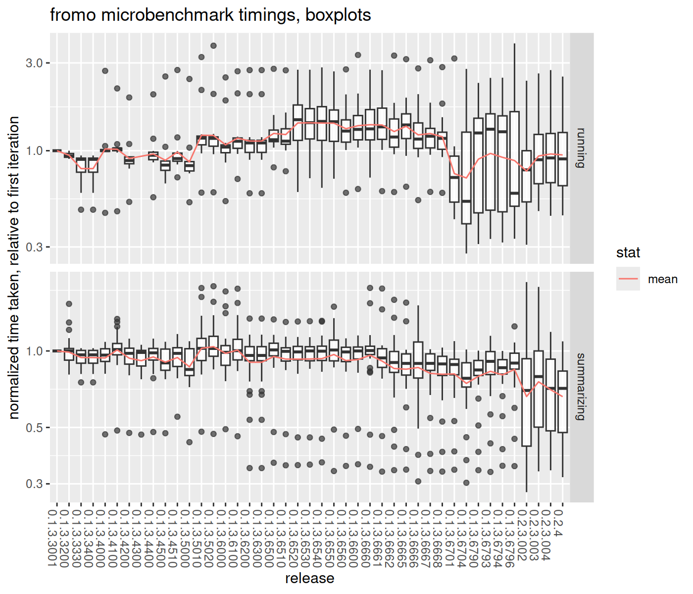

# fromo timings

To prevent performance regressions, compare them here, including benchmarks
against other packages:


``` r
library(fromo)
library(RollingWindow)
library(roll)
library(RcppRoll)
library(microbenchmark)
library(moments)
library(RcppParallel)
# keep this constant for comparison
setThreadOptions(numThreads = 2)

print(Sys.info())
```

```
##                                                            sysname                                                            release 
##                                                            "Linux"                                           "6.9.3-76060903-generic" 
##                                                            version                                                           nodename 
## "#202405300957~1721174657~22.04~abb7c06~dev-Ubuntu SMP PREEMPT_DY"                                                             "zinc" 
##                                                            machine                                                              login 
##                                                           "x86_64"                                                             "spav" 
##                                                               user                                                     effective_user 
##                                                             "spav"                                                             "spav"
```

``` r
print(sessionInfo())
```

```
## R version 4.4.2 (2024-10-31)
## Platform: x86_64-pc-linux-gnu
## Running under: Ubuntu 22.04.5 LTS
## 
## Matrix products: default
## BLAS:   /usr/lib/x86_64-linux-gnu/blas/libblas.so.3.10.0 
## LAPACK: /usr/lib/x86_64-linux-gnu/lapack/liblapack.so.3.10.0
## 
## locale:
##  [1] LC_CTYPE=en_US.UTF-8       LC_NUMERIC=C               LC_TIME=en_US.UTF-8        LC_COLLATE=en_US.UTF-8     LC_MONETARY=en_US.UTF-8   
##  [6] LC_MESSAGES=en_US.UTF-8    LC_PAPER=en_US.UTF-8       LC_NAME=C                  LC_ADDRESS=C               LC_TELEPHONE=C            
## [11] LC_MEASUREMENT=en_US.UTF-8 LC_IDENTIFICATION=C       
## 
## time zone: America/Los_Angeles
## tzcode source: system (glibc)
## 
## attached base packages:
## [1] utils   methods base   
## 
## other attached packages:
##  [1] RcppParallel_5.1.9   RcppRoll_0.3.0       roll_1.1.7           RollingWindow_0.2    microbenchmark_1.5.0 moments_0.14.1       dplyr_1.1.4         
##  [8] ggplot2_3.5.1        knitr_1.48           fromo_0.2.3.003     
## 
## loaded via a namespace (and not attached):
##  [1] vctrs_0.6.5      cli_3.6.3        rlang_1.1.4      xfun_0.48        generics_0.1.3   glue_1.7.0       colorspace_2.1-1 formatR_1.14     scales_1.3.0    
## [10] fansi_1.0.6      grid_4.4.2       munsell_0.5.1    evaluate_1.0.1   tibble_3.2.1     lifecycle_1.0.4  compiler_4.4.2   Rcpp_1.0.13-1    pkgconfig_2.0.3 
## [19] stats_4.4.2      graphics_4.4.2   R6_2.5.1         tidyselect_1.2.1 utf8_1.2.4       pillar_1.9.0     magrittr_2.0.3   tools_4.4.2      grDevices_4.4.2 
## [28] withr_3.0.1      gtable_0.3.5
```

``` r
set.seed(12345)
x <- rnorm(1e+05)
xpos <- runif(length(x)) + 1
xm <- matrix(x, ncol = 1)
xmps <- matrix(xpos, ncol = 1)
w <- runif(length(x))

dumbk <- function(x) {
    c(kurtosis(x) - 3, skewness(x), sd(x), mean(x),
        length(x))
}

checkit <- microbenchmark(sum(x), mean(x), sd(x), skewness(x),
    kurtosis(x), sd3(x), skew4(x), kurt5(x), dumbk(x))
print(checkit)
```

```
## Unit: microseconds
##         expr  min   lq mean median   uq   max neval    cld
##       sum(x)   80   80   87     81   83   170   100 a     
##      mean(x)  162  165  181    169  187   292   100 a     
##        sd(x)  303  311  339    329  352   528   100 a     
##  skewness(x) 3689 3795 4140   3875 4193 18028   100  b    
##  kurtosis(x) 3694 3788 3980   3848 4000  5441   100  b    
##       sd3(x) 1015 1036 1086   1046 1084  1507   100   c   
##     skew4(x) 6420 6556 6897   6662 7089  8718   100    d  
##     kurt5(x) 7297 7491 7946   7654 8239 10082   100     e 
##     dumbk(x) 7875 8152 8810   8371 8920 21655   100      f
```

``` r
resdf <- checkit
gc()
```

```
##         used (Mb) gc trigger (Mb) max used (Mb)
## Ncells 2e+06  106    3.6e+06  191  3.6e+06  191
## Vcells 4e+06   30    1.8e+07  134  3.4e+07  262
```


``` r
# weights
slow_sd <- function(x, w) {
    n0 <- length(x)
    mu <- weighted.mean(x, w = w)
    sg <- sqrt(sum(w * (x - mu)^2)/(n0 - 1))
    c(sg, mu, n0)
}
checkit <- microbenchmark(cent_moments(x, max_order = 4,
    wts = w, na_rm = TRUE, normalize_wts = FALSE),
    sd3(x, wts = w), slow_sd(x, w))
print(checkit)
```

```
## Unit: microseconds
##                                                                          expr  min   lq mean median   uq   max neval cld
##  cent_moments(x, max_order = 4, wts = w, na_rm = TRUE, normalize_wts = FALSE) 7805 8050 8447   8239 8593 11443   100 a  
##                                                               sd3(x, wts = w) 1142 1166 1222   1187 1232  1711   100  b 
##                                                                 slow_sd(x, w)  933  981 1736   1579 2094  7074   100   c
```

``` r
resdf <- rbind(resdf, checkit)
gc()
```

```
##         used (Mb) gc trigger (Mb) max used (Mb)
## Ncells 2e+06  106    3.6e+06  191  3.6e+06  191
## Vcells 4e+06   30    1.8e+07  134  3.4e+07  262
```


``` r
set.seed(12345)
x1 <- runif(10000)
x2 <- runif(length(x1))

checkit <- microbenchmark(as.centsums(x1, 1), as.centsums(x1,
    2), as.centsums(x1, 3), as.centsums(x1, 4))
print(checkit)
```

```
## Unit: microseconds
##                expr min  lq mean median  uq  max neval  cld
##  as.centsums(x1, 1)  76  77   83     77  80  164   100 a   
##  as.centsums(x1, 2) 128 130  139    132 135  287   100  b  
##  as.centsums(x1, 3) 655 669  713    680 705 1444   100   c 
##  as.centsums(x1, 4) 774 779  829    800 821 1505   100    d
```

``` r
resdf <- rbind(resdf, checkit)
gc()
```

```
##         used (Mb) gc trigger (Mb) max used (Mb)
## Ncells 2e+06  106    3.6e+06  191  3.6e+06  191
## Vcells 4e+06   31    1.8e+07  134  3.4e+07  262
```

``` r
# join them together
max_ord <- 6L
obj1 <- as.centsums(x1, max_ord)
obj2 <- as.centsums(x2, max_ord)
obj3 <- as.centsums(c(x1, x2), max_ord)

checkit <- microbenchmark(c(obj1, obj2), obj3 %-% obj1)
print(checkit)
```

```
## Unit: microseconds
##           expr min lq mean median uq max neval cld
##  c(obj1, obj2)  15 17   25     19 27 262   100  a 
##  obj3 %-% obj1  10 12   15     13 14  46   100   b
```

``` r
resdf <- rbind(resdf, checkit)
gc()
```

```
##         used (Mb) gc trigger (Mb) max used (Mb)
## Ncells 2e+06  106    3.6e+06  191  3.6e+06  191
## Vcells 4e+06   31    1.8e+07  134  3.4e+07  262
```

``` r
max_ord <- 6L
rs1 <- cent_sums(x1, max_ord)
rs2 <- cent_sums(x2, max_ord)
rs3 <- cent_sums(c(x1, x2), max_ord)

checkit <- microbenchmark(join_cent_sums(rs1, rs2),
    unjoin_cent_sums(rs3, rs2), unjoin_cent_sums(rs3,
        rs1))
print(checkit)
```

```
## Unit: microseconds
##                        expr min  lq mean median  uq max neval cld
##    join_cent_sums(rs1, rs2) 1.9 1.9  2.6    2.0 2.1  35   100   a
##  unjoin_cent_sums(rs3, rs2) 1.8 1.8  2.1    1.9 2.0  13   100   a
##  unjoin_cent_sums(rs3, rs1) 1.8 1.9  2.1    1.9 2.0  11   100   a
```

``` r
resdf <- rbind(resdf, checkit)
gc()
```

```
##         used (Mb) gc trigger (Mb) max used (Mb)
## Ncells 2e+06  106    3.6e+06  191  3.6e+06  191
## Vcells 4e+06   31    1.8e+07  134  3.4e+07  262
```


``` r
set.seed(54321)
x1 <- matrix(rnorm(100 * 4), ncol = 4)
x2 <- matrix(rnorm(100 * 4), ncol = 4)

max_ord <- 2L

# join them together
mobj1 <- as.centcosums(x1, max_ord)
mobj2 <- as.centcosums(x2, max_ord)
mobj3 <- as.centcosums(rbind(x1, x2), max_ord)
alt3 <- c(mobj1, mobj2)
# unjoin them, with this one weird operator:
alt2 <- mobj3 %-% mobj1
alt1 <- mobj3 %-% mobj2

checkit <- microbenchmark(as.centcosums(x1, max_ord),
    mobj3 %-% mobj1)
print(checkit)
```

```
## Unit: microseconds
##                        expr min lq mean median uq max neval cld
##  as.centcosums(x1, max_ord)  53 54   59     55 56 151   100  a 
##             mobj3 %-% mobj1  16 18   21     19 20 115   100   b
```

``` r
resdf <- rbind(resdf, checkit)
gc()
```

```
##         used (Mb) gc trigger (Mb) max used (Mb)
## Ncells 2e+06  106    3.6e+06  191  3.6e+06  191
## Vcells 4e+06   30    1.8e+07  134  3.4e+07  262
```


``` r
set.seed(4422)
x <- rnorm(10000)
xpos <- runif(length(x)) + 1
xm <- matrix(x, ncol = 1)
xmps <- matrix(xpos, ncol = 1)
w <- runif(length(x))

dumb_zscore <- function(x, window) {
    altz <- sapply(seq_along(x), function(iii) {
        rowi <- max(1, iii - window + 1)
        xrang <- x[rowi:iii]
        (x[iii] - mean(xrang))/sd(xrang)
    }, simplify = TRUE)
}

# run fun on each wins sized window...
silly_fun <- function(x, wins, fun, ...) {
    xout <- rep(NA, length(x))
    for (iii in seq_along(x)) {
        xout[iii] <- fun(x[max(1, iii - wins + 1):iii],
            ...)
    }
    xout
}

wins <- 250

checkit <- microbenchmark(silly_fun(x, wins, sum, na.rm = FALSE),
    silly_fun(x, wins, mean, na.rm = FALSE), running_sum(x,
        wins), running_mean(x, wins), roll::roll_sum(xm,
        wins), roll::roll_mean(xm, wins), roll::roll_sd(xm,
        wins), RollingWindow::RollingSum(x, wins, na_method = "ignore"),
    RollingWindow::RollingSum(x, wins), RollingWindow::RollingMean(x,
        wins), RollingWindow::RollingStd(x, wins),
    RcppRoll::roll_sum(xm, n = wins, align = "right",
        fill = NA), RcppRoll::roll_mean(xm, n = wins,
        align = "right", fill = NA), RcppRoll::roll_sd(xm,
        n = wins, align = "right", fill = NA), running_sd(x,
        wins, na_rm = FALSE, restart_period = 50000L),
    running_sd(x, wins, na_rm = TRUE, restart_period = 1000L),
    running_sd3(x, wins), running_skew(x, wins), running_skew4(x,
        wins), running_kurt(x, wins), running_kurt5(x,
        wins), running_tstat(x, wins), running_zscored(x,
        wins), running_sharpe(x, wins), running_apx_median(x,
        wins), running_centered(x, wins), running_scaled(x,
        wins))
print(checkit)
```

```
## Unit: microseconds
##                                                           expr   min    lq  mean median    uq    max neval    cld
##                         silly_fun(x, wins, sum, na.rm = FALSE) 18311 19583 25567  20748 26867 147572   100 a     
##                        silly_fun(x, wins, mean, na.rm = FALSE) 48685 50733 57331  52842 59512 182973   100  b    
##                                           running_sum(x, wins)   102   106   120    110   126    253   100   c   
##                                          running_mean(x, wins)   101   105   120    109   124    248   100   c   
##                                       roll::roll_sum(xm, wins)    75   104   135    131   149    415   100   c   
##                                      roll::roll_mean(xm, wins)    94   114   166    153   175   1167   100   c   
##                                        roll::roll_sd(xm, wins)   326   358   425    393   443   1290   100   c   
##       RollingWindow::RollingSum(x, wins, na_method = "ignore")   268   291   397    309   332   7291   100   c   
##                             RollingWindow::RollingSum(x, wins)   124   140   172    165   184    352   100   c   
##                            RollingWindow::RollingMean(x, wins)   129   148   175    168   192    314   100   c   
##                             RollingWindow::RollingStd(x, wins)   215   237   338    260   284   7212   100   c   
##   RcppRoll::roll_sum(xm, n = wins, align = "right", fill = NA)  1738  1806  1970   1927  2064   2818   100   c   
##  RcppRoll::roll_mean(xm, n = wins, align = "right", fill = NA)  1744  1808  2043   1980  2142   3020   100   c   
##    RcppRoll::roll_sd(xm, n = wins, align = "right", fill = NA)  8516  8782 10770   9179 10106  19970   100    d  
##    running_sd(x, wins, na_rm = FALSE, restart_period = 50000L)   187   193   219    199   223    404   100   c   
##      running_sd(x, wins, na_rm = TRUE, restart_period = 1000L)   205   213   242    230   249    439   100   c   
##                                           running_sd3(x, wins)   486   496   610    513   555   7877   100   c   
##                                          running_skew(x, wins)  4697  4817  5160   4967  5304  13122   100     e 
##                                         running_skew4(x, wins)  4783  4946  5229   5067  5424   6822   100     e 
##                                          running_kurt(x, wins)  5062  5195  5454   5301  5563   7348   100     e 
##                                         running_kurt5(x, wins)  5470  5658  6046   5801  6255   8734   100     e 
##                                         running_tstat(x, wins)   490   501   622    522   556   8287   100   c   
##                                       running_zscored(x, wins)   475   482   530    500   526   1037   100   c   
##                                        running_sharpe(x, wins)   481   495   538    511   538    932   100   c   
##                                    running_apx_median(x, wins) 15938 16582 17270  17022 17615  25520   100      f
##                                      running_centered(x, wins)  1122  1151  1233   1169  1238   1865   100   c   
##                                        running_scaled(x, wins)   473   482   524    497   524    809   100   c
```

``` r
resdf <- rbind(resdf, checkit)
gc()
```

```
##           used (Mb) gc trigger (Mb) max used (Mb)
## Ncells 1978326  106    3.6e+06  191  3.6e+06  191
## Vcells 3550875   27    1.4e+07  107  3.4e+07  262
```

## Covariance and correlation

New functions that support running bivariate regression, correlation, _etc_ on two vectors.
Lets check their timings too.


``` r
set.seed(8931)
x <- rnorm(10000)
y <- 0.33 + 2.5 * x + rnorm(length(x), sd = 7)

wins <- 250

checkit <- microbenchmark(running_covariance(x, y,
    window = wins), running_correlation(x, y, window = wins),
    running_regression_slope(x, y, window = wins),
    running_regression_diagnostics(x, y, window = wins))
print(checkit)
```

```
## Unit: microseconds
##                                                 expr  min   lq mean median   uq  max neval cld
##              running_covariance(x, y, window = wins)  593  606  645    622  644  953   100 a  
##             running_correlation(x, y, window = wins)  697  706  750    725  749 1187   100  b 
##        running_regression_slope(x, y, window = wins)  612  622  655    638  657  978   100 a  
##  running_regression_diagnostics(x, y, window = wins) 1473 1623 1736   1687 1769 2479   100   c
```

``` r
resdf <- rbind(resdf, checkit)
gc()
```

```
##           used (Mb) gc trigger (Mb) max used (Mb)
## Ncells 1978261  106    3.6e+06  191  3.6e+06  191
## Vcells 3558311   27    1.4e+07  107  3.4e+07  262
```


``` r
library(readr)
FAKE_IT <- FALSE
if (FAKE_IT) {
    resdf <- readr::read_csv("timings.csv")
    # print(resdf)
} else {
    readr::write_csv(resdf, "timings.csv")
}
```

## performance regressions?

Can we see them here? load all the timing data to check.


``` r
library(magrittr)
library(dplyr)
library(readr)
library(tidyr)
library(knitr)

mysernum <- as.character(packageVersion("fromo"))
allt <- data.frame(fname = dir(".", "*.csv"), stringsAsFactors = FALSE) %>%
    dplyr::filter(grepl("^timings_\\d.+\\d+.csv$",
        fname)) %>%
    group_by(fname) %>%
    mutate(tims = list(readr::read_csv(fname))) %>%
    ungroup() %>%
    tidyr::unnest() %>%
    mutate(sernum = gsub("^timings_(.+).csv$", "\\1",
        fname)) %>%
    dplyr::select(-fname) %>%
    rbind(resdf %>%
        dplyr::mutate(sernum = mysernum)) %>%
    group_by(sernum, expr) %>%
    summarize(meantime = mean(time, na.rm = TRUE)) %>%
    ungroup() %>%
    group_by(sernum) %>%
    mutate(sumx_time = median(ifelse(grepl("^sum\\(x\\)$",
        expr), meantime, NA), na.rm = TRUE)) %>%
    ungroup() %>%
    mutate(normalized = meantime/sumx_time) %>%
    arrange(sernum) %>%
    group_by(expr) %>%
    mutate(first_norm = first(normalized), last_norm = last(normalized)) %>%
    ungroup() %>%
    mutate(relchange = normalized/first_norm, last_status = last_norm/first_norm) %>%
    mutate(exgrp = ifelse(grepl("^(roll|RollingWindow|RcppRoll)::",
        expr), "brand_x", ifelse(grepl("^running_",
        expr), "running", "summarizing")))

library(ggplot2)
ph <- allt %>%
    dplyr::filter(!grepl("brand_x", exgrp)) %>%
    ggplot(aes(sernum, normalized, group = expr, color = expr)) +
    geom_line() + geom_point() + scale_y_log10() +
    guides(colour = FALSE) + theme(axis.text.x = element_text(angle = -90,
    hjust = 0)) + facet_grid(exgrp ~ ., scales = "free") +
    labs(x = "release", y = "mean time taken, relative to sum(x)",
        title = "fromo microbenchmark timings, lasagna")
print(ph)
```

<div class="figure">

<p class="caption">plot of chunk all_timing_stats</p>
</div>

``` r
ph <- allt %>%
    dplyr::filter(!grepl("brand_x", exgrp)) %>%
    ggplot(aes(sernum, relchange, group = expr, color = expr)) +
    geom_line() + geom_point() + scale_y_log10() +
    guides(colour = FALSE) + theme(axis.text.x = element_text(angle = -90,
    hjust = 0)) + facet_grid(exgrp ~ ., scales = "free") +
    labs(x = "release", y = "normalized time taken, relative to first iteration",
        title = "fromo microbenchmark timings, spaghetti")
print(ph)
```

<div class="figure">

<p class="caption">plot of chunk all_timing_stats</p>
</div>

``` r
ph <- allt %>%
    dplyr::filter(!grepl("brand_x", exgrp)) %>%
    ggplot(aes(sernum, relchange)) + geom_boxplot(aes(group = sernum),
    alpha = 0.7) + stat_summary(aes(group = "1", color = "mean"),
    fun.y = mean, geom = "line") + scale_y_log10() +
    theme(axis.text.x = element_text(angle = -90, hjust = 0)) +
    facet_grid(exgrp ~ ., scales = "free") + labs(x = "release",
    y = "normalized time taken, relative to first iteration",
    color = "stat", title = "fromo microbenchmark timings, boxplots")
print(ph)
```

<div class="figure">

<p class="caption">plot of chunk all_timing_stats</p>
</div>

``` r
allt %>%
    dplyr::filter(!grepl("brand_x", exgrp)) %>%
    select(expr, sernum, relchange, last_status) %>%
    tidyr::spread(key = "sernum", value = "relchange") %>%
    arrange(desc(last_status)) %>%
    select(-last_status) %>%
    head(n = 50) %>%
    kable()
```


|expr                                                                         | 0.1.3.3001| 0.1.3.3200| 0.1.3.3330| 0.1.3.3400| 0.1.3.4000| 0.1.3.4100| 0.1.3.4200| 0.1.3.4300| 0.1.3.4400| 0.1.3.4500| 0.1.3.4510| 0.1.3.5000| 0.1.3.5010| 0.1.3.5020| 0.1.3.6000| 0.1.3.6100| 0.1.3.6200| 0.1.3.6300| 0.1.3.6500| 0.1.3.6510| 0.1.3.6520| 0.1.3.6530| 0.1.3.6540| 0.1.3.6550| 0.1.3.6560| 0.1.3.6600| 0.1.3.6660| 0.1.3.6661| 0.1.3.6662| 0.1.3.6665| 0.1.3.6666| 0.1.3.6667| 0.1.3.6668| 0.1.3.6701| 0.1.3.6704| 0.1.3.6790| 0.1.3.6793| 0.1.3.6794| 0.1.3.6796| 0.2.3.002| 0.2.3.003| 0.2.3.3|
|:----------------------------------------------------------------------------|----------:|----------:|----------:|----------:|----------:|----------:|----------:|----------:|----------:|----------:|----------:|----------:|----------:|----------:|----------:|----------:|----------:|----------:|----------:|----------:|----------:|----------:|----------:|----------:|----------:|----------:|----------:|----------:|----------:|----------:|----------:|----------:|----------:|----------:|----------:|----------:|----------:|----------:|----------:|---------:|---------:|-------:|
|running_sum(x, wins)                                                         |          1|         NA|         NA|         NA|       2.72|       2.18|       1.95|         NA|       2.02|       2.53|       2.74|       2.45|       3.23|       3.72|       2.50|       2.70|       2.74|       2.74|       2.79|       2.74|       2.76|       2.76|       2.84|       2.70|       2.77|       3.31|       2.76|       2.74|       3.29|       3.14|       2.80|       3.10|       2.85|       3.17|       2.78|       1.96|       2.10|       2.02|       3.83|      2.40|      2.63|    2.74|
|running_centered(x, wins)                                                    |          1|       0.93|       0.91|       0.91|       1.01|       0.98|       0.92|         NA|       0.94|       0.84|       0.91|       0.87|       1.08|       1.06|       0.94|       1.04|       0.95|       0.95|       1.56|       1.61|       1.94|       1.86|       2.03|       2.05|       2.02|       2.04|       1.96|       1.89|       1.82|       1.94|       2.03|       1.83|       1.80|       0.99|       1.45|       1.58|       1.74|       1.66|       2.03|      1.66|      1.77|    1.85|
|running_skew(x, wins)                                                        |         NA|         NA|         NA|         NA|         NA|       1.00|       1.09|         NA|       1.16|       1.05|       1.18|       1.04|       1.17|       1.18|       1.05|       1.18|       1.13|       1.13|       1.29|       1.29|       1.36|       1.35|       1.39|       1.38|       1.34|       1.39|       1.93|       1.93|       1.72|       1.75|       1.70|       1.19|       1.17|       1.04|       1.43|       1.60|       1.68|       1.65|       1.79|      1.24|      1.45|    1.50|
|running_regression_diagnostics(x, y, window = wins)                          |         NA|         NA|         NA|         NA|         NA|         NA|         NA|         NA|         NA|         NA|         NA|         NA|         NA|         NA|         NA|         NA|         NA|         NA|         NA|         NA|         NA|         NA|         NA|         NA|         NA|         NA|         NA|         NA|         NA|         NA|         NA|         NA|         NA|         NA|         NA|         NA|         NA|         NA|         NA|      1.00|      1.25|    1.31|
|running_skew4(x, wins)                                                       |          1|       0.94|       0.89|       0.89|       1.02|       1.03|       0.92|         NA|       0.97|       0.87|       0.96|       0.86|       1.17|       1.18|       1.04|       1.17|       1.13|       1.13|       1.15|       1.13|       1.16|       1.19|       1.19|       1.16|       1.13|       1.17|       1.62|       1.61|       1.41|       1.45|       1.40|       0.99|       0.98|       0.87|       1.18|       1.34|       1.40|       1.36|       1.49|      1.12|      1.24|    1.25|
|running_regression_slope(x, y, window = wins)                                |         NA|         NA|         NA|         NA|         NA|         NA|         NA|         NA|         NA|         NA|         NA|         NA|         NA|         NA|         NA|         NA|         NA|         NA|         NA|         NA|         NA|         NA|         NA|         NA|         NA|         NA|         NA|         NA|         NA|         NA|         NA|         NA|         NA|         NA|         NA|         NA|         NA|         NA|         NA|      1.00|      1.21|    1.23|
|running_covariance(x, y, window = wins)                                      |         NA|         NA|         NA|         NA|         NA|         NA|         NA|         NA|         NA|         NA|         NA|         NA|         NA|         NA|         NA|         NA|         NA|         NA|         NA|         NA|         NA|         NA|         NA|         NA|         NA|         NA|         NA|         NA|         NA|         NA|         NA|         NA|         NA|         NA|         NA|         NA|         NA|         NA|         NA|      1.00|      1.17|    1.22|
|running_correlation(x, y, window = wins)                                     |         NA|         NA|         NA|         NA|         NA|         NA|         NA|         NA|         NA|         NA|         NA|         NA|         NA|         NA|         NA|         NA|         NA|         NA|         NA|         NA|         NA|         NA|         NA|         NA|         NA|         NA|         NA|         NA|         NA|         NA|         NA|         NA|         NA|         NA|         NA|         NA|         NA|         NA|         NA|      1.00|      1.16|    1.21|
|sd3(x)                                                                       |          1|       1.03|       1.01|       1.01|       1.03|       1.03|       1.02|       1.00|       1.02|       1.01|       0.99|       1.00|       1.77|       1.80|       1.71|       1.76|       1.34|       1.34|       1.33|       1.30|       1.31|       1.31|       1.31|       1.35|       1.01|       1.01|       1.00|       0.99|       1.00|       0.98|       0.97|       1.00|       0.80|       0.83|       0.76|       0.82|       0.83|       0.81|       0.85|      1.03|      1.19|    1.19|
|c(obj1, obj2)                                                                |          1|       1.29|       0.97|       0.97|       0.93|       0.98|       1.04|       0.87|       0.95|       0.85|       0.85|       0.81|       0.89|       0.88|       0.83|       0.96|       0.93|       0.93|       0.88|       1.01|       0.87|       0.91|       0.92|       0.90|       0.91|       1.01|       1.03|       0.94|       0.87|       0.89|       1.37|       0.90|       0.90|       0.92|       0.80|       0.84|       0.92|       0.87|       0.87|      1.00|      1.79|    1.14|
|running_apx_median(x, wins)                                                  |          1|       0.92|       0.90|       0.90|       1.06|       1.09|       0.93|         NA|       1.00|       0.89|       1.00|       0.88|       1.05|       1.05|       0.93|       1.05|       1.02|       1.02|       1.04|       1.00|       1.02|       1.03|       1.01|       1.01|       1.01|       1.04|       1.01|       1.01|       1.01|       1.08|       0.99|       1.08|       1.06|       1.06|       1.14|       1.25|       1.31|       1.27|       1.39|      0.96|      1.08|    1.11|
|sd3(x, wts = w)                                                              |          1|       0.94|       0.94|       0.94|       0.96|       0.97|       0.90|       0.90|       0.95|       0.90|       0.97|       0.83|       1.63|       1.56|       1.50|       1.54|       1.07|       1.07|       1.07|       1.05|       1.04|       1.06|       1.03|       1.10|       1.05|       0.97|       0.97|       0.92|       0.96|       0.94|       0.86|       0.93|       0.78|       0.81|       0.71|       0.79|       0.81|       0.79|       1.08|      0.95|      1.05|    1.08|
|mean(x)                                                                      |          1|       1.02|       1.00|       1.00|       1.01|       1.01|       1.01|       1.01|       1.01|       1.06|       0.97|       1.03|       1.02|       1.00|       1.05|       1.02|       1.00|       1.00|       1.00|       0.98|       0.98|       0.99|       1.02|       1.01|       0.98|       1.01|       0.97|       1.02|       1.00|       1.01|       1.03|       0.97|       0.99|       1.00|       1.01|       0.98|       1.02|       0.98|       0.99|      0.93|      0.98|    1.01|
|sum(x)                                                                       |          1|       1.00|       1.00|       1.00|       1.00|       1.00|       1.00|       1.00|       1.00|       1.00|       1.00|       1.00|       1.00|       1.00|       1.00|       1.00|       1.00|       1.00|       1.00|       1.00|       1.00|       1.00|       1.00|       1.00|       1.00|       1.00|       1.00|       1.00|       1.00|       1.00|       1.00|       1.00|       1.00|       1.00|       1.00|       1.00|       1.00|       1.00|       1.00|      1.00|      1.00|    1.00|
|join_cent_sums(rs1, rs2)                                                     |          1|       1.12|       0.96|       0.96|       1.02|       1.25|       1.12|       0.97|       1.10|       1.03|       1.05|       0.93|       1.02|       1.14|       1.01|       1.11|       1.16|       1.16|       1.11|       1.03|       1.13|       1.04|       1.06|       1.25|       1.05|       1.08|       1.15|       1.05|       1.16|       0.97|       1.18|       1.02|       1.03|       1.09|       0.90|       0.98|       1.11|       0.99|       0.98|      0.80|      1.24|    0.93|
|mobj3 %-% mobj1                                                              |          1|       0.93|       1.03|       1.03|       0.97|       1.30|       0.95|       1.04|       0.98|       0.88|       1.17|       0.83|       1.12|       1.14|       0.88|       0.89|       0.93|       0.93|       1.05|       0.91|       1.05|       0.92|       0.94|       0.99|       1.03|       0.93|       0.98|       0.84|       0.82|       0.89|       0.86|       0.86|       0.88|       0.83|       0.77|       0.84|       0.90|       0.85|       0.94|      1.87|      0.91|    0.93|
|obj3 %-% obj1                                                                |          1|       1.53|       0.96|       0.96|       0.91|       0.97|       1.00|       0.87|       1.00|       0.85|       0.85|       0.79|       0.92|       0.95|       0.90|       0.90|       0.96|       0.96|       0.97|       1.02|       0.92|       0.91|       0.83|       0.90|       0.91|       0.98|       1.04|       0.86|       0.87|       0.89|       1.41|       0.88|       0.92|       0.89|       0.78|       0.84|       0.91|       0.86|       0.85|      0.81|      1.59|    0.92|
|running_kurt5(x, wins)                                                       |          1|       0.94|       0.91|       0.91|       1.01|       1.03|       0.93|         NA|       1.00|       0.90|       0.98|       0.89|       1.13|       1.13|       1.01|       1.13|       1.09|       1.09|       1.13|       1.11|       1.11|       1.12|       1.09|       1.09|       1.10|       1.12|       1.05|       1.05|       0.96|       0.94|       0.92|       0.97|       0.94|       0.88|       1.26|       1.41|       1.45|       1.45|       1.61|      0.79|      0.89|    0.91|
|as.centcosums(x1, max_ord)                                                   |          1|       0.93|       1.02|       1.02|       0.96|       1.24|       0.98|       1.02|       0.98|       0.87|       1.13|       0.85|       1.12|       1.16|       0.83|       0.93|       0.92|       0.92|       1.06|       0.91|       1.07|       0.93|       0.94|       0.96|       0.98|       0.95|       1.00|       0.86|       0.87|       0.91|       0.91|       0.92|       0.93|       0.88|       0.78|       0.91|       0.99|       0.92|       1.03|      1.68|      0.90|    0.90|
|running_kurt(x, wins)                                                        |         NA|         NA|         NA|         NA|         NA|       1.00|       0.91|         NA|       0.97|       0.85|       0.95|       0.86|       0.97|       0.96|       0.86|       0.96|       0.92|       0.92|       1.05|       1.02|       1.06|       1.08|       1.09|       1.08|       1.06|       1.09|       1.04|       1.03|       0.97|       0.95|       0.93|       0.95|       0.92|       0.86|       1.26|       1.43|       1.50|       1.43|       1.65|      0.77|      0.88|    0.89|
|as.centsums(x1, 2)                                                           |          1|       0.82|       0.81|       0.81|       0.81|       0.88|       0.80|       0.78|       0.81|       0.77|       0.78|       0.72|       1.38|       1.38|       1.41|       1.38|       0.98|       0.98|       0.99|       0.98|       0.99|       1.02|       0.99|       0.94|       0.83|       0.82|       0.83|       0.78|       0.79|       0.80|       0.71|       0.79|       0.80|       0.79|       0.72|       0.80|       0.78|       0.81|       0.83|      0.72|      0.84|    0.87|
|unjoin_cent_sums(rs3, rs1)                                                   |          1|       1.21|       0.97|       0.97|       0.91|       1.34|       0.88|       0.99|       0.97|       0.99|       0.98|       0.85|       1.10|       1.19|       0.99|       1.11|       1.09|       1.09|       1.08|       1.04|       0.94|       1.05|       0.92|       1.20|       1.12|       1.00|       1.03|       0.90|       1.08|       0.99|       1.22|       1.00|       1.01|       1.06|       0.91|       0.96|       1.15|       1.00|       0.98|      0.76|      1.12|    0.83|
|skew4(x)                                                                     |          1|       1.01|       1.01|       1.01|       1.07|       1.07|       1.06|       1.05|       1.10|       1.08|       1.07|       1.09|       1.14|       1.14|       1.12|       1.13|       1.09|       1.09|       1.16|       1.14|       1.13|       1.13|       1.15|       1.16|       1.12|       1.15|       1.77|       1.76|       1.59|       1.55|       1.51|       1.01|       1.00|       1.01|       0.98|       1.00|       1.03|       0.99|       0.90|      0.70|      0.79|    0.81|
|running_sd3(x, wins)                                                         |         NA|         NA|         NA|         NA|       1.00|       1.04|       0.86|         NA|       0.95|       0.78|       0.88|       0.80|       2.14|       2.03|       1.88|       2.05|       2.03|       2.03|       1.56|       1.46|       1.85|       1.60|       1.76|       1.69|       1.44|       1.59|       1.43|       1.35|       1.47|       1.47|       1.22|       1.33|       1.23|       0.53|       0.40|       0.46|       0.47|       0.46|       0.59|      0.58|      0.79|    0.81|
|running_tstat(x, wins)                                                       |          1|       0.92|       0.94|       0.94|       0.99|       1.01|       0.82|         NA|       0.86|       0.80|       0.90|       0.76|       1.23|       1.23|       1.10|       1.14|       1.18|       1.18|       1.13|       1.13|       1.43|       1.50|       1.48|       1.44|       1.33|       1.28|       1.28|       1.35|       1.19|       1.38|       1.16|       1.31|       1.21|       0.55|       0.44|       0.50|       0.52|       0.51|       0.55|      0.54|      0.66|    0.77|
|unjoin_cent_sums(rs3, rs2)                                                   |          1|       0.86|       0.75|       0.75|       0.87|       1.05|       0.95|       0.77|       0.78|       0.82|       0.84|       0.73|       0.81|       0.99|       0.78|       0.92|       0.93|       0.93|       0.86|       0.86|       0.81|       0.87|       0.84|       1.03|       0.83|       0.88|       1.05|       0.82|       0.92|       0.84|       1.08|       0.87|       0.83|       0.91|       0.72|       0.83|       0.92|       0.85|       0.85|      0.74|      0.91|    0.71|
|silly_fun(x, wins, mean, na.rm = FALSE)                                      |          1|       0.91|       0.89|       0.89|       0.94|       0.94|       0.88|         NA|       0.92|       0.82|       0.90|       0.80|       0.92|       0.88|       0.79|       0.88|       0.76|       0.76|       0.88|       0.88|       0.87|       0.89|       0.88|       0.87|       0.89|       0.92|       0.86|       0.90|       0.66|       0.71|       0.59|       0.67|       0.64|       0.65|       0.59|       0.65|       0.66|       0.66|       0.72|      0.61|      0.74|    0.70|
|as.centsums(x1, 3)                                                           |          1|       0.85|       0.86|       0.86|       0.91|       0.96|       0.89|       0.87|       0.92|       0.84|       0.89|       0.83|       0.95|       0.95|       0.96|       0.94|       0.91|       0.91|       0.99|       0.97|       0.99|       1.00|       1.00|       0.93|       0.97|       0.96|       1.54|       1.46|       1.35|       1.31|       1.17|       0.84|       0.83|       0.83|       0.75|       0.84|       0.82|       0.85|       0.82|      0.56|      0.67|    0.70|
|running_sharpe(x, wins)                                                      |          1|       0.99|       0.90|       0.90|       0.98|       1.02|       0.84|         NA|       0.90|       0.79|       0.88|       0.77|       1.20|       1.19|       1.05|       1.11|       1.13|       1.13|       1.11|       1.08|       1.55|       1.42|       1.40|       1.44|       1.28|       1.31|       1.29|       1.34|       1.12|       1.29|       1.11|       1.26|       1.19|       0.52|       0.40|       0.45|       0.47|       0.46|       0.51|      0.53|      0.67|    0.67|
|sd(x)                                                                        |          1|       1.02|       1.01|       1.01|       1.01|       1.01|       1.03|       0.99|       1.01|       1.02|       1.00|       1.02|       1.02|       1.02|       1.04|       1.02|       0.69|       0.69|       1.01|       0.99|       0.99|       1.00|       1.30|       1.49|       0.99|       1.04|       1.00|       1.03|       0.77|       0.75|       0.78|       0.73|       0.95|       0.75|       0.79|       0.74|       0.78|       0.74|       1.25|      0.60|      0.67|    0.67|
|running_scaled(x, wins)                                                      |          1|       0.94|       0.91|       0.91|       0.98|       1.03|       0.88|         NA|       0.92|       0.79|       0.88|       0.79|       1.19|       1.19|       1.08|       1.19|       1.15|       1.15|       1.15|       1.15|       1.53|       1.47|       1.48|       1.53|       1.27|       1.40|       1.31|       1.31|       1.14|       1.25|       1.09|       1.20|       1.12|       0.72|       0.41|       0.46|       0.48|       0.47|       0.51|      0.53|      0.66|    0.67|
|running_sum(x, wins, robust = FALSE)                                         |         NA|       1.00|       0.66|       0.66|         NA|         NA|         NA|         NA|         NA|         NA|         NA|         NA|         NA|         NA|         NA|         NA|         NA|         NA|         NA|         NA|         NA|         NA|         NA|         NA|         NA|         NA|         NA|         NA|         NA|         NA|         NA|         NA|         NA|         NA|         NA|         NA|         NA|         NA|         NA|        NA|        NA|      NA|
|running_zscored(x, wins)                                                     |          1|       0.90|       0.88|       0.88|       1.01|       0.98|       0.80|         NA|       0.89|       0.77|       0.84|       0.78|       1.20|       1.17|       1.02|       1.14|       1.10|       1.10|       1.15|       1.09|       1.47|       1.41|       1.44|       1.42|       1.28|       1.29|       1.25|       1.26|       1.09|       1.29|       1.07|       1.20|       1.12|       0.51|       0.39|       0.44|       0.47|       0.44|       0.49|      0.50|      0.62|    0.64|
|silly_fun(x, wins, sum, na.rm = FALSE)                                       |          1|       0.92|       0.90|       0.90|       0.90|       0.90|       0.82|         NA|       0.87|       0.77|       0.87|       0.76|       0.86|       0.88|       0.76|       0.83|       0.67|       0.67|       0.86|       0.84|       0.84|       0.85|       0.87|       0.86|       0.84|       0.86|       0.82|       0.86|       0.49|       0.60|       0.49|       0.54|       0.53|       0.53|       0.46|       0.51|       0.56|       0.55|       0.60|      0.55|      0.67|    0.59|
|running_mean(x, wins)                                                        |          1|       0.92|       0.59|       0.59|       0.46|       0.47|       0.53|         NA|       0.56|       0.66|       0.72|       0.52|       0.59|       0.59|       0.53|       0.70|       0.59|       0.59|       0.81|       0.77|       0.60|       0.71|       0.63|       0.70|       0.59|       0.62|       0.71|       0.60|       0.60|       0.64|       0.54|       0.60|       0.59|       0.60|       0.53|       0.80|       1.14|       0.82|       0.45|      0.50|      0.55|    0.59|
|kurt5(x)                                                                     |          1|       1.02|       1.00|       1.00|       1.09|       1.10|       1.07|       1.06|       1.12|       1.09|       1.08|       1.08|       1.15|       1.16|       1.12|       1.14|       1.09|       1.09|       1.15|       1.12|       1.11|       1.12|       1.11|       1.14|       1.12|       1.14|       1.05|       1.04|       0.95|       0.92|       0.88|       0.98|       0.97|       0.99|       0.95|       0.98|       1.00|       0.96|       0.93|      0.46|      0.51|    0.53|
|running_sd(x, wins, na_rm = FALSE, restart_period = 50000L)                  |         NA|         NA|         NA|         NA|       1.00|       1.03|       0.86|         NA|       0.90|       0.85|       0.92|       0.83|       1.07|       1.06|       1.07|       1.02|       1.00|       1.00|       1.30|       1.35|       1.94|       2.04|       1.90|       1.90|       1.77|       1.74|       1.73|       1.81|       1.50|       1.71|       1.43|       1.55|       1.52|       0.42|       0.28|       0.31|       0.33|       0.32|       0.33|      0.31|      0.47|    0.49|
|cent_moments(x, max_order = 4, wts = w, na_rm = TRUE, normalize_wts = FALSE) |          1|       0.93|       0.94|       0.94|       1.01|       1.07|       0.96|       0.95|       1.02|       0.96|       1.06|       0.91|       1.04|       1.01|       0.97|       1.00|       0.96|       0.96|       1.02|       1.00|       1.01|       1.03|       0.98|       1.04|       1.01|       1.03|       1.03|       1.00|       0.90|       0.86|       0.79|       0.86|       0.84|       0.87|       0.78|       0.87|       0.89|       0.86|       0.96|      0.42|      0.47|    0.48|
|dumbk(x)                                                                     |          1|       1.03|       1.01|       1.01|       1.04|       1.04|       1.01|       0.99|       1.04|       1.02|       1.02|       1.02|       1.04|       1.04|       1.03|       1.03|       0.96|       0.96|       1.04|       1.02|       1.02|       1.02|       1.02|       1.04|       1.02|       1.05|       1.03|       1.02|       0.89|       0.89|       0.89|       0.89|       0.89|       0.90|       0.89|       0.90|       0.92|       0.89|       0.90|      0.42|      0.50|    0.48|
|running_sum(x, wins, robust = TRUE)                                          |         NA|       1.00|       0.48|       0.48|         NA|         NA|         NA|         NA|         NA|         NA|         NA|         NA|         NA|         NA|         NA|         NA|         NA|         NA|         NA|         NA|         NA|         NA|         NA|         NA|         NA|         NA|         NA|         NA|         NA|         NA|         NA|         NA|         NA|         NA|         NA|         NA|         NA|         NA|         NA|        NA|        NA|      NA|
|skewness(x)                                                                  |          1|       1.00|       1.00|       1.00|       1.06|       1.07|       1.04|       1.01|       1.06|       1.05|       1.03|       1.03|       1.06|       1.08|       1.06|       1.05|       0.98|       0.98|       1.08|       1.03|       1.03|       1.04|       1.04|       1.06|       1.03|       1.06|       1.04|       1.03|       0.90|       0.89|       0.88|       0.90|       0.89|       0.90|       0.88|       0.90|       0.92|       0.88|       0.89|      0.42|      0.49|    0.48|
|as.centsums(x1, 4)                                                           |          1|       0.84|       0.86|       0.86|       0.92|       0.99|       0.91|       0.89|       0.93|       0.86|       0.90|       0.84|       0.95|       0.95|       0.96|       0.95|       0.92|       0.92|       0.96|       0.96|       0.97|       0.98|       1.00|       0.91|       0.97|       0.94|       0.93|       0.90|       0.82|       0.80|       0.70|       0.84|       0.84|       0.85|       0.75|       0.84|       0.83|       0.87|       0.85|      0.39|      0.46|    0.47|
|kurtosis(x)                                                                  |          1|       1.00|       1.00|       1.00|       1.06|       1.06|       1.03|       1.00|       1.05|       1.04|       1.03|       1.03|       1.04|       1.07|       1.04|       1.04|       1.04|       1.04|       1.05|       1.03|       1.01|       1.03|       1.06|       1.09|       1.05|       1.06|       1.05|       1.02|       0.92|       0.91|       0.90|       0.92|       0.92|       0.93|       0.95|       0.92|       0.95|       0.92|       0.91|      0.42|      0.49|    0.47|
|running_sd(x, wins, na_rm = TRUE, restart_period = 1000L)                    |         NA|         NA|         NA|         NA|       1.00|       1.03|       0.87|         NA|       0.87|       0.76|       0.87|       0.75|       1.17|       1.08|       1.07|       0.96|       0.89|       0.89|       1.20|       1.24|       1.69|       1.79|       1.71|       1.64|       1.51|       1.52|       1.48|       1.61|       1.24|       1.41|       1.20|       1.31|       1.29|       0.43|       0.29|       2.34|       2.49|       2.49|       0.34|      0.36|      0.53|    0.44|
|slow_sd(x, w)                                                                |          1|       0.94|       0.89|       0.89|       0.47|       0.49|       0.48|       0.47|       0.48|       0.47|       0.55|       0.44|       0.48|       0.47|       0.49|       0.46|       0.54|       0.54|       0.48|       0.47|       0.46|       0.46|       0.45|       0.49|       0.46|       0.49|       0.47|       0.46|       0.42|       0.41|       0.39|       0.39|       0.40|       0.40|       0.37|       0.40|       0.43|       0.41|       0.45|      0.36|      0.38|    0.41|
|as.centsums(x1, 1)                                                           |          1|       0.81|       0.82|       0.82|       0.85|       0.92|       0.85|       0.81|       0.87|       0.83|       0.85|       0.77|       0.87|       0.85|       0.93|       0.87|       0.35|       0.35|       0.36|       0.35|       0.36|       0.36|       0.36|       0.34|       0.35|       0.36|       0.35|       0.34|       0.34|       0.34|       0.31|       0.34|       0.34|       0.34|       0.30|       0.34|       0.33|       0.35|       0.35|      0.28|      0.34|    0.34|

``` r
allt %>%
    dplyr::filter(!grepl("brand_x", exgrp)) %>%
    select(-sernum, -relchange, -meantime, -sumx_time,
        -normalized) %>%
    distinct(expr, .keep_all = TRUE) %>%
    arrange(desc(last_status)) %>%
    head(n = 20) %>%
    kable()
```


|expr                                                | first_norm| last_norm| last_status|exgrp       |
|:---------------------------------------------------|----------:|---------:|-----------:|:-----------|
|running_sum(x, wins)                                |       0.51|      1.39|        2.74|running     |
|running_centered(x, wins)                           |       7.68|     14.20|        1.85|running     |
|running_skew(x, wins)                               |      39.66|     59.44|        1.50|running     |
|running_regression_diagnostics(x, y, window = wins) |      15.28|     20.00|        1.31|running     |
|running_skew4(x, wins)                              |      48.07|     60.24|        1.25|running     |
|running_regression_slope(x, y, window = wins)       |       6.15|      7.54|        1.23|running     |
|running_covariance(x, y, window = wins)             |       6.09|      7.43|        1.22|running     |
|running_correlation(x, y, window = wins)            |       7.14|      8.65|        1.21|running     |
|sd3(x)                                              |      10.52|     12.51|        1.19|summarizing |
|c(obj1, obj2)                                       |       0.25|      0.28|        1.14|summarizing |
|running_apx_median(x, wins)                         |     179.28|    198.94|        1.11|running     |
|sd3(x, wts = w)                                     |      13.06|     14.08|        1.08|summarizing |
|mean(x)                                             |       2.07|      2.08|        1.01|summarizing |
|sum(x)                                              |       1.00|      1.00|        1.00|summarizing |
|join_cent_sums(rs1, rs2)                            |       0.03|      0.03|        0.93|summarizing |
|mobj3 %-% mobj1                                     |       0.26|      0.24|        0.93|summarizing |
|obj3 %-% obj1                                       |       0.19|      0.17|        0.92|summarizing |
|running_kurt5(x, wins)                              |      76.25|     69.64|        0.91|running     |
|as.centcosums(x1, max_ord)                          |       0.75|      0.68|        0.90|summarizing |
|running_kurt(x, wins)                               |      70.61|     62.83|        0.89|running     |


