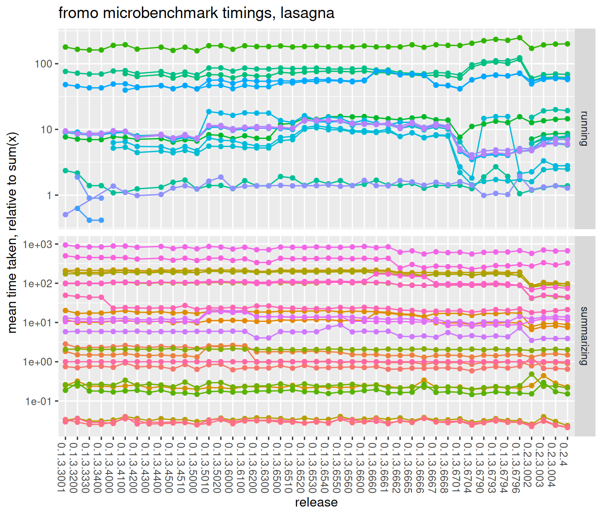
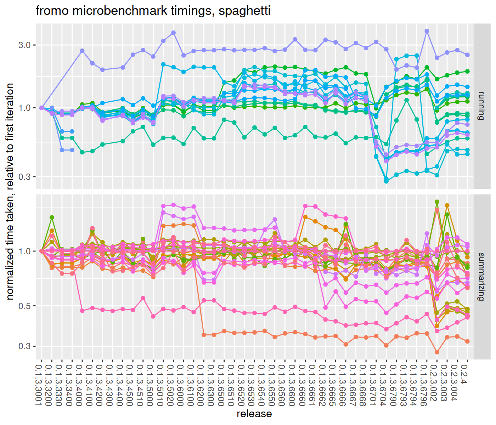

# fromo timings

To prevent performance regressions, compare them here, including benchmarks
against other packages:


```r
library(fromo)
library(RollingWindow)
library(roll)
library(RcppRoll)
library(microbenchmark)
library(moments)
library(RcppParallel)
# keep this constant for comparison
setThreadOptions(numThreads = 2)

print(Sys.info())
```

```
##                                       sysname                                       release                                       version 
##                                       "Linux"                            "4.4.0-77-generic" "#98-Ubuntu SMP Wed Apr 26 08:34:02 UTC 2017" 
##                                      nodename                                       machine                                         login 
##                                "660c103c2f76"                                      "x86_64"                                     "unknown" 
##                                          user                                effective_user 
##                                        "spav"                                        "spav"
```

```r
print(sessionInfo())
```

```
## R version 3.3.0 RC (2016-05-01 r70566)
## Platform: x86_64-pc-linux-gnu (64-bit)
## Running under: Debian GNU/Linux stretch/sid
## 
## locale:
##  [1] LC_CTYPE=en_US.UTF-8       LC_NUMERIC=C               LC_TIME=en_US.UTF-8        LC_COLLATE=en_US.UTF-8     LC_MONETARY=en_US.UTF-8   
##  [6] LC_MESSAGES=en_US.UTF-8    LC_PAPER=en_US.UTF-8       LC_NAME=C                  LC_ADDRESS=C               LC_TELEPHONE=C            
## [11] LC_MEASUREMENT=en_US.UTF-8 LC_IDENTIFICATION=C       
## 
## attached base packages:
## [1] utils   methods base   
## 
## other attached packages:
##  [1] RcppParallel_4.3.20    RcppRoll_0.2.2         roll_1.0.7             RollingWindow_0.2      microbenchmark_1.4-2.1 moments_0.14          
##  [7] dplyr_0.5.0            ggplot2_2.2.1          knitr_1.15.1           fromo_0.1.3.6660      
## 
## loaded via a namespace (and not attached):
##  [1] Rcpp_0.12.11     grDevices_3.3.0  assertthat_0.1   R6_2.1.2         grid_3.3.0       plyr_1.8.4       DBI_0.6-1        gtable_0.2.0     formatR_1.4     
## [10] magrittr_1.5     evaluate_0.10    scales_0.4.1     stringi_1.0-1    lazyeval_0.2.0   graphics_3.3.0   tools_3.3.0      stringr_1.0.0    munsell_0.4.3   
## [19] stats_3.3.0      colorspace_1.3-2 tibble_1.2
```

```r
set.seed(12345)
x <- rnorm(1e+05)
xpos <- runif(length(x)) + 1
xm <- matrix(x, ncol = 1)
xmps <- matrix(xpos, ncol = 1)
w <- runif(length(x))

dumbk <- function(x) {
    c(kurtosis(x) - 3, skewness(x), sd(x), mean(x), 
        length(x))
}

checkit <- microbenchmark(sum(x), mean(x), sd(x), skewness(x), 
    kurtosis(x), sd3(x), skew4(x), kurt5(x), dumbk(x))
print(checkit)
```

```
## Unit: microseconds
##         expr   min    lq  mean median    uq   max neval     cld
##       sum(x)    80    80    87     82    89   139   100 a      
##      mean(x)   162   164   175    169   178   280   100 a      
##        sd(x)   459   474   506    498   528   725   100  b     
##  skewness(x)  8459  8613  9086   8871  9271 10826   100    d   
##  kurtosis(x)  8296  8423  8980   8613  9104 20011   100    d   
##       sd3(x)   849   876   917    900   942  1267   100   c    
##     skew4(x) 14367 14538 15020  14843 15344 17701   100     e  
##     kurt5(x) 15082 15290 15845  15525 16373 19055   100      f 
##     dumbk(x) 17491 17772 18726  18642 19348 21501   100       g
```

```r
resdf <- checkit
gc()
```

```
##           used (Mb) gc trigger (Mb) max used (Mb)
## Ncells 1243453   66    2164898  116  1503396   80
## Vcells 1519662   12    3221224   25  3220360   25
```


```r
# weights
slow_sd <- function(x, w) {
    n0 <- length(x)
    mu <- weighted.mean(x, w = w)
    sg <- sqrt(sum(w * (x - mu)^2)/(n0 - 1))
    c(sg, mu, n0)
}
checkit <- microbenchmark(cent_moments(x, max_order = 4, 
    wts = w, na_rm = TRUE, normalize_wts = FALSE), 
    sd3(x, wts = w), slow_sd(x, w))
print(checkit)
```

```
## Unit: milliseconds
##                                                                          expr  min   lq mean median   uq  max neval cld
##  cent_moments(x, max_order = 4, wts = w, na_rm = TRUE, normalize_wts = FALSE) 16.8 17.2 17.9   17.7 18.6 20.7   100   c
##                                                               sd3(x, wts = w)  1.0  1.0  1.1    1.1  1.1  1.3   100 a  
##                                                                 slow_sd(x, w)  1.4  1.5  2.0    1.6  2.8  3.7   100  b
```

```r
resdf <- rbind(resdf, checkit)
gc()
```

```
##           used (Mb) gc trigger (Mb) max used (Mb)
## Ncells 1243844   66    2164898  116  1503396   80
## Vcells 1522316   12    3221224   25  3220360   25
```


```r
set.seed(12345)
x1 <- runif(10000)
x2 <- runif(length(x1))

checkit <- microbenchmark(as.centsums(x1, 1), as.centsums(x1, 
    2), as.centsums(x1, 3), as.centsums(x1, 4))
print(checkit)
```

```
## Unit: microseconds
##                expr  min   lq mean median   uq  max neval  cld
##  as.centsums(x1, 1)   77   80   86     85   90  142   100 a   
##  as.centsums(x1, 2)  116  117  132    126  139  398   100  b  
##  as.centsums(x1, 3) 1422 1507 1578   1564 1609 1937   100   c 
##  as.centsums(x1, 4) 1500 1566 1638   1624 1676 2087   100    d
```

```r
resdf <- rbind(resdf, checkit)
gc()
```

```
##           used (Mb) gc trigger (Mb) max used (Mb)
## Ncells 1244266   66    2164898  116  1511672   81
## Vcells 1545771   12    3221224   25  3220360   25
```

```r
# join them together
max_ord <- 6L
obj1 <- as.centsums(x1, max_ord)
obj2 <- as.centsums(x2, max_ord)
obj3 <- as.centsums(c(x1, x2), max_ord)

checkit <- microbenchmark(c(obj1, obj2), obj3 %-% obj1)
print(checkit)
```

```
## Unit: microseconds
##           expr min lq mean median uq max neval cld
##  c(obj1, obj2)  16 18   22     18 19 219   100   b
##  obj3 %-% obj1  13 14   17     15 15 110   100  a
```

```r
resdf <- rbind(resdf, checkit)
gc()
```

```
##           used (Mb) gc trigger (Mb) max used (Mb)
## Ncells 1244857   66    2164898  116  1511672   81
## Vcells 1546507   12    3221224   25  3220360   25
```

```r
max_ord <- 6L
rs1 <- cent_sums(x1, max_ord)
rs2 <- cent_sums(x2, max_ord)
rs3 <- cent_sums(c(x1, x2), max_ord)

checkit <- microbenchmark(join_cent_sums(rs1, rs2), 
    unjoin_cent_sums(rs3, rs2), unjoin_cent_sums(rs3, 
        rs1))
print(checkit)
```

```
## Unit: microseconds
##                        expr min  lq mean median  uq max neval cld
##    join_cent_sums(rs1, rs2) 2.2 2.4  3.2    2.5 2.7  32   100   a
##  unjoin_cent_sums(rs3, rs2) 2.0 2.2  3.1    2.4 2.5  40   100   a
##  unjoin_cent_sums(rs3, rs1) 2.0 2.2  2.6    2.3 2.4  26   100   a
```

```r
resdf <- rbind(resdf, checkit)
gc()
```

```
##           used (Mb) gc trigger (Mb) max used (Mb)
## Ncells 1244936   66    2164898  116  1511672   81
## Vcells 1547247   12    3221224   25  3220360   25
```


```r
set.seed(54321)
x1 <- matrix(rnorm(100 * 4), ncol = 4)
x2 <- matrix(rnorm(100 * 4), ncol = 4)

max_ord <- 2L

# join them together
mobj1 <- as.centcosums(x1, max_ord)
mobj2 <- as.centcosums(x2, max_ord)
mobj3 <- as.centcosums(rbind(x1, x2), max_ord)
alt3 <- c(mobj1, mobj2)
# unjoin them, with this one weird operator:
alt2 <- mobj3 %-% mobj1
alt1 <- mobj3 %-% mobj2

checkit <- microbenchmark(as.centcosums(x1, max_ord), 
    mobj3 %-% mobj1)
print(checkit)
```

```
## Unit: microseconds
##                        expr min lq mean median uq max neval cld
##  as.centcosums(x1, max_ord)  55 58   65     59 71 202   100   b
##             mobj3 %-% mobj1  17 19   22     20 21  46   100  a
```

```r
resdf <- rbind(resdf, checkit)
gc()
```

```
##           used (Mb) gc trigger (Mb) max used (Mb)
## Ncells 1244979   66    2164898  116  1511672   81
## Vcells 1527490   12    3221224   25  3220360   25
```


```r
set.seed(4422)
x <- rnorm(10000)
xpos <- runif(length(x)) + 1
xm <- matrix(x, ncol = 1)
xmps <- matrix(xpos, ncol = 1)
w <- runif(length(x))

dumb_zscore <- function(x, window) {
    altz <- sapply(seq_along(x), function(iii) {
        rowi <- max(1, iii - window + 1)
        xrang <- x[rowi:iii]
        (x[iii] - mean(xrang))/sd(xrang)
    }, simplify = TRUE)
}

# run fun on each wins sized window...
silly_fun <- function(x, wins, fun, ...) {
    xout <- rep(NA, length(x))
    for (iii in seq_along(x)) {
        xout[iii] <- fun(x[max(1, iii - wins + 1):iii], 
            ...)
    }
    xout
}

wins <- 250

checkit <- microbenchmark(silly_fun(x, wins, sum, na.rm = FALSE), 
    silly_fun(x, wins, mean, na.rm = FALSE), running_sum(x, 
        wins), running_mean(x, wins), roll::roll_sum(xm, 
        wins), roll::roll_mean(xm, wins), roll::roll_sd(xm, 
        wins), RollingWindow::RollingSum(x, wins, na_method = "ignore"), 
    RollingWindow::RollingSum(x, wins), RollingWindow::RollingMean(x, 
        wins), RollingWindow::RollingStd(x, wins), 
    RcppRoll::roll_sum(xm, n = wins, align = "right", 
        fill = NA), RcppRoll::roll_mean(xm, n = wins, 
        align = "right", fill = NA), RcppRoll::roll_sd(xm, 
        n = wins, align = "right", fill = NA), running_sd(x, 
        wins, na_rm = FALSE, restart_period = 50000L), 
    running_sd(x, wins, na_rm = TRUE, restart_period = 1000L), 
    running_sd3(x, wins), running_skew(x, wins), running_skew4(x, 
        wins), running_kurt(x, wins), running_kurt5(x, 
        wins), running_tstat(x, wins), running_zscored(x, 
        wins), running_sharpe(x, wins), running_apx_median(x, 
        wins), running_centered(x, wins), running_scaled(x, 
        wins))
print(checkit)
```

```
## Unit: microseconds
##                                                           expr   min    lq  mean median    uq    max neval      cld
##                         silly_fun(x, wins, sum, na.rm = FALSE) 32763 34327 35812  35939 36877  40962   100       g 
##                        silly_fun(x, wins, mean, na.rm = FALSE) 65576 67830 70308  69025 71398 144831   100        h
##                                           running_sum(x, wins)   106   110   121    117   126    195   100 a       
##                                          running_mean(x, wins)   106   111   147    118   130   2344   100 a       
##                                       roll::roll_sum(xm, wins)  1912  1988  2069   2035  2105   2802   100   cd    
##                                      roll::roll_mean(xm, wins)  2098  2180  2267   2238  2301   2887   100    d    
##                                        roll::roll_sd(xm, wins)  5858  5951  6230   6042  6191  16123   100     e   
##       RollingWindow::RollingSum(x, wins, na_method = "ignore")   361   399   536    434   480   2948   100 a  d    
##                             RollingWindow::RollingSum(x, wins)   109   132   997    160   193  80999   100 a  d    
##                            RollingWindow::RollingMean(x, wins)   141   171   278    210   228   2624   100 ab      
##                             RollingWindow::RollingStd(x, wins)   228   258   419    295   328   2987   100 abc     
##   RcppRoll::roll_sum(xm, n = wins, align = "right", fill = NA)  1760  1904  2036   2015  2096   3800   100  b d    
##  RcppRoll::roll_mean(xm, n = wins, align = "right", fill = NA)  1756  1879  2031   2043  2162   2620   100  b d    
##    RcppRoll::roll_sd(xm, n = wins, align = "right", fill = NA) 10628 11212 14248  11453 12905  89409   100      f  
##    running_sd(x, wins, na_rm = FALSE, restart_period = 50000L)   665   726   781    756   810   1138   100 a  d    
##      running_sd(x, wins, na_rm = TRUE, restart_period = 1000L)   708   762   809    797   838   1043   100 a  d    
##                                           running_sd3(x, wins)   907   994  1082   1059  1141   1389   100 a  d    
##                                          running_skew(x, wins)  6223  6400  6647   6516  6784   8006   100     e   
##                                         running_skew4(x, wins)  6237  6429  6752   6600  6878   9006   100     e   
##                                          running_kurt(x, wins)  5965  6083  6388   6222  6447  10021   100     e   
##                                         running_kurt5(x, wins)  6529  6721  6974   6812  7090   8935   100     e   
##                                         running_tstat(x, wins)   893   964  1040   1008  1047   3392   100 a  d    
##                                       running_zscored(x, wins)   885   944  1027    988  1042   3293   100 a  d    
##                                        running_sharpe(x, wins)   886   973  1035   1016  1081   1325   100 a  d    
##                                    running_apx_median(x, wins) 14777 15034 15678  15294 16074  19986   100      f  
##                                      running_centered(x, wins)  1113  1214  1305   1290  1384   1630   100 a  d    
##                                        running_scaled(x, wins)   887   953  1032    988  1043   3059   100 a  d
```

```r
resdf <- rbind(resdf, checkit)
gc()
```

```
##           used (Mb) gc trigger (Mb) max used (Mb)
## Ncells 1248916 66.7    2164898  116  2070068  111
## Vcells 1095625  8.4    3221224   25  3221224   25
```


```r
library(readr)
FAKE_IT <- FALSE
if (FAKE_IT) {
    resdf <- readr::read_csv("timings.csv")
    # print(resdf)
} else {
    readr::write_csv(resdf, "timings.csv")
}
```

## performance regressions?

Can we see them here? load all the timing data to check.


```r
library(magrittr)
library(dplyr)
library(readr)
library(tidyr)
library(knitr)

mysernum <- as.character(packageVersion("fromo"))
allt <- data.frame(fname = dir(".", "*.csv"), stringsAsFactors = FALSE) %>% 
    dplyr::filter(grepl("^timings_\\d.+\\d+.csv$", 
        fname)) %>% group_by(fname) %>% mutate(tims = list(readr::read_csv(fname))) %>% 
    ungroup() %>% tidyr::unnest() %>% mutate(sernum = gsub("^timings_(.+).csv$", 
    "\\1", fname)) %>% dplyr::select(-fname) %>% rbind(resdf %>% 
    dplyr::mutate(sernum = mysernum)) %>% group_by(sernum, 
    expr) %>% summarize(meantime = mean(time, na.rm = TRUE)) %>% 
    ungroup() %>% group_by(sernum) %>% mutate(sumx_time = median(ifelse(grepl("^sum\\(x\\)$", 
    expr), meantime, NA), na.rm = TRUE)) %>% ungroup() %>% 
    mutate(normalized = meantime/sumx_time) %>% arrange(sernum) %>% 
    group_by(expr) %>% mutate(first_norm = first(normalized), 
    last_norm = last(normalized)) %>% ungroup() %>% 
    mutate(relchange = normalized/first_norm, last_status = last_norm/first_norm) %>% 
    mutate(exgrp = ifelse(grepl("^(roll|RollingWindow|RcppRoll)::", 
        expr), "brand_x", ifelse(grepl("^running_", 
        expr), "running", "summarizing")))

library(ggplot2)
ph <- allt %>% dplyr::filter(!grepl("brand_x", exgrp)) %>% 
    ggplot(aes(sernum, normalized, group = expr, color = expr)) + 
    geom_line() + geom_point() + scale_y_log10() + 
    guides(colour = FALSE) + theme(axis.text.x = element_text(angle = -90, 
    hjust = 0)) + facet_grid(exgrp ~ ., scales = "free") + 
    labs(x = "release", y = "mean time taken, relative to sum(x)", 
        title = "fromo microbenchmark timings, lasagna")
print(ph)
```



```r
ph <- allt %>% dplyr::filter(!grepl("brand_x", exgrp)) %>% 
    ggplot(aes(sernum, relchange, group = expr, color = expr)) + 
    geom_line() + geom_point() + scale_y_log10() + 
    guides(colour = FALSE) + theme(axis.text.x = element_text(angle = -90, 
    hjust = 0)) + facet_grid(exgrp ~ ., scales = "free") + 
    labs(x = "release", y = "normalized time taken, relative to first iteration", 
        title = "fromo microbenchmark timings, spaghetti")
print(ph)
```



```r
ph <- allt %>% dplyr::filter(!grepl("brand_x", exgrp)) %>% 
    ggplot(aes(sernum, relchange)) + geom_boxplot(aes(group = sernum), 
    alpha = 0.7) + stat_summary(aes(group = "1", color = "mean"), 
    fun.y = mean, geom = "line") + scale_y_log10() + 
    theme(axis.text.x = element_text(angle = -90, hjust = 0)) + 
    facet_grid(exgrp ~ ., scales = "free") + labs(x = "release", 
    y = "normalized time taken, relative to first iteration", 
    color = "stat", title = "fromo microbenchmark timings, boxplots")
print(ph)
```


```r
allt %>% dplyr::filter(!grepl("brand_x", exgrp)) %>% 
    select(expr, sernum, relchange, last_status) %>% 
    tidyr::spread(key = "sernum", value = "relchange") %>% 
    arrange(desc(last_status)) %>% select(-last_status) %>% 
    head(n = 50) %>% kable()
```


|expr                                                                         | 0.1.3.3001| 0.1.3.3200| 0.1.3.3330| 0.1.3.3400| 0.1.3.4000| 0.1.3.4100| 0.1.3.4200| 0.1.3.4300| 0.1.3.4400| 0.1.3.4500| 0.1.3.4510| 0.1.3.5000| 0.1.3.5010| 0.1.3.5020| 0.1.3.6000| 0.1.3.6100| 0.1.3.6200| 0.1.3.6300| 0.1.3.6500| 0.1.3.6510| 0.1.3.6520| 0.1.3.6530| 0.1.3.6540| 0.1.3.6550| 0.1.3.6560| 0.1.3.6600| 0.1.3.6660|
|:----------------------------------------------------------------------------|----------:|----------:|----------:|----------:|----------:|----------:|----------:|----------:|----------:|----------:|----------:|----------:|----------:|----------:|----------:|----------:|----------:|----------:|----------:|----------:|----------:|----------:|----------:|----------:|----------:|----------:|----------:|
|running_sum(x, wins)                                                         |          1|         NA|         NA|         NA|       2.72|       2.18|       1.95|         NA|       2.02|       2.53|       2.74|       2.45|       3.23|       3.72|       2.50|       2.70|       2.74|       2.74|       2.79|       2.74|       2.76|       2.76|       2.84|       2.70|       2.77|       3.31|       2.76|
|running_centered(x, wins)                                                    |          1|       0.93|       0.91|       0.91|       1.01|       0.98|       0.92|         NA|       0.94|       0.84|       0.91|       0.87|       1.08|       1.06|       0.94|       1.04|       0.95|       0.95|       1.56|       1.61|       1.94|       1.86|       2.03|       2.05|       2.02|       2.04|       1.96|
|running_skew(x, wins)                                                        |         NA|         NA|         NA|         NA|         NA|       1.00|       1.09|         NA|       1.16|       1.05|       1.18|       1.04|       1.17|       1.18|       1.05|       1.18|       1.13|       1.13|       1.29|       1.29|       1.36|       1.35|       1.39|       1.38|       1.34|       1.39|       1.93|
|skew4(x)                                                                     |          1|       1.01|       1.01|       1.01|       1.07|       1.07|       1.06|       1.05|       1.10|       1.08|       1.07|       1.09|       1.14|       1.14|       1.12|       1.13|       1.09|       1.09|       1.16|       1.14|       1.13|       1.13|       1.15|       1.16|       1.12|       1.15|       1.77|
|running_sd(x, wins, na_rm = FALSE, restart_period = 50000L)                  |         NA|         NA|         NA|         NA|       1.00|       1.03|       0.86|         NA|       0.90|       0.85|       0.92|       0.83|       1.07|       1.06|       1.07|       1.02|       1.00|       1.00|       1.30|       1.35|       1.94|       2.04|       1.90|       1.90|       1.77|       1.74|       1.73|
|running_skew4(x, wins)                                                       |          1|       0.94|       0.89|       0.89|       1.02|       1.03|       0.92|         NA|       0.97|       0.87|       0.96|       0.86|       1.17|       1.18|       1.04|       1.17|       1.13|       1.13|       1.15|       1.13|       1.16|       1.19|       1.19|       1.16|       1.13|       1.17|       1.62|
|as.centsums(x1, 3)                                                           |          1|       0.85|       0.86|       0.86|       0.91|       0.96|       0.89|       0.87|       0.92|       0.84|       0.89|       0.83|       0.95|       0.95|       0.96|       0.94|       0.91|       0.91|       0.99|       0.97|       0.99|       1.00|       1.00|       0.93|       0.97|       0.96|       1.54|
|running_sd(x, wins, na_rm = TRUE, restart_period = 1000L)                    |         NA|         NA|         NA|         NA|       1.00|       1.03|       0.87|         NA|       0.87|       0.77|       0.87|       0.75|       1.17|       1.08|       1.07|       0.96|       0.89|       0.89|       1.20|       1.24|       1.69|       1.79|       1.71|       1.64|       1.51|       1.52|       1.48|
|running_sd3(x, wins)                                                         |         NA|         NA|         NA|         NA|       1.00|       1.04|       0.86|         NA|       0.95|       0.78|       0.88|       0.80|       2.14|       2.03|       1.88|       2.05|       2.03|       2.03|       1.56|       1.46|       1.85|       1.60|       1.76|       1.69|       1.44|       1.59|       1.43|
|running_scaled(x, wins)                                                      |          1|       0.94|       0.91|       0.91|       0.98|       1.03|       0.88|         NA|       0.92|       0.79|       0.88|       0.79|       1.19|       1.19|       1.08|       1.19|       1.15|       1.15|       1.15|       1.15|       1.53|       1.47|       1.48|       1.53|       1.27|       1.40|       1.31|
|running_sharpe(x, wins)                                                      |          1|       0.99|       0.90|       0.90|       0.98|       1.02|       0.84|         NA|       0.90|       0.79|       0.88|       0.77|       1.20|       1.19|       1.05|       1.11|       1.13|       1.13|       1.11|       1.08|       1.55|       1.42|       1.40|       1.44|       1.28|       1.31|       1.29|
|running_tstat(x, wins)                                                       |          1|       0.92|       0.94|       0.94|       0.99|       1.01|       0.82|         NA|       0.86|       0.80|       0.90|       0.76|       1.23|       1.23|       1.10|       1.14|       1.18|       1.18|       1.13|       1.13|       1.43|       1.50|       1.48|       1.44|       1.33|       1.28|       1.28|
|running_zscored(x, wins)                                                     |          1|       0.90|       0.88|       0.88|       1.01|       0.98|       0.80|         NA|       0.89|       0.77|       0.84|       0.78|       1.20|       1.17|       1.02|       1.14|       1.10|       1.10|       1.15|       1.09|       1.47|       1.41|       1.44|       1.42|       1.28|       1.29|       1.25|
|join_cent_sums(rs1, rs2)                                                     |          1|       1.12|       0.96|       0.96|       1.02|       1.25|       1.12|       0.97|       1.10|       1.03|       1.05|       0.93|       1.02|       1.14|       1.01|       1.11|       1.16|       1.16|       1.11|       1.03|       1.13|       1.04|       1.06|       1.25|       1.05|       1.08|       1.15|
|kurt5(x)                                                                     |          1|       1.02|       1.00|       1.00|       1.09|       1.10|       1.07|       1.06|       1.12|       1.09|       1.08|       1.08|       1.15|       1.16|       1.12|       1.14|       1.09|       1.09|       1.15|       1.12|       1.11|       1.12|       1.11|       1.14|       1.12|       1.14|       1.05|
|running_kurt5(x, wins)                                                       |          1|       0.94|       0.91|       0.91|       1.01|       1.03|       0.93|         NA|       1.00|       0.90|       0.98|       0.89|       1.13|       1.13|       1.01|       1.13|       1.09|       1.09|       1.13|       1.11|       1.11|       1.12|       1.09|       1.09|       1.10|       1.12|       1.05|
|unjoin_cent_sums(rs3, rs2)                                                   |          1|       0.86|       0.75|       0.75|       0.87|       1.05|       0.95|       0.77|       0.78|       0.82|       0.84|       0.73|       0.81|       0.99|       0.78|       0.92|       0.93|       0.93|       0.86|       0.86|       0.81|       0.87|       0.84|       1.03|       0.83|       0.88|       1.05|
|kurtosis(x)                                                                  |          1|       1.00|       1.00|       1.00|       1.06|       1.06|       1.03|       1.00|       1.05|       1.04|       1.03|       1.03|       1.04|       1.07|       1.04|       1.04|       1.04|       1.04|       1.05|       1.03|       1.01|       1.03|       1.06|       1.09|       1.05|       1.06|       1.05|
|skewness(x)                                                                  |          1|       1.00|       1.00|       1.00|       1.06|       1.07|       1.04|       1.01|       1.06|       1.05|       1.03|       1.03|       1.06|       1.08|       1.06|       1.05|       0.98|       0.98|       1.08|       1.03|       1.03|       1.04|       1.04|       1.06|       1.03|       1.06|       1.04|
|obj3 %-% obj1                                                                |          1|       1.53|       0.96|       0.96|       0.91|       0.97|       1.00|       0.87|       1.00|       0.85|       0.85|       0.79|       0.92|       0.95|       0.90|       0.90|       0.96|       0.96|       0.97|       1.02|       0.92|       0.91|       0.83|       0.90|       0.91|       0.98|       1.04|
|running_kurt(x, wins)                                                        |         NA|         NA|         NA|         NA|         NA|       1.00|       0.91|         NA|       0.97|       0.85|       0.95|       0.86|       0.97|       0.96|       0.86|       0.96|       0.92|       0.92|       1.05|       1.02|       1.06|       1.08|       1.09|       1.08|       1.06|       1.09|       1.04|
|c(obj1, obj2)                                                                |          1|       1.29|       0.97|       0.97|       0.93|       0.98|       1.04|       0.87|       0.95|       0.86|       0.85|       0.81|       0.89|       0.88|       0.83|       0.96|       0.93|       0.93|       0.88|       1.01|       0.87|       0.91|       0.92|       0.90|       0.91|       1.01|       1.03|
|unjoin_cent_sums(rs3, rs1)                                                   |          1|       1.21|       0.97|       0.97|       0.91|       1.34|       0.88|       0.99|       0.98|       0.99|       0.98|       0.85|       1.10|       1.19|       0.99|       1.11|       1.09|       1.09|       1.08|       1.04|       0.94|       1.05|       0.92|       1.20|       1.12|       1.00|       1.03|
|cent_moments(x, max_order = 4, wts = w, na_rm = TRUE, normalize_wts = FALSE) |          1|       0.93|       0.94|       0.94|       1.01|       1.07|       0.96|       0.95|       1.02|       0.96|       1.06|       0.91|       1.04|       1.01|       0.97|       1.00|       0.96|       0.96|       1.02|       1.00|       1.01|       1.03|       0.98|       1.04|       1.01|       1.03|       1.03|
|dumbk(x)                                                                     |          1|       1.03|       1.01|       1.01|       1.04|       1.04|       1.01|       0.99|       1.04|       1.02|       1.02|       1.02|       1.04|       1.04|       1.03|       1.03|       0.96|       0.96|       1.04|       1.02|       1.02|       1.02|       1.02|       1.04|       1.02|       1.05|       1.03|
|running_apx_median(x, wins)                                                  |          1|       0.92|       0.90|       0.90|       1.06|       1.09|       0.93|         NA|       1.00|       0.89|       1.00|       0.88|       1.05|       1.05|       0.93|       1.05|       1.02|       1.02|       1.04|       1.00|       1.02|       1.03|       1.01|       1.01|       1.01|       1.04|       1.01|
|sd3(x)                                                                       |          1|       1.03|       1.01|       1.01|       1.03|       1.03|       1.02|       1.00|       1.02|       1.01|       0.99|       1.00|       1.77|       1.80|       1.71|       1.76|       1.34|       1.34|       1.33|       1.30|       1.31|       1.31|       1.31|       1.35|       1.01|       1.01|       1.00|
|as.centcosums(x1, max_ord)                                                   |          1|       0.93|       1.02|       1.02|       0.96|       1.24|       0.98|       1.02|       0.98|       0.87|       1.13|       0.85|       1.12|       1.16|       0.83|       0.93|       0.92|       0.92|       1.06|       0.91|       1.07|       0.93|       0.94|       0.96|       0.98|       0.95|       1.00|
|sum(x)                                                                       |          1|       1.00|       1.00|       1.00|       1.00|       1.00|       1.00|       1.00|       1.00|       1.00|       1.00|       1.00|       1.00|       1.00|       1.00|       1.00|       1.00|       1.00|       1.00|       1.00|       1.00|       1.00|       1.00|       1.00|       1.00|       1.00|       1.00|
|sd(x)                                                                        |          1|       1.02|       1.01|       1.01|       1.01|       1.01|       1.03|       0.99|       1.01|       1.02|       1.00|       1.02|       1.02|       1.02|       1.04|       1.02|       0.69|       0.69|       1.01|       0.99|       0.99|       1.00|       1.30|       1.49|       0.99|       1.04|       1.00|
|mobj3 %-% mobj1                                                              |          1|       0.93|       1.03|       1.03|       0.97|       1.30|       0.95|       1.04|       0.98|       0.88|       1.17|       0.83|       1.12|       1.14|       0.88|       0.89|       0.93|       0.93|       1.05|       0.91|       1.05|       0.92|       0.94|       0.99|       1.03|       0.93|       0.98|
|mean(x)                                                                      |          1|       1.02|       1.00|       1.00|       1.01|       1.01|       1.01|       1.01|       1.01|       1.06|       0.97|       1.03|       1.02|       1.00|       1.05|       1.02|       1.00|       1.00|       1.00|       0.98|       0.98|       0.99|       1.02|       1.01|       0.98|       1.01|       0.97|
|sd3(x, wts = w)                                                              |          1|       0.94|       0.94|       0.94|       0.96|       0.97|       0.90|       0.90|       0.95|       0.90|       0.97|       0.83|       1.63|       1.56|       1.50|       1.54|       1.07|       1.07|       1.07|       1.05|       1.04|       1.06|       1.03|       1.10|       1.05|       0.97|       0.97|
|as.centsums(x1, 4)                                                           |          1|       0.84|       0.86|       0.86|       0.92|       0.99|       0.91|       0.89|       0.93|       0.86|       0.90|       0.84|       0.95|       0.95|       0.96|       0.95|       0.92|       0.92|       0.96|       0.96|       0.97|       0.98|       1.00|       0.91|       0.97|       0.94|       0.93|
|silly_fun(x, wins, mean, na.rm = FALSE)                                      |          1|       0.91|       0.89|       0.89|       0.94|       0.94|       0.88|         NA|       0.92|       0.82|       0.90|       0.80|       0.92|       0.88|       0.79|       0.88|       0.76|       0.76|       0.88|       0.88|       0.87|       0.89|       0.88|       0.87|       0.89|       0.92|       0.86|
|as.centsums(x1, 2)                                                           |          1|       0.82|       0.81|       0.81|       0.81|       0.88|       0.80|       0.78|       0.81|       0.77|       0.78|       0.72|       1.38|       1.38|       1.41|       1.38|       0.98|       0.98|       0.99|       0.98|       0.99|       1.02|       0.99|       0.94|       0.83|       0.82|       0.83|
|silly_fun(x, wins, sum, na.rm = FALSE)                                       |          1|       0.92|       0.90|       0.90|       0.90|       0.90|       0.82|         NA|       0.87|       0.77|       0.87|       0.76|       0.86|       0.88|       0.76|       0.83|       0.67|       0.67|       0.86|       0.84|       0.84|       0.85|       0.87|       0.86|       0.84|       0.86|       0.82|
|running_mean(x, wins)                                                        |          1|       0.92|       0.59|       0.59|       0.46|       0.47|       0.53|         NA|       0.56|       0.66|       0.72|       0.52|       0.59|       0.59|       0.53|       0.70|       0.59|       0.59|       0.81|       0.77|       0.60|       0.71|       0.63|       0.70|       0.59|       0.62|       0.71|
|running_sum(x, wins, robust = FALSE)                                         |         NA|       1.00|       0.66|       0.66|         NA|         NA|         NA|         NA|         NA|         NA|         NA|         NA|         NA|         NA|         NA|         NA|         NA|         NA|         NA|         NA|         NA|         NA|         NA|         NA|         NA|         NA|         NA|
|running_sum(x, wins, robust = TRUE)                                          |         NA|       1.00|       0.48|       0.48|         NA|         NA|         NA|         NA|         NA|         NA|         NA|         NA|         NA|         NA|         NA|         NA|         NA|         NA|         NA|         NA|         NA|         NA|         NA|         NA|         NA|         NA|         NA|
|slow_sd(x, w)                                                                |          1|       0.94|       0.89|       0.89|       0.47|       0.49|       0.48|       0.47|       0.48|       0.47|       0.55|       0.44|       0.48|       0.47|       0.49|       0.46|       0.54|       0.54|       0.48|       0.47|       0.46|       0.46|       0.45|       0.49|       0.46|       0.49|       0.47|
|as.centsums(x1, 1)                                                           |          1|       0.81|       0.82|       0.82|       0.85|       0.92|       0.85|       0.81|       0.87|       0.83|       0.85|       0.77|       0.87|       0.85|       0.93|       0.87|       0.35|       0.35|       0.36|       0.36|       0.36|       0.36|       0.36|       0.34|       0.35|       0.36|       0.35|

```r
allt %>% dplyr::filter(!grepl("brand_x", exgrp)) %>% 
    select(-sernum, -relchange, -meantime, -sumx_time, 
        -normalized) %>% distinct(expr, .keep_all = TRUE) %>% 
    arrange(desc(last_status)) %>% head(n = 20) %>% 
    kable()
```


|expr                                                        | first_norm| last_norm| last_status|exgrp       |
|:-----------------------------------------------------------|----------:|---------:|-----------:|:-----------|
|running_sum(x, wins)                                        |       0.51|      1.39|         2.8|running     |
|running_centered(x, wins)                                   |       7.68|     15.01|         2.0|running     |
|running_skew(x, wins)                                       |      39.66|     76.49|         1.9|running     |
|skew4(x)                                                    |      97.66|    172.84|         1.8|summarizing |
|running_sd(x, wins, na_rm = FALSE, restart_period = 50000L) |       5.19|      8.99|         1.7|running     |
|running_skew4(x, wins)                                      |      48.07|     77.70|         1.6|running     |
|as.centsums(x1, 3)                                          |      11.79|     18.16|         1.5|summarizing |
|running_sd(x, wins, na_rm = TRUE, restart_period = 1000L)   |       6.29|      9.31|         1.5|running     |
|running_sd3(x, wins)                                        |       8.72|     12.46|         1.4|running     |
|running_scaled(x, wins)                                     |       9.03|     11.87|         1.3|running     |
|running_sharpe(x, wins)                                     |       9.22|     11.91|         1.3|running     |
|running_tstat(x, wins)                                      |       9.32|     11.97|         1.3|running     |
|running_zscored(x, wins)                                    |       9.49|     11.82|         1.2|running     |
|join_cent_sums(rs1, rs2)                                    |       0.03|      0.04|         1.1|summarizing |
|kurt5(x)                                                    |     173.12|    182.34|         1.1|summarizing |
|running_kurt5(x, wins)                                      |      76.25|     80.26|         1.1|running     |
|unjoin_cent_sums(rs3, rs2)                                  |       0.03|      0.04|         1.1|summarizing |
|kurtosis(x)                                                 |      98.46|    103.34|         1.1|summarizing |
|skewness(x)                                                 |     100.16|    104.55|         1.0|summarizing |
|obj3 %-% obj1                                               |       0.19|      0.20|         1.0|summarizing |


